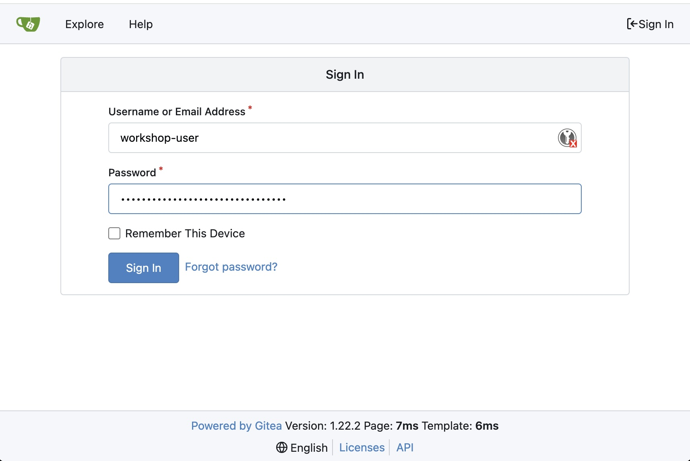
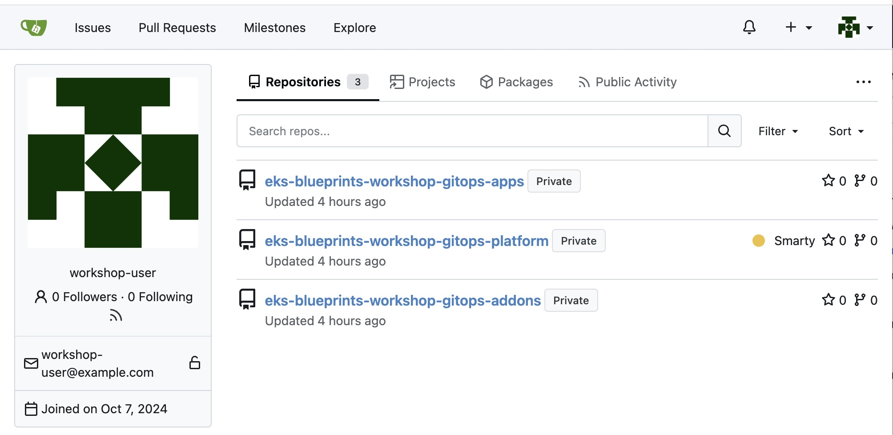
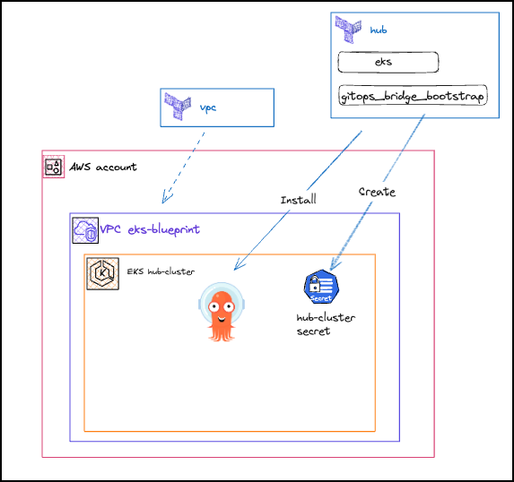
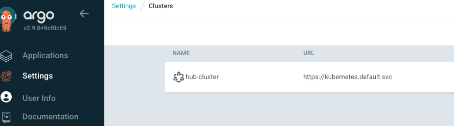

# Git 저장소 개요(5분)

이 장에서는 gitea를 사용하여 세 개의 Git 저장소를 작업합니다. IDE 인스턴스에 사전 설치된 서버:

**개발자 저장소**

- eks-blueprints-workshop-gitops-apps - 웹스토어 마이크로서비스 워크로드에 대한 Kubernetes 매니페스트가 포함되어 있습니다.

**플랫폼 저장소**

- eks-blueprints-workshop-gitops-platform - 네임스페이스 생성 및 워크로드 배포를 자동화하는 인프라 코드가 포함되어 있습니다.
- eks-blueprints-workshop-gitops-addons - Kubernetes 추가 기능 매니페스트 및 구성 값이 포함되어 있습니다.

워크로드와 플랫폼 저장소를 분리하면 개발자와 플랫폼 엔지니어의 역할과 책임이 서로 다르다는 것을 알 수 있습니다.

이 워크숍에서는 편의를 위해 Gitea를 사용하지만, GitHub, GitLab, Bitbucket과 같은 Git 관리 시스템을 대체 시스템으로 사용할 수 있습니다.

## Gitea 대시보드

Gitea 서버에 접속하면 저장소를 볼 수 있습니다.

Gitea URL을 찾으려면 다음을 실행하세요.

```sh
gitea_credentials
```

> **중요한**
> 
> 워크숍 전체에서 여러 bash 함수를 사용합니다. 함수에 대해 자세히 알아보려면 다음을 실행하여 `type <function_name>`해당 소스 파일을 찾을 수 있습니다.
> ```sh
> type gitea_credentials
> ```
> 
> 예제 출력
> 
> ```sh
> gitea_credentials is a shell function from /home/ec2-user/.bashrc.d/argocd.bash
> ```

출력 예

```sh
Gitea Username: workshop-user
Gitea Password: 8yJPQ4IMsW97EQdKXJXGqRlIty6n3B
https://d3aeqzejs2v8j.cloudfront.net/gitea/workshop-user/
출력 링크를 클릭하면 브라우저에서 열 수 있습니다. 처음에는 제공된 로그인 정보와 비밀번호를 입력해야 합니다.
```



로그인 후 저장소와 파일을 탐색할 수 있습니다.



# ArgoCD 설치(15분)

이 장에서는 플랫폼 엔지니어로서 EKS 클러스터에 ArgoCD를 설치합니다.

**Terraform 대신 Argo CD를 사용하여 Kubernetes 리소스를 배포하는 이유는 무엇입니까?**

> Terraform과 Argo CD는 모두 유용한 인프라 자동화 도구이지만, 각기 다른 용도로 사용됩니다. Terraform은 VPC, EKS 클러스터, RDS 인스턴스와 같은 인프라 구성 요소를 프로비저닝하는 데 탁월합니다. 하지만 Terraform을 사용하면 애드온 설치, 워크로드 배포, 네임스페이스 생성과 같은 지속적인 쿠버네티스 작업을 관리하는 것이 복잡해질 수 있습니다.
> 
> Argo CD는 쿠버네티스 리소스의 지속적 배포(CD)를 전문으로 합니다. 클러스터 상태를 지속적으로 모니터링하고 모든 구성 변동 사항을 Git에 정의된 원하는 상태로 자동으로 동기화합니다. 따라서 Argo CD는 쿠버네티스 애플리케이션 및 구성의 수명 주기를 관리하는 데 매우 적합합니다.
> 
> 주요 차이점은 Terraform은 일회성 프로비저닝을 수행하는 반면, Argo CD는 지속적인 조정을 제공한다는 것입니다. Terraform과 달리 Argo CD는 인프라 변경 사항을 적극적으로 모니터링하고 라이브 상태가 Git과 다를 때 알림을 제공합니다.

## GitOps Bridge로 Argo CD 설치

이 장에서는 GitOps Bridge를 사용하여 허브 클러스터에 Argo CD를 설치합니다. GitOps Bridge는 클러스터에 대한 레이블 및 주석과 같은 메타데이터를 저장하는 Kubernetes 시크릿도 생성합니다.



1. GitOps Bridge 구성

    GitOps Bridge는 최소한의 설정으로 Argo CD를 작동시키기 위한 초기 구성을 처리합니다.

    ```sh
    cat <<'EOF' >> ~/environment/hub/main.tf
    provider "helm" {
      kubernetes {
        host                   = module.eks.cluster_endpoint
        cluster_ca_certificate = base64decode(module.eks.cluster_certificate_authority_data)

        exec {
          api_version = "client.authentication.k8s.io/v1beta1"
          command     = "aws"
          # This requires the awscli to be installed locally where Terraform is executed
          args = ["eks", "get-token", "--cluster-name", module.eks.cluster_name, "--region", local.region]
        }
      }
    }

    locals{
      argocd_namespace = "argocd"
      environment = "dev"
    }

    resource "kubernetes_namespace" "argocd" {
      metadata {
        name = local.argocd_namespace
      }
    }
    ################################################################################
    # GitOps Bridge: Bootstrap
    ################################################################################
    module "gitops_bridge_bootstrap" {
      source = "gitops-bridge-dev/gitops-bridge/helm"
      version = "0.1.0"
      cluster = {
        cluster_name = module.eks.cluster_name
        environment = local.environment
        #enableannotation metadata     = local.annotations
        #enableaddons addons       = local.addons
      }

      #enableapps apps = local.argocd_apps
      argocd = {
        name = "argocd"
        namespace        = local.argocd_namespace
        chart_version    = "7.8.13"
        values = [file("${path.module}/argocd-initial-values.yaml")]
        timeout          = 600
        create_namespace = false
      }
    }
    EOF
    ```

2. Argo CD에 대한 값 파일을 만듭니다.

    ```sh
    cat <<'EOF' >> ~/environment/hub/argocd-initial-values.yaml
    global:
      tolerations:
      - key: "CriticalAddonsOnly"
        operator: "Exists"
    configs:
      cm:
        timeout.reconciliation: 30s
      params:
        server.insecure: true

    server:
      resources:
        requests:
          cpu: 300m
          memory: 512Mi
      service:
        type: LoadBalancer
        port: 80
        targetPort: 8080
        annotations:
          service.beta.kubernetes.io/aws-load-balancer-scheme: internet-facing
    repoServer:
      resources:
        requests:
          cpu: 300m
          memory: 512Mi

    controller:
      resources:
        requests:
          cpu: 300m
          memory: 512Mi

    EOF
    ```

3. Terraform 적용

    ```sh
    cd ~/environment/hub
    terraform init
    terraform apply -auto-approve
    ```

4. Argo CD 설치 확인

    Argo CD 대시보드 URL을 검색하려면 다음을 실행하세요.

    > 중요
    > 
    > 로드 밸런서를 프로비저닝하는 데도 몇 분이 걸립니다.

    ```sh
    argocd_hub_credentials
    ```

    위에 있는 명령어에서 Argo CD 비밀번호를 복사한 후, 사용자 이름(username)으로 `admin`을 사용하여 Argo CD UI에 로그인합니다.

    출력 링크를 클릭하고 **'열기'**를 선택하면 Argo CD 사용자 인터페이스에 액세스할 수 있습니다.

    > 메모
    > 
    > 이 워크숍 환경에서는 편의성을 위해 HTTP 프로토콜을 사용합니다. 하지만 운영 환경에서는 안전한 통신을 위해 항상 HTTPS 프로토콜을 사용해야 합니다.

    GitOps Bridge가 Argo CD를 설치하면 기본 관리자 계정과 자동 생성된 비밀번호를 사용하여 Argo CD 대시보드에 액세스할 수 있습니다. **Argo CD UI의 설정 > 클러스터** 에서 허브 클러스터가 이미 등록되어 있는 것을 확인할 수 있습니다 . 즉, Argo CD가 허브 클러스터를 관리할 수 있는 기능을 갖추고 있음을 의미합니다.

    

    또한 gitops-bridge가 argocd 네임스페이스에서 이 EKS 클러스터에 대한 Secret을 올바르게 생성했는지 확인할 수 있습니다.

    ```sh
    kubectl --context hub-cluster get secrets -n argocd hub-cluster
    ```

    예상 출력:

    ```
    NAME          TYPE     DATA   AGE
    hub-cluster   Opaque   3      4m41s
    ```