# ArgoCD 및 GitOps Bridge 기능의 기본 사항(50분)

이 장에서는 ArgoCD 객체를 살펴보고 ArgoCD의 GitOps Bridge 기능을 살펴보겠습니다.

## Application (20분)

Kubernetes manifast를 배포하려면 로컬 manifast 파일(배포할 대상)과 대상 EKS 클러스터(배포할 위치)라는 두 가지 주요 정보가 필요합니다. 예를 들면 다음과 같습니다.

```sh
kubectl apply -f ./local-path-to-manifest.yaml --context hub-cluster
```

이 명령은 매니페스트를 허브 클러스터에 배포합니다.

Argo CD는 Application 객체를 사용하여 유사한 접근 방식을 따릅니다. Git에서 배포할 내용과 배포할 위치(대상 클러스터 및 네임스페이스)를 정의합니다.

### guestbook 애플리케이션 생성

이 섹션에서는 guestbook ArgoCD 애플리케이션을 만들어 보겠습니다. 이 애플리케이션은 애플리케이션 저장소의 코드를 허브 클러스터에 배포합니다.

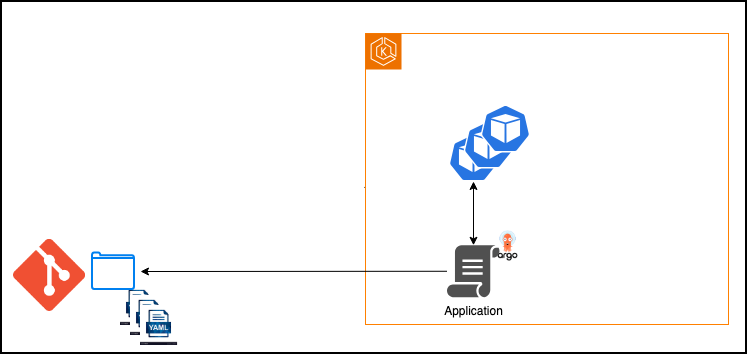

1. guestbook ArgoCD Application 생성

    ArgoCD **Application** 은 ArgoCD에 Git에서 배포할 내용과 배포 위치를 알려주는 특수한 쿠버네티스 객체(CRD)입니다. 클러스터의 실제 상태를 지속적으로 확인하고 Git의 상태와 자동으로 동기화합니다.

    이 단계에서는 ArgoCD Application을 배포합니다. 각 Application은 다음을 지정해야 합니다.

    - Source: 매니페스트가 포함된 Git 저장소.
    - Destination: 대상 Kubernetes 클러스터 및 네임스페이스.
    아래 예시에서는 소스(13번째 줄, `<<APP REPO URL>>` )와 대상(16번째 줄, `<<CLUSTER NAME>>`)에 대한 자리 표시자가 있습니다. 이후 단계에서 이를 업데이트하겠습니다.

    ```sh
    mkdir -p ~/environment/basics
    cd ~/environment/basics
    cat <<'EOF' >> ~/environment/basics/guestbook.yaml
    apiVersion: argoproj.io/v1alpha1
    kind: Application
    metadata:
      name: guestbook
      namespace: argocd
    spec:
      project: default
      # Source of the application manifests
      source:
        repoURL: <<APP REPO URL>> 
        path: guestbook
      destination:
        name: <<CLUSTER NAME>>
        namespace: guestbook   
      syncPolicy:
        automated: 
          prune: true
    EOF
    ```

    VSCode에서 방명록 작업 열기

    ```sh
    code ~/environment/basics/guestbook.yaml
    ```

2. 소스 업데이트(repoURL)

    "eks-blueprints-workshop-gitops-apps"에 방명록 매니페스트 파일을 채웁니다.

    우리는 이미 이 저장소를 로컬 "gitops-repos/workload" 폴더에 복제했습니다.

    ```sh
    mkdir -p "${GITOPS_DIR}/workload/guestbook"
    cp -r /home/ec2-user/eks-blueprints-for-terraform-workshop/gitops/workload/guestbook/* "${GITOPS_DIR}/workload/guestbook/"
    ```

    애플리케이션 Git 저장소에 변경 사항을 푸시해 보겠습니다.

    ```sh
    cd ~/environment/gitops-repos/workload
    git add .
    git commit -m "initial guestbook"
    git push --set-upstream origin main
    ```

    gitea 대시보드로 이동하여 애플리케이션 저장소(eks-blueprints-workshop-gitops-apps)의 HTTPS URL을 복사합니다.

    터미널에서 다음을 실행하여 gitea 대시보드 URL을 가져옵니다.

    ```
    gitea_credentials
    ```

    

    저장소에 guestbook이 포함되어 있는 것을 볼 수 있습니다.

    이전 단계의 `<<APP REPO URL>>`을 애플리케이션 저장소 URL로 교체합니다.

    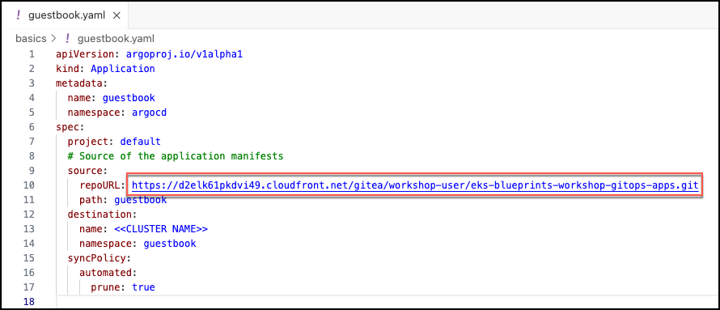

3. ArgoCD를 구성하여 Git 저장소에 액세스

    ArgoCD cli를 사용하여 ArgoCD에 git 저장소에 대한 액세스 권한을 부여해 보겠습니다.

    `<APP_REPO_URL>`을 2단계에서 복사한 HTTPS URL로 바꾸세요. gitea_credentials 명령어에서 사용된 URL은 사용하지 마세요. gitea 대시보드의 URL입니다.

    <GIT_PASSWORD>을 2단계에서 workshop-user의 비밀번호로 바꾸세요 . 이 비밀번호는 gitea_credentials에 표시되는 비밀번호입니다. Gitea 저장소는 편의를 위해 대시보드와 동일한 비밀번호를 사용합니다.

    ```sh
    argocd repo add <APP_REPO_URL> --name guestbookrepo --username workshop-user --password <GIT_PASSWORD>
    ```

    다음과 같은 형태입니다.
    
    ```sh
    argocd repo add https://d2exxxxxxxx.cloudfront.net/gitea/workshop-user/eks-blueprints-workshop-gitops-apps.git --username workshop-user --password pmQ5mWKM3aiISbVvxxxxxxx
    ```

    ArgoCD 대시보드에서 새로 생성된 git 저장소의 유효성을 검사할 수 있습니다. **설정 > 저장소**로 이동하세요.

    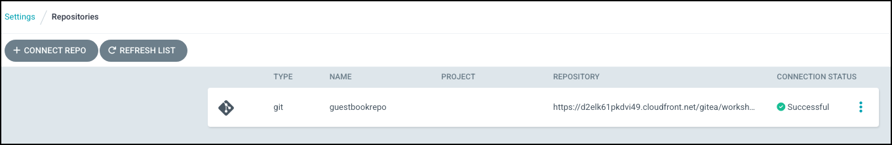

4. 목적지 업데이트

    GitOps Bridge는 이미 ArgoCD에 hub-cluster에 대한 액세스 권한을 제공했습니다.

    ArgoCD 대시보드 > 설정 > 클러스터 > hub-cluster로 이동합니다. 클러스터 이름(예: hub-cluster)을 기록해 둡니다.

    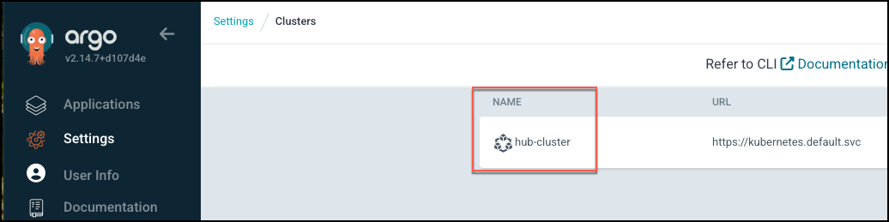

    guestbook 매니페스트의 `<<CLUSTER NAME>>`을 클러스터 이름(예: hub-cluster)으로 바꾸세요 .

    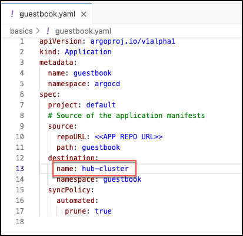

5. 파일을 저장합니다

    파일을 업데이트했습니다. 파일을 저장하세요.

    햄버거 > File > Save을 클릭하세요

6. 방명록 매니페스트 적용

    이 매니페스트를 적용하면:

    - ArgoCD는 Application 객체를 생성합니다.
    - ArgoCD는 리소스(배포, 서비스, Pod)를 허브 클러스터에 동기화하고 배포합니다.

    ```sh
    kubectl create ns guestbook --context hub-cluster
    kubectl apply -f ~/environment/basics/guestbook.yaml --context hub-cluster
    ```

7. 응용 프로그램 확인
    
    ArgoCD 웹 UI로 이동하세요. 방명록 애플리케이션이 나열되어 있어야 합니다.

    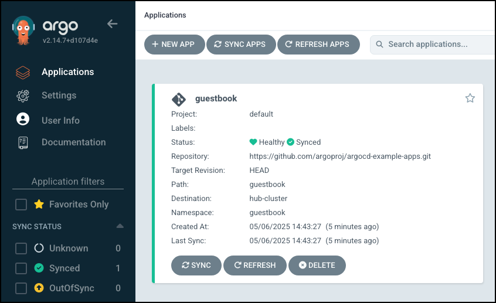

    방명록을 클릭하면 방명록 애플리케이션에서 생성된 모든 리소스를 볼 수 있습니다.

    Application(svc,deployment, replicaset, pods)에서 생성된 리소스를 확인할 수 있습니다.

    ```sh
    kubectl get all -n guestbook --context hub-cluster
    ```

### 자동 조정(Auto Reconciliation)

이 섹션에서는 애플리케이션 git 저장소의 manifest를 수정하고 클러스터에서 자동으로 조정되는 모습을 살펴보겠습니다.

1. 복제본 수 업데이트
    
    현재 guestbook-ui-deployment.yaml의 replicas는 1입니다. replica를 3으로 업데이트해 보겠습니다.

    ```sh
    sed -i 's/replicas: 1/replicas: 3/g' ~/environment/gitops-repos/workload/guestbook/guestbook-ui-deployment.yaml
    ```

    Application Git 저장소에 변경 사항을 푸시해 보겠습니다.

    ```sh
    cd ~/environment/gitops-repos/workload
    git add .
    git commit -m "updated replica count to 3"
    git push 
    ```

2. 자동 조정 검증

    ArgoCD가 애플리케이션 Git 저장소와 조정되어 3개의 복제본에 배포된 것을 확인할 수 있습니다. 3개의 Pod가 표시되어야 합니다.

    **Argo CD는 30초**마다 Git 저장소에서 변경 사항을 폴링하고 (이 워크숍에서 설정한 대로), 모든 업데이트를 클러스터에 자동으로 동기화합니다. 서버 부하가 높으면 조정에 **1~2분 정도 걸릴 수 있습니다.**

    **서버가 바쁠 수 있으므로 조정하는 데 1~2분이 걸릴 수 있습니다.**

    ```sh
    kubectl get pods -n guestbook --context hub-cluster
    ```

3. 정리

    ArgoCD CLI를 사용하여 애플리케이션과 관리되는 리소스를 삭제합니다.

    ```sh
    argocd app delete guestbook --cascade -y
    kubectl delete ns guestbook --force --context hub-cluster
    ```

    > 메모
    > 
    > 리소스를 삭제하는 데 몇 분이 걸릴 수 있습니다.


## ApplicationSet (20분)

이전 장에서는 ArgoCD Application 객체를 사용하여 허브 클러스터에 애플리케이션을 배포했습니다. 동일한 애플리케이션을 스포크 클러스터에 배포하려면 다른 ArgoCD 애플리케이션을 수동으로 생성해야 합니다.

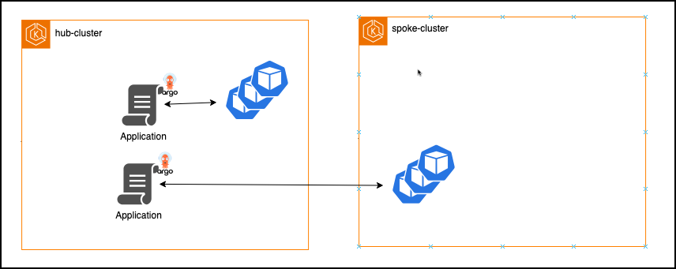

Argo CD는 매번 이런 작업을 수행하는 대신, 확장성과 자동화성이 더 뛰어난 솔루션인 **ApplicationSet**을 제공합니다.

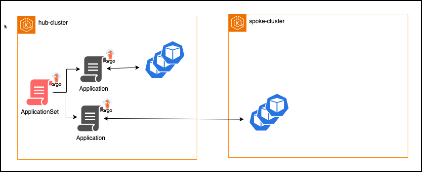

ApplicationSet은 ArgoCD 애플리케이션의 팩토리라고 생각하면 됩니다. 템플릿을 정의하고 생성기를 사용하여 여러 애플리케이션 객체를 생성합니다.

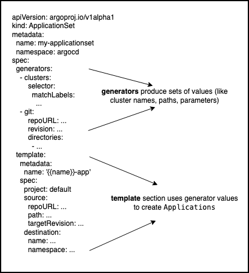

### 정적 목록 생성기

방명록 ArgoCD 애플리케이션을 클러스터 목록에 배포하는 ApplicationSet을 만들어 보겠습니다. 이 예에서는 hub-cluster에 배포합니다.

1. guestbook ApplicationSet 만들기

    ```sh
    cd ~/environment/basics
    cat <<'EOF' >> ~/environment/basics/guestbookApplicationSet.yaml
    apiVersion: argoproj.io/v1alpha1
    kind: ApplicationSet
    metadata:
      name: guestbook
      namespace: argocd
    spec:
      goTemplate: true
      goTemplateOptions: ["missingkey=error"]
      generators:
      - list:
          elements:
          - cluster: hub-cluster
            name: hub-cluster
          # - cluster: spoke-cluster
          #  name: spoke-cluster

      template:
        metadata:
          name: '{{.cluster}}-guestbook'
        spec:
          project: "default"
          source:
            repoURL: <<APP REPO URL>>
            path: guestbook
            targetRevision: HEAD
          destination:
            name: '{{.name}}'
            namespace: guestbook
          syncPolicy:
            automated: {}        

    EOF
    ```

2. repoURL 업데이트

    이 ApplicationSet은 Git 저장소 URL에 대한 자리 표시자를 사용하고 있습니다 `<<APP REPO URL>>`. 이 단계에서는 Guestbook 앱 저장소의 실제 URL로 업데이트합니다.

    VSCode에서 guestbook ApplicationSet을 엽니다.

    ```sh
    code ~/environment/basics/guestbookApplicationSet.yaml
    ```

    gitea 대시보드로 이동하여 애플리케이션 저장소(eks-blueprints-workshop-gitops-apps)의 HTTPS URL을 복사합니다.

    > Gitea 대시보드 URL
    > 
    > 터미널에서 gitea url에 대한 다음 명령을 실행합니다.
    > ```sh
    > gitea_credentials
    > ```
    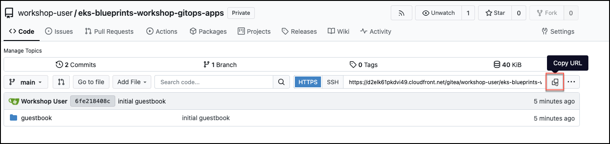
    `<<APP REPO URL>>`을 애플리케이션 저장소 URL로 **교체**

3. 파일을 저장합니다

    파일을 업데이트했습니다. 파일을 저장하세요.

    햄버거 > File > Save을 클릭하세요

4. 정적 목록 생성기 적용

    manifest를 적용하세요
    ```sh
    kubectl create ns guestbook --context hub-cluster
    kubectl apply -f ~/environment/basics/guestbookApplicationSet.yaml --context hub-cluster
    ```

5. 신청서 확인

    ArgoCD 웹 UI로 이동하세요. 방명록 ArgoCD 애플리케이션이 나열되어 있어야 합니다.

    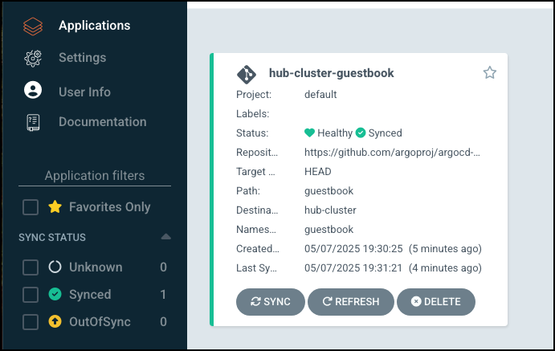

    spoke-cluster를 만든 후 spoke-cluster 섹션의 주석 처리를 제거하면 해당 클러스터를 타겟으로 하는 두 번째 애플리케이션이 자동으로 생성됩니다.

3. 정리하기

    ```sh
    argocd appset delete guestbook  -y
    kubectl delete ns guestbook --force --context hub-cluster
    kubectl get secrets -n argocd -o json --context hub-cluster | jq -r '
      .items[]
      | select(.data != null)
      | select(any(.data[]?; @base64d == "guestbookrepo"))
      | .metadata.name
    ' | xargs -r -I{} kubectl delete secret -n argocd {}
    ```

    > **메모**
    >
    > 리소스를 삭제하는 데 몇 분이 걸릴 수 있습니다.

### 동적 목록 생성기

정적 목록 생성기를 사용하면 각 클러스터를 수동으로 추가해야 합니다. 더 나은 방법은 레이블을 기반으로 클러스터를 선택하는 클러스터 생성기를 사용하여 클러스터를 동적으로 선택하는 것입니다.

ArgoCD는 다양한 유형의 [Generator를 지원합니다.](https://argo-cd.readthedocs.io/en/stable/operator-manual/applicationset/Generators/) 클러스터, git, 매트릭스 등을 사용하여 동적으로 애플리케이션을 생성합니다.

#### 클러스터 생성기

클러스터 생성기의 작동 방식을 살펴보겠습니다. 클러스터 생성기는 클러스터 객체에 정의된 **레이블**을 기반으로 클러스터를 선택합니다 . ArgoCD 대시보드 > 설정 > 클러스터 > 허브 클러스터로 이동하여 레이블을 확인할 수 있습니다.

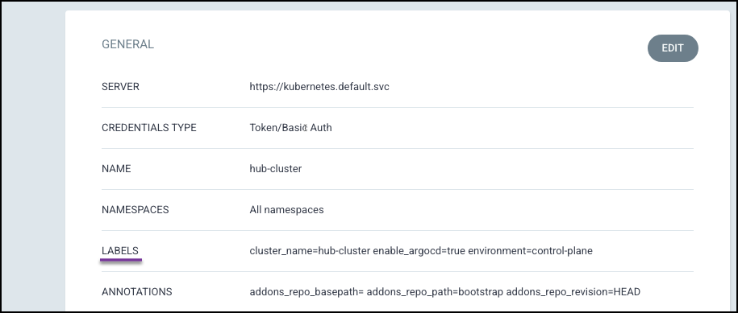

이러한 라벨은 GitOps Bridge에서 생성되었습니다.

레이블은 AWS 태그와 유사합니다. 예를 들어 AWS에서는 `app=webserver` 또는 `app=appserver`와 같은 태그를 사용하여 EC2 인스턴스의 역할을 지정할 수 있습니다. 이러한 태그는 인스턴스의 역할이나 용도를 식별하는 데 도움이 됩니다.

ArgoCD의 레이블은 비슷한 방식으로 작동합니다. 클러스터에 레이블을 지정하여 역할, 환경 또는 용도를 나타낼 수 있습니다. 예를 들어, 클러스터에 `workload_webstore=true(웹스토어 앱 배포 가능)` 또는 `environment=staging`(스테이징 버전 수신 필요) 레이블을 지정하면 Argo CD ApplicationSet과 같은 도구가 해당 역할에 따라 적절한 클러스터를 동적으로 타겟팅할 수 있습니다.

클러스터 생성기에서 라벨을 사용하는 방법에 대한 몇 가지 예를 살펴보겠습니다.

hub-cluster, spoke-staging, spoke-prod라는 3개의 클러스터 객체가 있고 각 객체마다 레이블(키 값 쌍)이 다르다고 가정해 보겠습니다.

다음은 ApplicationSet의 코드 조각입니다. 클러스터 생성기는 하나의 클러스터 레이블이 조건에 부합하므로 하나의 애플리케이션을 생성합니다.

```yaml
  .
  .
  generators:
  - clusters:
      selector:
        matchLabels:
          environment: hub
  .
  .
```

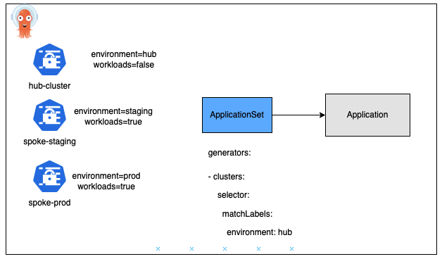

다음 생성기는 2개의 클러스터 레이블이 기준과 일치하므로 2개의 애플리케이션을 생성합니다.

```yaml
  generators:
  - clusters:
      selector:
        matchLabels:
          workloads: true
```

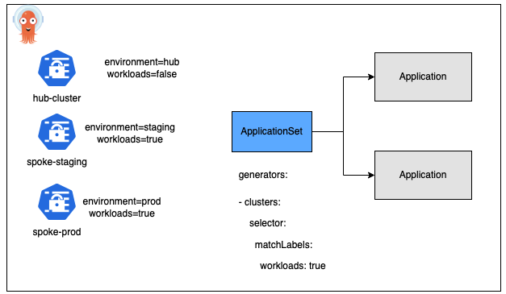

클러스터의 레이블을 업데이트하면 ApplicationSet 컨트롤러는 업데이트된 레이블 값에 따라 새로운 ArgoCD 애플리케이션을 동적으로 생성하거나 기존 애플리케이션을 삭제합니다.

예를 들어, 위의 시나리오에서 허브 클러스터에 workloads=true를 설정하면 ApplicationSet은 해당 클러스터를 타겟으로 하는 추가 애플리케이션을 자동으로 생성합니다.

## App of Apps Pattern (10분)

이 장에서는 실습이 없지만, 워크숍 전체에서 앱 오브 앱 패턴이 광범위하게 사용됩니다.

### 배경

실제 조직에서는 애플리케이션 배포에 여러 팀이 관여합니다. 이를 크게 다음과 같이 분류해 보겠습니다.

- 개발자 : 작업 부하에 대한 애플리케이션 코드와 Kubernetes 매니페스트를 담당합니다.
- 플랫폼 팀 : 인프라(VPC, 클러스터, 애드온), 네임스페이스 생성(할당량, 제한, 정책) 및 워크로드 배포 자동화를 담당합니다.

책임과 자동화를 명확하게 분리하기 위해 ArgoCD 사용자는 종종 앱 오브 앱 패턴을 채택합니다.

### App of Apps Pattern이란 무엇인가요?

일반적으로 ArgoCD 애플리케이션은 쿠버네티스 매니페스트를 배포하는 데 사용됩니다. 예를 들어, 이전 장에서 guestbook Application이 배포 및 서비스 리소스를 허브 클러스터에 직접 배포하는 방법을 살펴보았습니다.

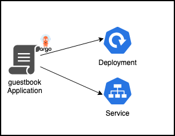

ArgoCD의 **App of Apps Pattern은 하나의** 부모 애플리케이션이 Application 여러 자식 애플리케이션을 배포하는 전략입니다 Applications/ApplicationSets. 예를 들어, 웹스토어 부모 애플리케이션은 UI, 에셋, 카트 마이크로서비스를 위한 애플리케이션을 배포합니다.

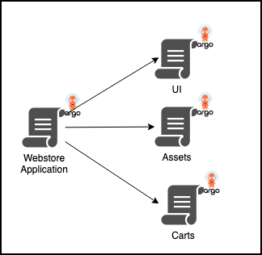

**이 패턴을 사용하여 웹스토어** 워크로드를 어떻게 배포할 수 있는지 살펴보겠습니다 .

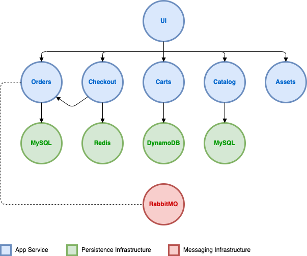

웹 스토어는 `ui` , `orders`, `checkout`, `carts`, `catalog`, `assets`와 같은 여러 개의 마이크로서비스로 구성됩니다.

### 개발자 저장소 레이아웃

개발자는 모듈식 구조를 사용하여 코드와 매니페스트를 구성합니다. 각 마이크로서비스는 다음 폴더 아래에 있습니다. `webstore/`:

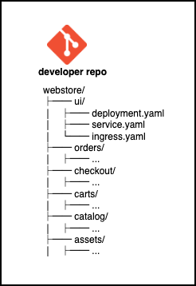

### 플랫폼 온보딩 웹스토어 워크로드

플랫폼 팀은 플랫폼 저장소 폴더 `workload/`에 `deploy-webstore.yaml`파일을 생성하여 웹스토어 워크로드를 온보딩합니다. 이 파일은 모든 웹스토어 마이크로서비스를 배포하는 `ApplicationSet`를 정의합니다.

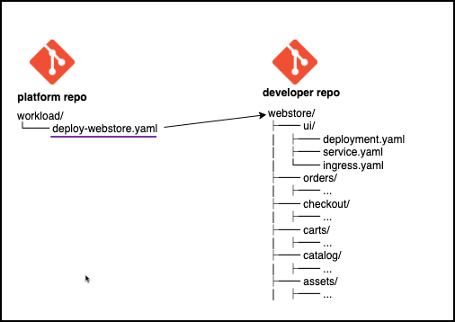

```yaml
apiVersion: argoproj.io/v1alpha1
kind: ApplicationSet
metadata:
  name: webstore-applications
  namespace: argocd
spec:
  goTemplate: true
  goTemplateOptions: ["missingkey=error"]
  generators:
    - git:
        repoURL: https://<developer-repo-url>
        revision: HEAD
        directories:
          - path: webstore/*
  template:
    metadata:
      name: '{{.path.basename}}'
    spec:
      project: default
      source:
        repoURL: https://<developer-repo-url>
        targetRevision: HEAD
        path: '{{.path.path}}'
      destination:
        name: hub-cluster
        namespace: '{{.path.basename}}'
      syncPolicy:
        automated: {}
```

### Generator
- 10번째 줄 : [Git 생성기를 사용합니다.](https://argo-cd.readthedocs.io/en/stable/operator-manual/applicationset/Generators-Git/) 동적으로 디렉토리를 감지합니다.
- 13-14번째 줄 : `webstore/`아래의 모든 하위 디렉토리를 탐색합니다.


### 템플릿
- 21번째 줄 : 개발자 Git 저장소를 가리킵니다.
- 22번째 줄 : `{{.path.path}}`는 `webstore/ui`, `webstore/orders`와 같은 경로로 해석됩니다.
- 25번째 줄 : 배포 대상 hub-cluster.
- 26번째 줄 : `{{.path.basename}}`는 `ui`, `carts` 등과 같은 네임스페이스 마이크로서비스 이름을 제공합니다.

이렇게 하면 `ApplicationSet`은 마이크로서비스마다 하나의 Argo CD 애플리케이션이 생성됩니다.

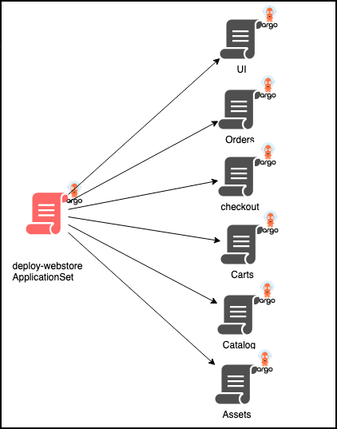

### Root Application

`App of Apps Pattern`을 활성화하기 위해 플랫폼 팀은 위의 `ApplicationSet`을 배포하는 Root Argo CD 애플리케이션을 만듭니다.

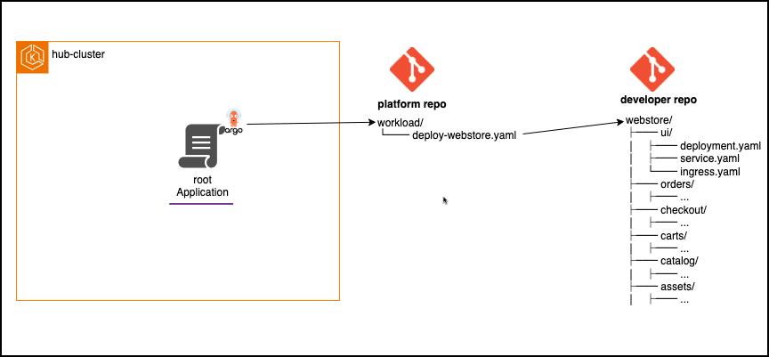

```yaml
apiVersion: argoproj.io/v1alpha1
kind: Application
metadata:
  name: webstore-root
  namespace: argocd
spec:
  project: default
  source:
    repoURL: https://<platform-repo-url>
    path: workload
    targetRevision: HEAD
  destination:
    name: hub-cluster
    namespace: argocd
  syncPolicy:
    automated: {}
```

- 9번째 줄 : Repo URL은 Platform repo를 가리킵니다.
- 10번째 줄 : `workload/`폴더(`deploy-webstore.yaml`) 아래의 모든 manifest를 동기화합니다.

### 다이어그램: 작동 원리

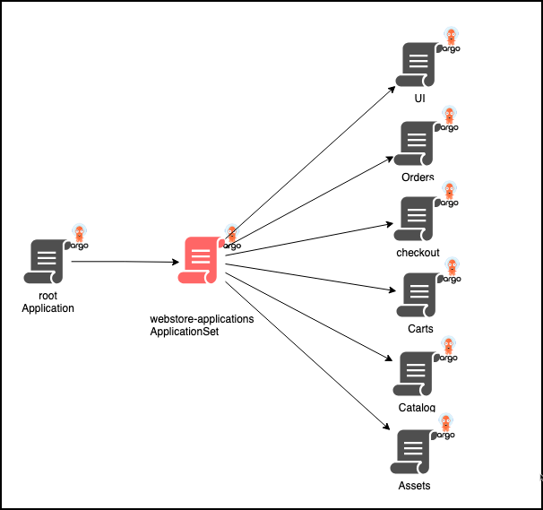

- Root 애플리케이션(`webstore-root`)이 `workload`폴더를 동기화합니다.
- 이렇게 하면 ApplicationSet(`deploy-webstore`)가 마이크로서비스당 하나의 Argo CD Application를 생성합니다.

### App of Apps Pattern의 이점

- 🔄 자동화 : 루트 앱 배포는 ApplicationSet모든 마이크로서비스를 배포합니다.  
  새로운 워크로드를 온보딩하려면 플랫폼 팀은 플랫폼 Git 저장소의 워크로드 폴더에 새 ApplicationSet을 추가하기만 하면 됩니다.
- 👥 책임 분리 :
  - 플랫폼 팀은 구조와 환경 정책을 정의합니다.
  - 개발자는 자신의 서비스 매니페스트를 소유합니다.
