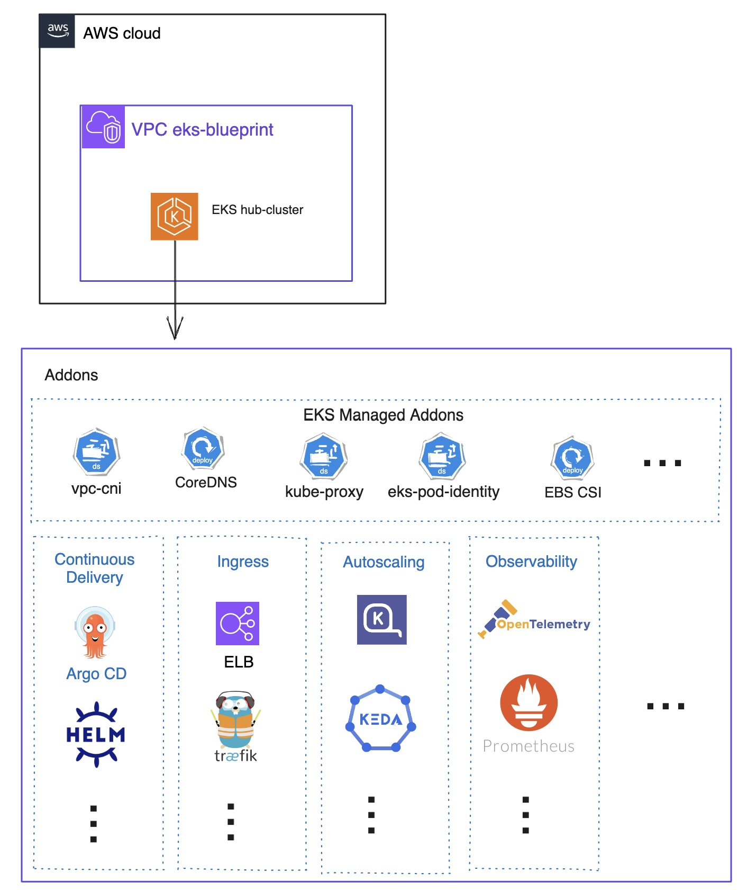
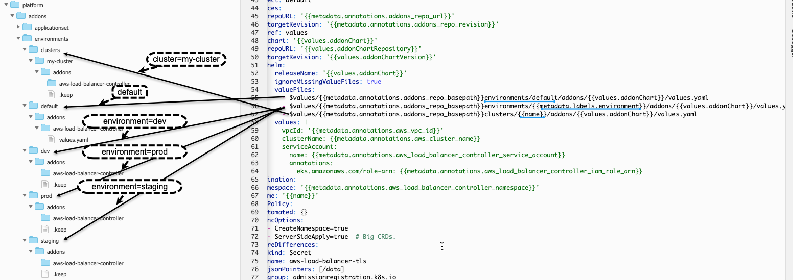
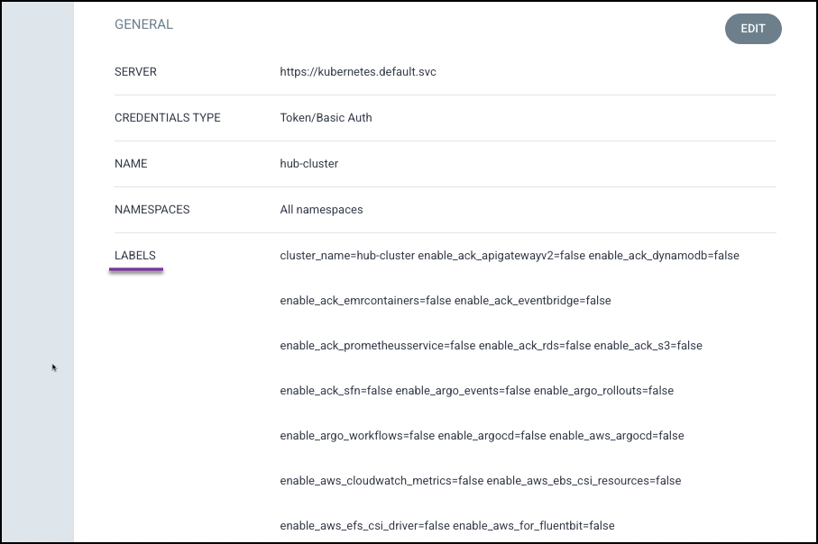
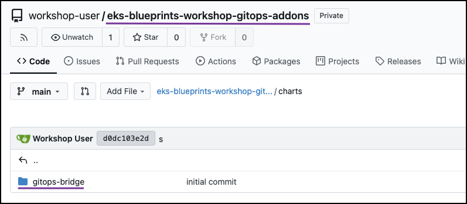
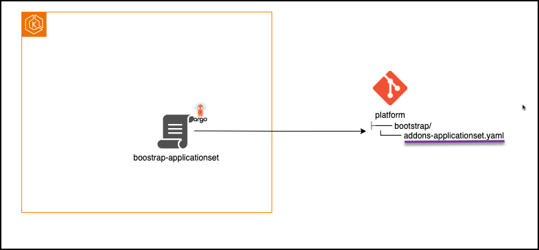
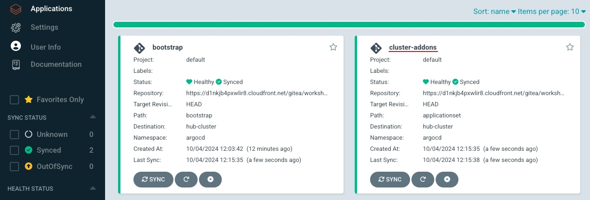
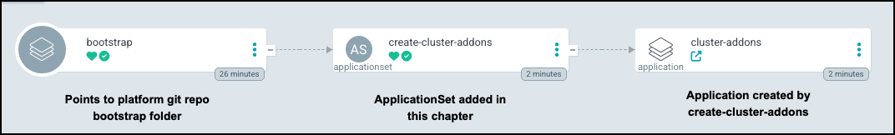
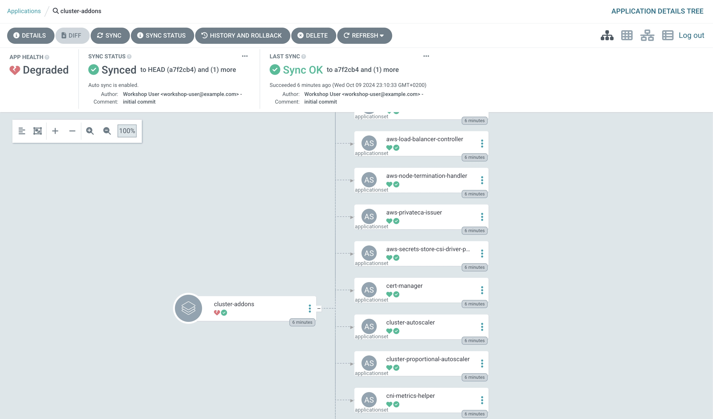
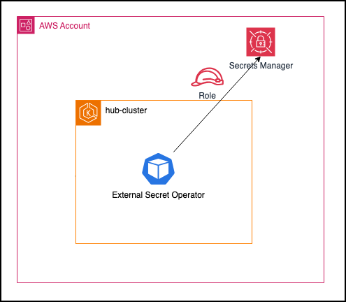
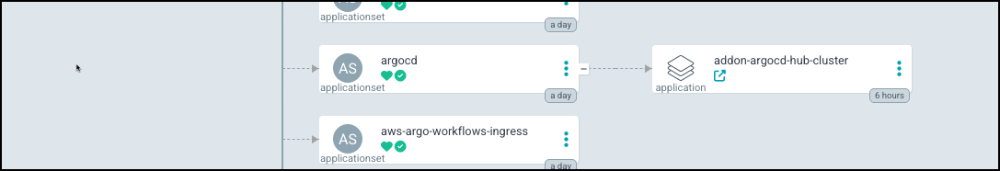

# Kubernetes Addon(20분)

이 장에서는 플랫폼 엔지니어로서 애드온 관리를 자동화할 수 있습니다.



애드온은 쿠버네티스 애플리케이션에 운영 기능을 지원합니다. 애드온 소프트웨어는 일반적으로 쿠버네티스 커뮤니티, AWS와 같은 클라우드 제공업체 또는 타사 공급업체에서 개발 및 유지 관리합니다. Amazon EKS Auto 모든 클러스터에 대해 Kubernetes용 Amazon VPC CNI 플러그인, Karpenter, kube-proxy, CoreDNS, PodIdentity 등의 애드온을 자동으로 관리합니다. 다른 모든 애드온은 직접 설치하고 관리해야 합니다.

GitOps Bridge는 Argo CD ApplicationSets를 유지 관리합니다. 저장소의 addons 폴더 아래에 있는 다양한 애드온에 대해 설명합니다. Kubernetes와 EKS가 발전함에 따라 이러한 ApplicationSet은 GitOps Bridge 프로젝트를 통해 업데이트됩니다. 각 애드온에 대해 별도의 ApplicationSet을 작성하는 대신, GitOps Bridge에서 제공하는 ApplicationSet을 활용합니다. 이 방법을 사용하면 불필요한 작업을 방지하고 GitOps Bridge 커뮤니티에서 엄선한 애드온 ApplicationSet의 이점을 활용할 수 있습니다.

이 워크숍에서는 GitOps Bridge ApplicationSets 저장소의 복제본을 활용합니다. 조직에서는 ApplicationSets를 복제한 후 그대로 사용하거나 특정 기업 요구에 맞게 사용자 정의하는 것을 고려해야 합니다.

**Argo CD로 애드온을 관리하는 이유는 무엇인가요?**

- GitOps 기반 - 매니페스트는 Git에 저장되어 버전 제어, 협업 및 검토가 가능합니다.
- 자동 동기화 - Argo CD는 Git 저장소와 일치하도록 클러스터 상태를 자동으로 동기화하여 지속적인 배포를 제공합니다.
- 롤백 및 감사 가능성 - 변경 사항을 추적하고 쉽게 롤백할 수 있어 안정성이 향상됩니다.
- 유연한 수명 주기 관리 - 애드온의 업그레이드, 확장 등을 쉽게 자동화할 수 있습니다.
- 다중 클러스터 가능 - 일관된 방식으로 여러 클러스터에서 애드온을 관리할 수 있습니다.
- 상태 모니터링 - Argo CD는 애드온 배포에 대한 상태 및 알림을 제공합니다.

**GitOps Bridge ApplicationSet은 어떻게 구성되나요?**

GitOps Bridge가 제공하는 ApplicationSets는 환경별 및 클러스터별로 재정의될 수 있습니다.

예를 들어, 아래는 재정의 파일이 있는 GitOps Repo와 GitOps Bridge ApplicationSet의 스니펫을 나란히 비교한 것입니다. 구성 값은 먼저 기본 설정에서 읽습니다. 그런 다음 환경별 설정이 기본값을 재정의합니다. 마지막으로 클러스터별 설정이 기본값과 환경 값을 모두 재정의합니다. 예를 들어 aws-load-balancer-controller 애드온에서는 폴더에서 기본값을 가져옵니다 . dev 환경에서는 <path> 아래에 <path> environments/default/addons/aws-load-balancer-controller를 추가하여 일부 값을 재정의할 수 있습니다 . my-cluster 환경에서는 <path> 아래에 <path>.yaml을 추가하여 이러한 값을 재정의할 수 있습니다 . 기본값 재정의는 선택 사항입니다. 사용자 지정이 필요하지 않으면 기본값을 사용할 수 있습니다.values.yamlenvironments/dev/addons/aws-load-balancer-controllerenvironments/clusters/my-cluster/addons/aws-load-balancer-controller



## 애드온 자동화를 위한 레이블 삽입

이 장에서는 애드온 설치 및 제거 자동화를 지원하는 메타데이터로 클러스터에 레이블을 지정합니다. 다음 장에서는 ArgoCD와 GitOps Bridge가 이러한 레이블을 읽어 각 클러스터에 배포하거나 제거할 애드온을 결정합니다.

1. 애드온 레이블 변수 정의

    다음 코드는 애드온에 대한 부울 변수를 정의합니다.

    변수는 aws_addons와 oss_addons의 두 가지 범주로 구성됩니다. aws_addons는 IAM 역할(예: 외부 비밀 운영자는 AWS Secrets Manager에 액세스해야 함)과 같은 AWS 관련 통합이 필요합니다. "oss_addons"는 AWS 관련 서비스(예: Nginx)에 의존하지 않는 오픈 소스 도구입니다.

    ```sh
    cat <<'EOF' >> ~/environment/hub/main.tf

    locals{
      aws_addons = {
        enable_cert_manager                          = try(var.addons.enable_cert_manager, false)
        enable_aws_efs_csi_driver                    = try(var.addons.enable_aws_efs_csi_driver, false)
        enable_aws_fsx_csi_driver                    = try(var.addons.enable_aws_fsx_csi_driver, false)
        enable_aws_cloudwatch_metrics                = try(var.addons.enable_aws_cloudwatch_metrics, false)
        enable_aws_privateca_issuer                  = try(var.addons.enable_aws_privateca_issuer, false)
        enable_cluster_autoscaler                    = try(var.addons.enable_cluster_autoscaler, false)
        enable_external_dns                          = try(var.addons.enable_external_dns, false)
        enable_external_secrets                      = try(var.addons.enable_external_secrets, false)
        enable_aws_load_balancer_controller          = try(var.addons.enable_aws_load_balancer_controller, false)
        enable_fargate_fluentbit                     = try(var.addons.enable_fargate_fluentbit, false)
        enable_aws_for_fluentbit                     = try(var.addons.enable_aws_for_fluentbit, false)
        enable_aws_node_termination_handler          = try(var.addons.enable_aws_node_termination_handler, false)
        enable_karpenter                             = try(var.addons.enable_karpenter, false)
        enable_velero                                = try(var.addons.enable_velero, false)
        enable_aws_gateway_api_controller            = try(var.addons.enable_aws_gateway_api_controller, false)
        enable_aws_ebs_csi_resources                 = try(var.addons.enable_aws_ebs_csi_resources, false)
        enable_aws_secrets_store_csi_driver_provider = try(var.addons.enable_aws_secrets_store_csi_driver_provider, false)
        enable_ack_apigatewayv2                      = try(var.addons.enable_ack_apigatewayv2, false)
        enable_ack_dynamodb                          = try(var.addons.enable_ack_dynamodb, false)
        enable_ack_s3                                = try(var.addons.enable_ack_s3, false)
        enable_ack_rds                               = try(var.addons.enable_ack_rds, false)
        enable_ack_prometheusservice                 = try(var.addons.enable_ack_prometheusservice, false)
        enable_ack_emrcontainers                     = try(var.addons.enable_ack_emrcontainers, false)
        enable_ack_sfn                               = try(var.addons.enable_ack_sfn, false)
        enable_ack_eventbridge                       = try(var.addons.enable_ack_eventbridge, false)
        enable_aws_argocd                            = try(var.addons.enable_aws_argocd , false)
        enable_cw_prometheus                         = try(var.addons.enable_cw_prometheus, false)
        enable_cni_metrics_helper                    = try(var.addons.enable_cni_metrics_helper, false)
      }
      oss_addons = {
        enable_argocd                          = try(var.addons.enable_argocd, false)
        enable_argo_rollouts                   = try(var.addons.enable_argo_rollouts, false)
        enable_argo_events                     = try(var.addons.enable_argo_events, false)
        enable_argo_workflows                  = try(var.addons.enable_argo_workflows, false)
        enable_cluster_proportional_autoscaler = try(var.addons.enable_cluster_proportional_autoscaler, false)
        enable_gatekeeper                      = try(var.addons.enable_gatekeeper, false)
        enable_gpu_operator                    = try(var.addons.enable_gpu_operator, false)
        enable_ingress_nginx                   = try(var.addons.enable_ingress_nginx, false)
        enable_keda                            = try(var.addons.enable_keda, false)
        enable_kyverno                         = try(var.addons.enable_kyverno, false)
        enable_kyverno_policy_reporter         = try(var.addons.enable_kyverno_policy_reporter, false)
        enable_kyverno_policies                = try(var.addons.enable_kyverno_policies, false)
        enable_kube_prometheus_stack           = try(var.addons.enable_kube_prometheus_stack, false)
        enable_metrics_server                  = try(var.addons.enable_metrics_server, false)
        enable_prometheus_adapter              = try(var.addons.enable_prometheus_adapter, false)
        enable_secrets_store_csi_driver        = try(var.addons.enable_secrets_store_csi_driver, false)
        enable_vpa                             = try(var.addons.enable_vpa, false)
      }

    }

    EOF
    ```


2. 라벨 주입

    이전 Bootstrap 챕터에서는 addonsGitOps Bridge에서 레이블을 생성하는 데 사용되는 변수를 추가했습니다. 이제 위에서 정의한 aws_addons와 oss_addons를 해당 변수에 병합해 보겠습니다.

    ```sh
    sed -i "s/#enableaddonvariable//g" ~/environment/hub/main.tf
    ```

    위 코드는 아래에 강조된 것처럼 main.tf의 애드온 변수의 주석 처리를 제거합니다.

    ```sh
    locals{
      addons = merge(
        { fleet_member = "hub" },
        { tenant = "tenant1" },
        local.aws_addons,
        local.oss_addons,
        #enablewebstore{ workload_webstore = true }  
      )
    }
    ```

3. Terraform 적용

    ```sh
    cd ~/environment/hub
    terraform apply --auto-approve
    ```

4. 라벨 검증

    Argo CD 대시보드에서 Settings > Clusters > hub-cluster로 이동합니다. 허브-클러스터 객체를 검사하여 GitOps Bridge가 레이블을 성공적으로 업데이트했는지 확인합니다.

    

    ArgoCD는 클러스터를 나타내는 Kubernetes Secret에서 레이블을 읽습니다.

    클러스터 비밀의 라벨과 주석을 확인할 수 있습니다.

    ```sh
    kubectl --context hub-cluster get secrets -n argocd hub-cluster -o yaml
    ```

    **출력 예**

    ```yaml
    apiVersion: v1
    data:
      config: ewogICJ0bHNDbGllbnRDb25maWciOiB7CiAgICAiaW5zZWN1cmUiOiBmYWxzZQogIH0KfQo=
      name: aHViLWNsdXN0ZXI=
      server: aHR0cHM6Ly9rdWJlcm5ldGVzLmRlZmF1bHQuc3Zj
    kind: Secret
    metadata:
      annotations:
        addons_repo_basepath: ""
        addons_repo_path: bootstrap
        addons_repo_revision: HEAD
        addons_repo_url: https://dcv3flp70gaiw.cloudfront.net/gitea/workshop-user/eks-blueprints-workshop-gitops-addons
        argocd_namespace: argocd
        aws_account_id: "012345678910"
        aws_cluster_name: hub-cluster
        aws_load_balancer_controller_namespace: kube-system
        aws_load_balancer_controller_service_account: aws-load-balancer-controller-sa
        aws_region: us-west-2
        aws_vpc_id: vpc-0281c90d8fb4ce6a2
        cluster_name: hub-cluster
        environment: control-plane
        external_secrets_namespace: external-secrets
        external_secrets_service_account: external-secrets-sa
        platform_repo_basepath: ""
        platform_repo_path: bootstrap
        platform_repo_revision: HEAD
        platform_repo_url: https://dcv3flp70gaiw.cloudfront.net/gitea/workshop-user/eks-blueprints-workshop-gitops-platform
        workload_repo_basepath: ""
        workload_repo_path: ""
        workload_repo_revision: HEAD
        workload_repo_url: https://dcv3flp70gaiw.cloudfront.net/gitea/workshop-user/eks-blueprints-workshop-gitops-apps
      creationTimestamp: "2024-10-07T21:40:44Z"
      labels:
        argocd.argoproj.io/secret-type: cluster
        aws_cluster_name: hub-cluster
        cluster_name: hub-cluster
        enable_argocd: "true"
        environment: control-plane
        fleet_member: control-plane
        kubernetes_version: "1.30"
        tenant: tenant1
        workloads: "true"
      name: hub-cluster
      namespace: argocd
      resourceVersion: "6865"
      uid: af0dfcb9-a034-4f2d-be9b-167eb78c830a
    type: Opaque
    ```

이제 gitops_bridge_bootstrap terraform 모듈 에서 구성된 모든 메타데이터를 secret에서 볼 수 있습니다 .

## 애드온 관리 자동화

이전 장에서는 GitOps Bridge Terraform 모듈을 사용하여 ArgoCD를 설치하고 필요한 레이블과 주석을 클러스터에 삽입했습니다.

이 장에서는 다음 단계로 넘어가서 GitOps Bridge Helm 차트를 사용하여 클러스터 애드온의 설치 및 수명 주기 관리를 자동화합니다.

GitOps Bridge는 선언적 접근 방식을 사용하여 애드온 관리를 간소화하는 미리 작성된 Helm 차트를 제공합니다. 이 차트는 애드온 저장소의 charts 폴더에 있습니다.



1. Addons ApplicationSet 구성

    이전 부트스트랩 챕터에서는 플랫폼 Git 저장소의 bootstrap/ 폴더를 지속적으로 감시하는 Argo CD 애플리케이션을 만들었습니다. 이제 GitOps Bridge Helm 차트를 허브 클러스터에 동적으로 배포하는 ApplicationSet을 bootstrap 폴더에 추가합니다.

    

    이제 cluster-addons ApplicationSet을 플랫폼 Git 저장소의 bootstrap 폴더에 추가합니다. 아래 강조 표시된 줄은 addons Git 저장소의 GitOps Bridge Helm 차트를 가리키는 repoURL과 경로를 보여줍니다.

    ```sh
    cat <<'EOF' >> ~/environment/gitops-repos/platform/bootstrap/addons-applicationset.yaml

    apiVersion: argoproj.io/v1alpha1
    kind: ApplicationSet
    metadata:
      name: create-cluster-addons
      namespace: argocd
    spec:
      syncPolicy:
        preserveResourcesOnDeletion: true
      goTemplate: true
      goTemplateOptions: 
        - missingkey=error
      generators: 
        - clusters:
            selector:
              matchLabels:
                fleet_member: hub
            values:
              addonChart: gitops-bridge
      template:
        metadata:
          name: cluster-addons
          finalizers: 
            # This is here only for workshop purposes. In a real-world scenario, you should not use this 
            - resources-finalizer.argocd.argoproj.io
        spec:
          project: default
          sources: 
            - ref: values
              repoURL: "{{.metadata.annotations.addons_repo_url}}"
              targetRevision: "{{.metadata.annotations.addons_repo_revision}}" 
            - repoURL: "{{.metadata.annotations.addons_repo_url}}"
              path: "{{.metadata.annotations.addons_repo_basepath}}charts/{{.values.addonChart}}"
              targetRevision: "{{.metadata.annotations.addons_repo_revision}}"
              helm:
                valuesObject:
                  #selectorMatchLabels: 
                  # fleet_member: control-plane
                ignoreMissingValueFiles: true
                valueFiles: 
                  - "$values/{{.metadata.annotations.addons_repo_basepath}}default/addons/{{.values.addonChart}}/values.yaml"
                  - "$values/{{.metadata.annotations.addons_repo_basepath}}environments/{{.metadata.labels.environment}}/addons/{{.values.addonChart}}/values.yaml" 
                  - "$values/{{.metadata.annotations.addons_repo_basepath}}clusters/{{.name}}/addons/{{.values.addonChart}}/values.yaml"
                  - "$values/{{.metadata.annotations.addons_repo_basepath}}tenants/{{.metadata.labels.tenant}}/default/addons/{{.values.addonChart}}/values.yaml" 
                  - "$values/{{.metadata.annotations.addons_repo_basepath}}tenants/{{.metadata.labels.tenant}}/environments/{{.metadata.labels.environment}}/addons/{{.values.addonChart}}/values.yaml"
                  - "$values/{{.metadata.annotations.addons_repo_basepath}}tenants/{{.metadata.labels.tenant}}/clusters/{{.name}}/addons/{{.values.addonChart}}/values.yaml"
          destination:
            namespace: argocd
            name: "{{.name}}"
          syncPolicy:
            automated:
              selfHeal: false
              allowEmpty: true
              prune: false
            retry:
              limit: 100
            syncOptions: 
              - CreateNamespace=true 
              - ServerSideApply=true

    EOF
    ```

    업데이트된 ApplicationSet 구성을 플랫폼 저장소에 커밋하고 푸시합니다.

    ```sh
    git -C ${GITOPS_DIR}/platform add .  || true
    git -C ${GITOPS_DIR}/platform commit -m "add addon applicationset" || true
    git -C ${GITOPS_DIR}/platform push || true
    ```

2. 애드온 ApplicationSet 검증

    UI에서 Argo CD 대시보드로 이동하여 "cluster-addons" 애플리케이션이 성공적으로 생성되었는지 확인합니다.

    

    Argo CD 대시보드에서 "부트스트랩" 애플리케이션을 클릭하고 해당 애플리케이션에서 생성된 애플리케이션 목록을 살펴보세요.

    

    cluster -addons 애플리케이션은 GitOps 애드온 저장소에 정의된 모든 애드온에 대한 ApplicationSets를 생성합니다.

    

    현재는 클러스터 레이블에서 설치가 활성화되지 않았기 때문에 **추가 기능이 배포되지 않았습니다.**

## External Secrets Operator(ESO) 애드온 설치

일부 애드온은 AWS 서비스에 액세스하려면 IAM 역할이 필요합니다.

- 외부 비밀 운영자(ESO) – AWS Secrets Manager에 액세스하려면 IAM 역할이 필요합니다.
- Karpenter – EC2 API에 액세스하려면 IAM 역할이 필요합니다.
- Cert-manager – AWS Certificate Manager(ACM)에 액세스하려면 IAM 역할이 필요합니다.

이 장에서는 AWS Secrets Manager에 접근하기 위해 외부 비밀 운영자(ESO)를 배포합니다. ESO는 Pod Identity를 사용하여 AWS에서 비밀을 안전하게 인증하고 검색합니다.



1. 레이블을 사용하여 ESO 추가 기능 활성화

    이것은 label enable_external_secrets = true를 설정하여 설치할 수 있습니다.

    ```sh
    sed -i '
    /addons = {/,/}/ {
    /}/ i\
        enable_external_secrets = true
    }
    ' ~/environment/hub/terraform.tfvars
    ```

2. ESO 서비스 계정에 IAM 역할 연결

    다음 코드는 ESO Service Account에 대한 Pod Identity를 생성합니다.

    ```sh
    cat <<'EOF' >> ~/environment/hub/main.tf

    locals {
      external_secrets = {
        namespace = "external-secrets"
        service_account = "external-secrets-sa"
      }
    }
    module "external_secrets_pod_identity" {
      source = "terraform-aws-modules/eks-pod-identity/aws"
      version = "~> 1.4.0"

      name = "external-secrets"

      attach_external_secrets_policy = true
      external_secrets_ssm_parameter_arns = ["arn:aws:ssm:*:*:parameter/*"] # In case you want to restrict access to specific SSM parameters "arn:aws:ssm:${data.aws_region.current.id}:${data.aws_caller_identity.current.account_id}:parameter/${local.name}/*"
      external_secrets_secrets_manager_arns = ["arn:aws:secretsmanager:*:*:secret:*"] # In case you want to restrict access to specific Secrets Manager secrets "arn:aws:secretsmanager:${data.aws_region.current.id}:${data.aws_caller_identity.current.account_id}:secret:${local.name}/*"
      external_secrets_kms_key_arns = ["arn:aws:kms:*:*:key/*"] # In case you want to restrict access to specific KMS keys "arn:aws:kms:${data.aws_region.current.id}:${data.aws_caller_identity.current.account_id}:key/*"
      external_secrets_create_permission = false

      # Pod Identity Associations

      associations = {
        addon = {
          cluster_name = module.eks.cluster_name
          namespace = local.external_secrets.namespace
          service_account = local.external_secrets.service_account
        }
      }

      tags = local.tags
    }
    EOF
    ```

3. ESO 서비스 계정 주석 추가

    GitOps Bridge는 어노테이션을 사용하여 생성할 ESO 서비스 계정의 이름과 네임스페이스를 결정합니다. 어노테이션이 제공되지 않으면 Helm 차트에 정의된 기본값을 사용합니다.

    다음 코드는 허브 클러스터에 주석을 추가하기 위해 주석 처리를 제거합니다.

    ```sh
    sed -i "s/#enableeso//g" ~/environment/hub/main.tf
    ```

    주석 처리를 해제한 코드는 아래와 같습니다.

    ```sh
      annotations = merge(
        .
        .
        {
          external_secrets_service_account = local.external_secrets.service_account
          external_secrets_namespace = local.external_secrets.namespace
        }
        .
        .  
      )
    ```

    > **메모**
    > 
    > Terraform EKS Blueprints 애드온 모듈 eks_blueprints_addons를 사용하면 각 애드온에 대한 최소 권한 역할을 자동으로 프로비저닝할 수도 있습니다.
    > 
    > 이 모듈을 사용하면 애드온을 설치하고 IAM 역할을 생성할 수 있습니다. 하지만 IAM 역할만 생성하고 애드온 자체는 배포하지 않습니다. EKS 클러스터에 애드온을 설치하는 작업은 Argo CD를 통해 수행됩니다.
    > 
    > EKS Blueprint Addons 모듈을 사용하면 보안이 강화되고 복잡성이 줄어듭니다.
    > 
    > create_kubernetes_resources = false를 설정하여 Terraform 모듈이 필요한 AWS 리소스만 생성하고 Kubernetes 리소스는 생성하지 않도록 구성합니다(Argo CD가 Kubernetes 리소스를 관리하도록 하는 것을 선호하기 때문입니다).

4. Terraform 적용

    ```sh
    cd ~/environment/hub
    terraform init
    terraform apply --auto-approve
    ```

5. ESO 추가 기능 검증

    AWS Secret Manager에 Gitea 저장소 정보가 이미 있습니다. AWS Secret eks-blueprints-workshop-gitops-addons에서 Kubernetes secret-addon secret으로 복사할 외부 Secret을 생성하겠습니다.

    ```sh
    mkdir ~/environment/basic
    cat <<'EOF' >> ~/environment/basic/eso.yaml
    apiVersion: external-secrets.io/v1beta1
    kind: SecretStore
    metadata:
      name: aws-secretsmanager
      namespace: default
    spec:
      provider:
        aws:
          service: SecretsManager
          region: ap-northeast-2

    ---

    apiVersion: external-secrets.io/v1beta1
    kind: ExternalSecret
    metadata:
      name: service-addon
      namespace: default
    spec:
      refreshInterval: 1h
      secretStoreRef:
        name: aws-secretsmanager
        kind: SecretStore
      target:
        name: secret-addon
        creationPolicy: Owner
      dataFrom:
        - extract:
            key: "eks-blueprints-workshop-gitops-addons"
    EOF
    ```

    외부 비밀 생성

    ```sh
    kubectl apply -f ~/environment/basic/eso.yaml --context hub-cluster
    ```

    > **문제 해결**
    > 
    > "서버 오류(InternalError): 생성 중 오류"와 같은 오류가 표시되면 ESO 컨트롤러가 아직 생성 중임을 의미합니다. 몇 분 정도 기다린 후 아래 명령을 다시 실행해 보세요.
    > ```sh
    > kubectl apply -f ~/environment/basic/eso.yaml --context hub-cluster
    > ```

    Kubernetes Secret 검증

    ```sh
    kubectl get secrets secret-addon -oyaml --context hub-cluster
    ```

data: 섹션에 복사된 eks-blueprints-workshop-gitops-addons 비밀이 base64로 인코딩된 것을 볼 수 있습니다.


## metrics-server, argo rollout 애드온 설치

1. 레이블을 사용하여 metrics-server, argo-rollouts 추가 기능 활성화

    이것은 label `enable_metrics_server = true`, `enable_argo_rollouts = true`를 설정하여 설치할 수 있습니다.

    ```sh
    sed -i '
    /addons = {/,/}/{
        /}/i\
        enable_metrics_server = true\
        enable_argo_rollouts = true
    }
    ' ~/environment/hub/terraform.tfvars
    ```

2. Terraform 적용

    ```sh
    cd ~/environment/hub
    terraform init
    terraform apply --auto-approve
    ```

## ArgoCD를 애드온으로 자체 관리

처음에는 ArgoCD가 GitOps Bridge Terraform 모듈을 사용하여 설치되었습니다. 하지만 ArgoCD는 다른 애드온과 마찬가지로 GitOps 관리 애드온으로 관리할 수도 있습니다.

ArgoCD를 애드온으로 활성화하면 ArgoCD가 자체 라이프사이클을 관리할 수 있습니다. 이를 통해 선언적 업그레이드, 구성 변경, 심지어 완전한 삭제까지 GitOps를 통해 가능합니다.

1. ArgoCD 레이블 설정

    ```sh
    sed -i '
    /addons = {/,/}/{
        /}/i\
        enable_argocd = true
    }
    ' ~/environment/hub/terraform.tfvars
    ```

    `terraform.tfvars`에 대한 이 업데이트에는 다음이 추가되었습니다.

    ```sh
    eks_admin_role_name          = "WSParticipantRole"


    addons = {
        .
        .
        enable_argocd = "true"
    }
    ```

2. Terraform으로 변경 사항 적용

    ```sh
    cd ~/environment/hub
    terraform apply --auto-approve
    ```

3. ArgoCD 애드온 검증

이제 ArgoCD 애플리케이션 자체가 대시보드에 나열되어 다른 애드온과 마찬가지로 관리되는 것을 볼 수 있습니다.



> **메모**
> 
> ArgoCD가 다시 배포되면 대상 Pod가 갱신되면서 연결이 일시적으로 끊어집니다. ArgoCD 대시보드에서 연결을 다시 설정하는 데 **몇 분 정도 걸릴 수 있습니다.**

> **축하합니다.**
> 
> 이제 ArgoCD를 사용하여 ArgoCD 시스템을 관리하고 있습니다!
