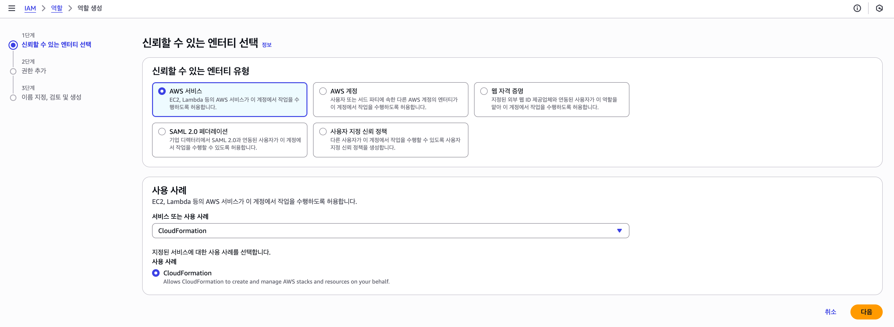
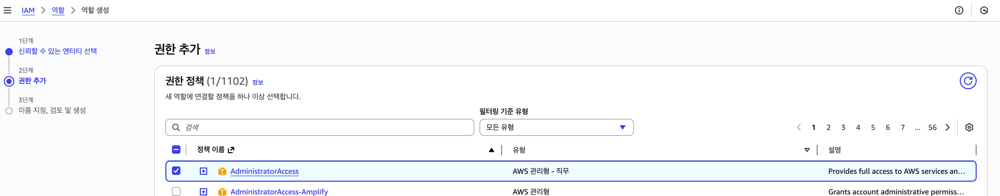
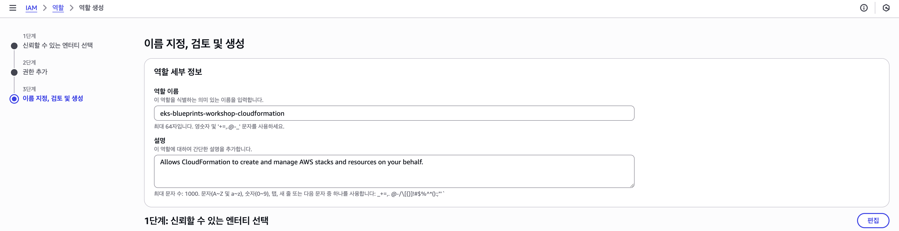
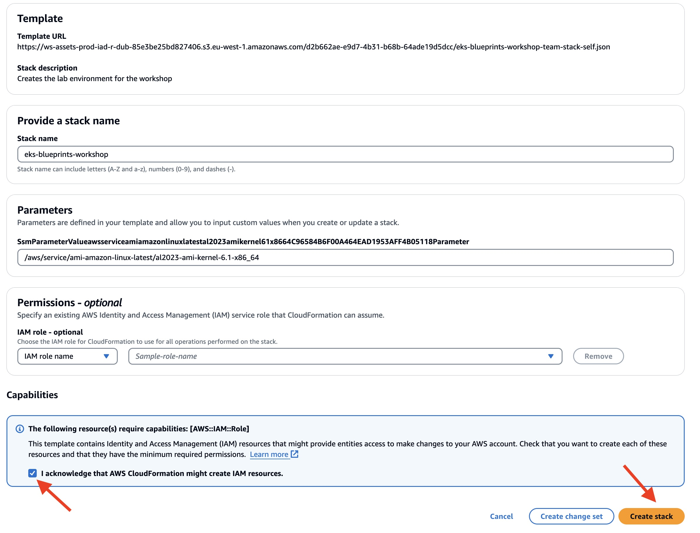
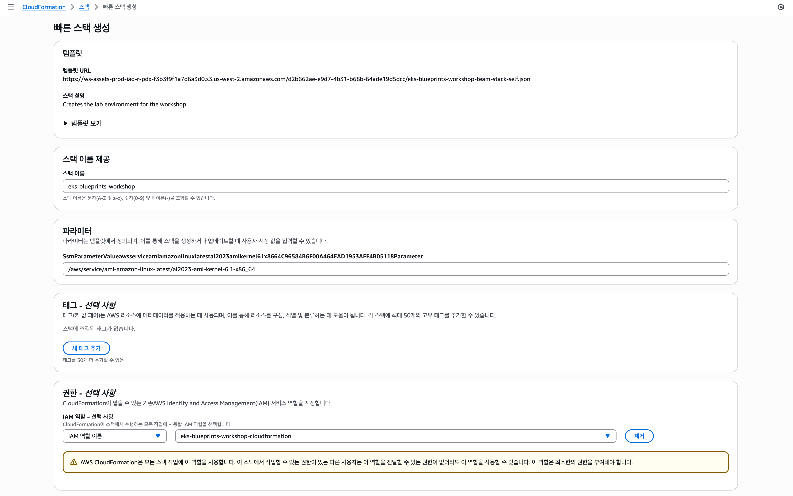
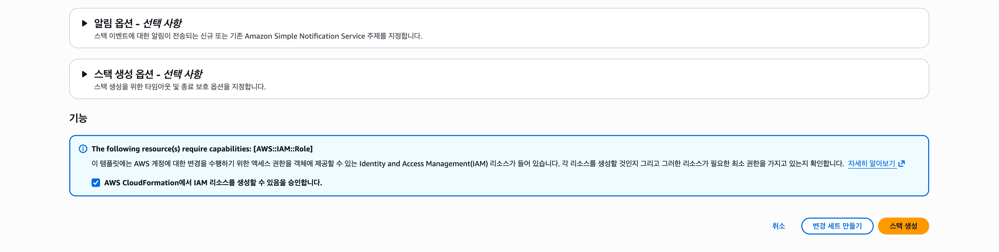
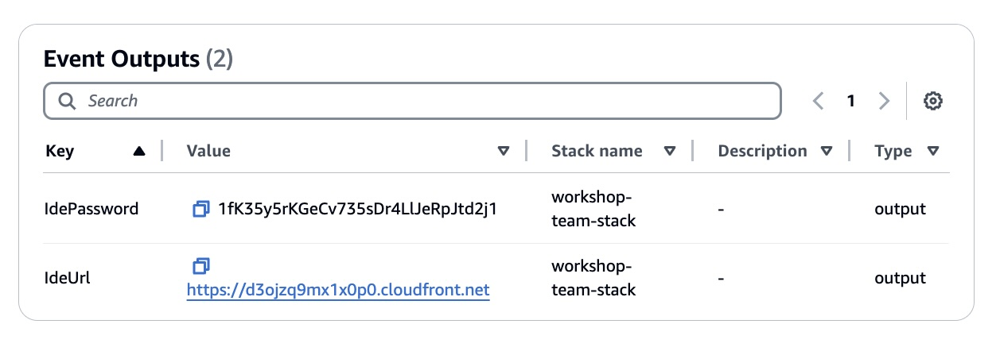
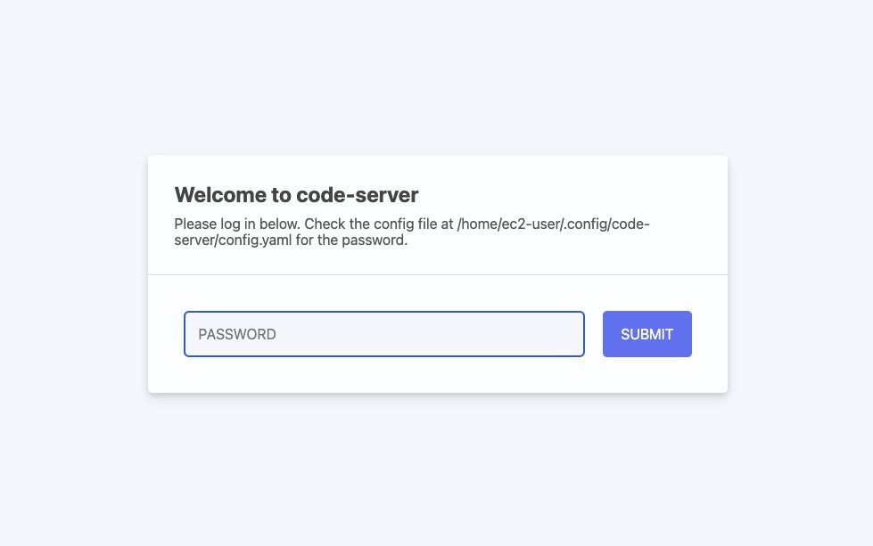
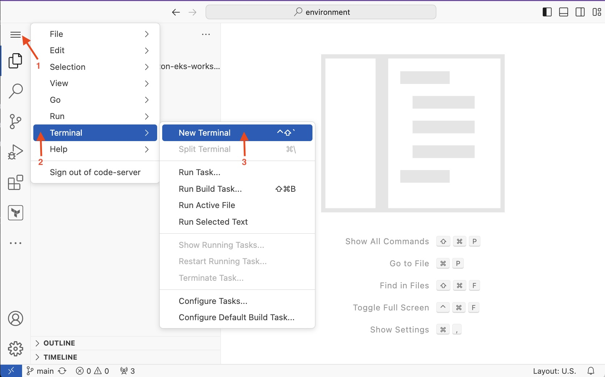
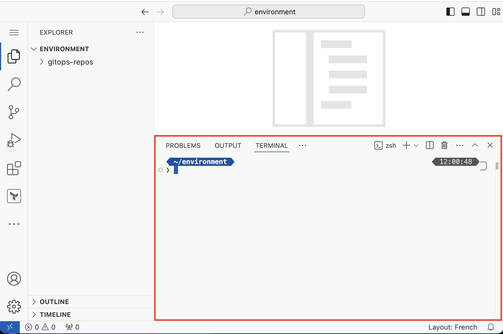

Workhop setup (45분)
---

# 자신의 AWS 계정에서 실행

**참고** : 이 워크숍은 Amazon EKS를 사용할 수 있는 모든 AWS 리전과 호환됩니다. 기본 리전은 설치를 실행하는 컴퓨터/노트북에 구성된 리전입니다.

이 워크숍은 다음 GitHub 저장소의 aws-samples조직에서 호스팅됩니다: https://github.com/aws-samples/fleet-management-on-amazon-eks-workshop/ 

## Cloudformation IAM 생성

역할 이름을 `eks-blueprints-workshop-cloudformation`이라고 입력합니다.

## 환경 Bootstrapping

[ap-northeast-2(서울)에서 시작](https://ap-northeast-2.console.aws.amazon.com/cloudformation/home#/stacks/quickcreate?templateUrl=https://ws-assets-prod-iad-r-pdx-f3b3f9f1a7d6a3d0.s3.us-west-2.amazonaws.com/d2b662ae-e9d7-4b31-b68b-64ade19d5dcc/eks-blueprints-workshop-team-stack-self.json&stackName=eks-blueprints-workshop&param_RepositoryRef=VAR::MANIFESTS_REF)

EKS 클러스터에 액세스하는 데 사용할 유효한 IAM 역할 이름(`eks-blueprints-workshop-cloudformation`)을 입력해야 합니다.
<!--  -->

# IDE에 접근하기

## AWS Workshop IDE에 액세스하기

Cloud IDE에 액세스하는 데 필요한 정보는 개인 대시보드 페이지(이벤트 출력 섹션까지 아래로 스크롤) 또는 CloudFormation 스택 출력에서 ​​찾을 수 있습니다. 새 브라우저 탭에서 열어 보겠습니다.

이전 단계에서 제공된 비밀번호를 입력하세요:

IDE 터미널을 열려면 다음 단계를 따르세요.

1. 왼쪽 상단 모서리에 있는 메뉴 아이콘을 클릭하세요
2. 아래와 같이 터미널 -> 새 터미널을 선택하세요 .

화면 하단에 터미널이 나타납니다. 워크숍 전체에서 이 터미널을 사용하여 명령을 입력할 것입니다.

