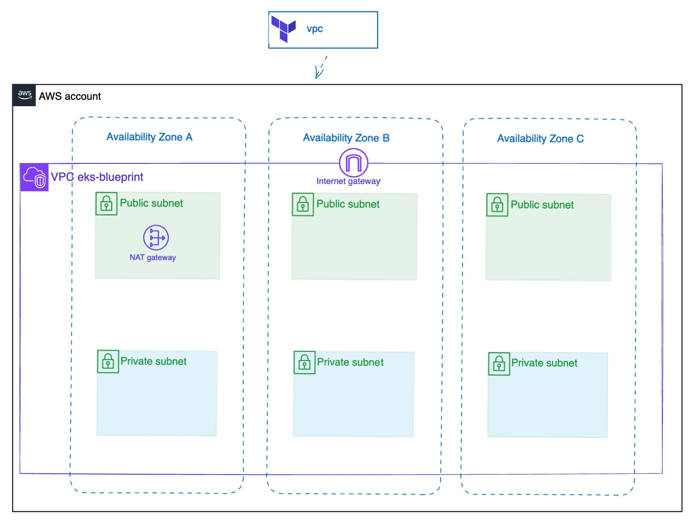
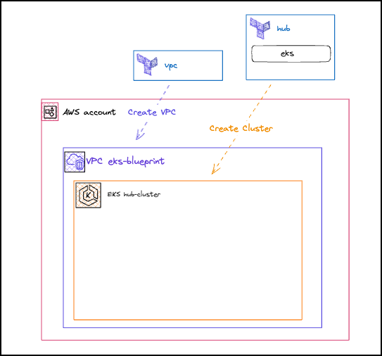
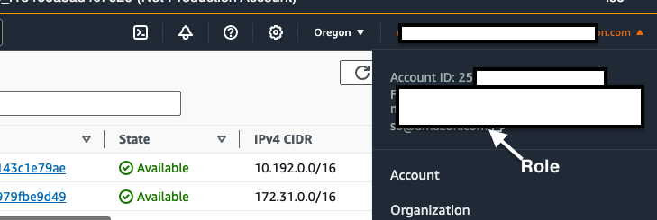

워크숍 인프라 생성 (45분)
---

# VPC 생성 (15분)

이 장에서는 플랫폼 엔지니어로서 퍼블릭 및 프라이빗 서브넷을 모두 갖춘 Amazon Virtual Private Cloud(VPC)를 프로비저닝하기 위해 Terraform 스택을 생성합니다. 퍼블릭 서브넷은 로드 밸런서와 같은 인터넷 연결 리소스에 사용되는 반면, 프라이빗 서브넷은 Amazon EKS 워커 노드와 같이 인터넷에서 직접 액세스해서는 안 되는 내부 리소스를 호스팅합니다.



1. Terraform 프로젝트 생성

    ```sh
    mkdir -p ~/environment/vpc
    cd ~/environment/vpc
    ```

    Terraform과 공급자 버전을 정의해 보겠습니다.

    ```sh
    cat > ~/environment/vpc/versions.tf << 'EOF'
    terraform {
      required_version = ">= 1.4.0"

      required_providers {
        aws = {
          source  = "hashicorp/aws"
          version = ">= 5.0.0"
        }
        random = {
          version = ">= 3"
        }
      }
    }
    EOF
    ```

2. 변수 정의

    ```sh
    cat > ~/environment/vpc/variables.tf << 'EOF'
    variable "environment_name" {
      description = "The name of environment Infrastructure stack, feel free to rename it. Used for cluster and VPC names."
      type        = string
      default     = "eks-blueprints-workshop"
    }

    variable "vpc_cidr" {
      description = "CIDR block for VPC"
      type        = string
      default     = "10.0.0.0/16"
    }

    EOF
    ```

3. VPC 구성

    이제 세 개의 가용 영역에 걸쳐 퍼블릭 및 프라이빗 서브넷을 포함하는 Amazon VPC를 설정하겠습니다. 다음 Terraform 코드는 인터넷 게이트웨이, NAT 게이트웨이, 그리고 필요한 네트워크 리소스를 포함한 기본 VPC 인프라를 프로비저닝합니다. 서브넷에는 Kubernetes 로드 밸런서 컨트롤러의 동적 검색을 위해 특별히 태그가 지정되어 있습니다. 이 VPC는 ​​Kubernetes 클러스터를 배포하고 실행하기 위한 네트워크 기반 역할을 합니다.

    ```sh
    cat > ~/environment/vpc/main.tf <<'EOF'

    data "aws_availability_zones" "available" {
      # Do not include local zones
      filter {
        name   = "opt-in-status"
        values = ["opt-in-not-required"]
      }
    }
    data "aws_region" "current" {}

    locals {
      name   = var.environment_name
      region = data.aws_region.current.id

      vpc_cidr       = var.vpc_cidr
      num_of_subnets = min(length(data.aws_availability_zones.available.names), 3)
      azs            = slice(data.aws_availability_zones.available.names, 0, local.num_of_subnets)

      tags = {
        Blueprint  = local.name
        GithubRepo = "github.com/aws-ia/terraform-aws-eks-blueprints"
      }
    }

    module "vpc" {
      source  = "terraform-aws-modules/vpc/aws"
      version = "~> 5.0.0"

      name = local.name
      cidr = local.vpc_cidr

      azs             = local.azs
      public_subnets  = [for k, v in local.azs : cidrsubnet(local.vpc_cidr, 6, k)]
      private_subnets = [for k, v in local.azs : cidrsubnet(local.vpc_cidr, 6, k + 10)]

      enable_nat_gateway   = true
      create_igw           = true
      enable_dns_hostnames = true
      single_nat_gateway   = true

      manage_default_network_acl    = true
      default_network_acl_tags      = { Name = "${local.name}-default" }
      manage_default_route_table    = true
      default_route_table_tags      = { Name = "${local.name}-default" }
      manage_default_security_group = true
      default_security_group_tags   = { Name = "${local.name}-default" }

      public_subnet_tags = {
        "kubernetes.io/role/elb" = 1
      }

      private_subnet_tags = {
        "kubernetes.io/role/internal-elb" = 1
      }

      tags = local.tags

    }

    EOF
    ```

4. 출력 정의

    EKS 클러스터를 생성할 때 사용될 VPC 및 개인 서브넷 출력을 정의합니다.

    ```sh
    cat > ~/environment/vpc/outputs.tf <<'EOF'
    output "vpc_id" {
      description = "The ID of the VPC"
      value       = module.vpc.vpc_id
    }

    output "private_subnets" {
      description = "List of IDs of private subnets"
      value       = module.vpc.private_subnets
    }

    output "vpc_name" {
      description = "The ID of the VPC"
      value       = local.name
    }


    EOF
    ```

5. VPC 프로비저닝

    먼저, 필요한 모듈과 공급자를 가져오기 위해 Terraform을 초기화해 보겠습니다.

    ```sh
    cd ~/environment/vpc
    terraform init
    ```

    먼저 plan을 해보는 것이 좋습니다.

    ```sh
    cd ~/environment/vpc
    terraform plan
    ```

    오류가 없으면 배포를 진행할 수 있습니다.

    ```sh
    cd ~/environment/vpc
    terraform apply -auto-approve
    ```
    
    > **리소스가 생성될 때까지 기다리세요**  
    > 가상 사설 클라우드(VPC)를 만드는 과정은 완료하는 데 최대 5분이 걸릴 수 있습니다.

    완료되면 콘솔 에서 VPC를 볼 수 있습니다. 

    > **Terraform 상태 관리**  
    > 이 워크숍에서는 로컬 Terraform 상태를 사용합니다. 올바른 설정 방법은 https://www.terraform.io/language/state 에서 확인하세요. 

    얼마 후, 다음과 비슷한 출력이 표시됩니다.

    ```sh
    ...
    module.vpc.aws_route.private_nat_gateway[0]: Creation complete after 0s [id=r-rtb-0a42c62f0538aede11080289494]
    
    Apply complete! Resources: 23 added, 0 changed, 0 destroyed.
    
    Outputs:
    
    private_subnets = [
      "subnet-02f11317d12ebc4c0",
      "subnet-0be1b9e9832fb1e3d",
      "subnet-05da55f463254176f",
    ]
    vpc_id = "vpc-056a18d25ca30e155"
    vpc_name = "eks-blueprints-workshop"
    ```

# Hub Cluster 생성 (25분)

이 장에서는 플랫폼 엔지니어로서 EKS Audomod 클러스터를 생성합니다. Amazon EKS Audomode는 컴퓨팅, 스토리지, 네트워킹을 포함한 Kubernetes 클러스터 관리를 완전히 자동화합니다.

이 섹션에서는 이전에 프로비저닝된 VPC 내에 EKS 클러스터(허브)를 생성하고 EKS Terraform 모듈을 활용하여 배포 프로세스를 간소화합니다.



1. 원격 상태 생성

    허브 클러스터의 VPC 모듈에서 출력을 참조해야 합니다.
    ```sh
    mkdir -p ~/environment/hub
    cd ~/environment/hub
    cat > ~/environment/hub/remote_state.tf << 'EOF'
    data "terraform_remote_state" "vpc" {
      backend = "local"

      config = {
        path = "${path.module}/../vpc/terraform.tfstate"
      }
    }
    EOF
    ```

2. 변수 생성

    이 섹션에서는 허브 클러스터의 EKS 버전을 정의합니다. 콘솔에서 EKS 관리자 역할을 사용하여 허브 클러스터의 포드, 배포, 네임스페이스와 같은 EKS 객체를 관리할 수 있습니다. 이러한 변수의 대부분은 나중에 terraform.tfvars 파일을 사용하여 구성됩니다.

    **변수에 대한 자세한 설명, 설명을 확인하세요**

    여기서는 EKS 클러스터를 만드는 데 사용되는 여러 변수를 정의합니다.

    - kubernetes_version : EKS 클러스터에 설치하거나 업데이트할 Kubernetes 버전을 지정합니다.
    - eks_admin_role_name : EKS 클러스터 내에서 관리 권한이 부여된 IAM 역할의 이름을 나타냅니다.
    - 애드온 : 클러스터에서 활성화할 EKS 애드온을 나열합니다. 애드온은 추가 기능과 통합 기능을 제공합니다.
    - authentication_mode : EKS 클러스터 내에서 사용되는 인증 모드를 결정합니다. "API_AND_CONFIG_MAP" 값을 사용하면 EKS Access API 또는 Kubernetes aws-auth ConfigMap을 사용하여 인증할 수 있습니다.

    이러한 변수를 제공하면 특정 요구 사항에 따라 EKS 클러스터 배포를 사용자 지정할 수 있습니다. terraform.tfvars 파일은 나중에 이러한 변수의 값을 구성하는 데 사용되므로 Terraform 코드를 직접 변경하지 않고도 설정을 쉽게 수정할 수 있습니다.

    ```sh
    cat > ~/environment/hub/variables.tf << 'EOF'
    variable "kubernetes_version" {
      description = "EKS version"
      type        = string
      default     = "1.32"
    }

    variable "eks_admin_role_name" {
      description = "EKS admin role"
      type        = string
      default     = "WSParticipantRole"
    }

    variable "addons" {
      description = "EKS addons"
      type        = any
    }

    variable "project_context_prefix" {
      description = "Prefix for project"
      type        = string
      default     = "eks-blueprints-workshop"
    }

    variable "authentication_mode" {
      description = "The authentication mode for the cluster. Valid values are CONFIG_MAP, API or API_AND_CONFIG_MAP"
      type        = string
      default     = "API"
    }

    variable "enable_irsa" {
      description = "Enable IRSA"
      type        = bool
      default     = true
    }

    variable "secret_name_git_data_addons" {
      description = "Secret name for Git data addons"
      type        = string
      default     = "eks-blueprints-workshop-gitops-addons"
    }

    variable "secret_name_git_data_platform" {
      description = "Secret name for Git data platform"
      type        = string
      default     = "eks-blueprints-workshop-gitops-platform"
    }

    variable "secret_name_git_data_workloads" {
      description = "Secret name for Git data workloads"
      type        = string
      default     = "eks-blueprints-workshop-gitops-workloads"
    }


    EOF
    ```

3. EKS 클러스터 구성

    Terraform EKS 모듈을 사용하여 개인 서브넷에 EKS 클러스터(허브)를 구성합니다.

    ```sh
    cat > ~/environment/hub/main.tf << 'EOF'
    data "aws_caller_identity" "current" {}
    data "aws_region" "current" {}
    data "aws_iam_session_context" "current" {
      # This data source provides information on the IAM source role of an STS assumed role
      # For non-role ARNs, this data source simply passes the ARN through issuer ARN
      # Ref https://github.com/terraform-aws-modules/terraform-aws-eks/issues/2327#issuecomment-1355581682
      # Ref https://github.com/hashicorp/terraform-provider-aws/issues/28381
      arn = data.aws_caller_identity.current.arn
    }

    provider "kubernetes" {
      host                   = module.eks.cluster_endpoint
      cluster_ca_certificate = base64decode(module.eks.cluster_certificate_authority_data)

      exec {
        api_version = "client.authentication.k8s.io/v1beta1"
        command     = "aws"
        # This requires the awscli to be installed locally where Terraform is executed
        args = ["eks", "get-token", "--cluster-name", module.eks.cluster_name, "--region", local.region]
      }
    }

    locals{
      context_prefix   = var.project_context_prefix
      name            = "hub-cluster"
      region          = data.aws_region.current.id
      cluster_version = var.kubernetes_version
      enable_irsa = var.enable_irsa

      vpc_id = data.terraform_remote_state.vpc.outputs.vpc_id
      private_subnets = data.terraform_remote_state.vpc.outputs.private_subnets

      authentication_mode = var.authentication_mode

      tags = {
        Blueprint  = local.name
        GithubRepo = "github.com/aws-samples/eks-blueprints-for-terraform-workshop"
      }
    }

    data "aws_iam_role" "eks_admin_role_name" {
      name = var.eks_admin_role_name
    }

    ################################################################################
    # EKS Cluster
    ################################################################################
    #tfsec:ignore:aws-eks-enable-control-plane-logging
    module "eks" {
      source  = "terraform-aws-modules/eks/aws"
      version = "~> 20.34.0"

      cluster_name                   = local.name
      cluster_version                = local.cluster_version
      cluster_endpoint_public_access = true

      authentication_mode = local.authentication_mode

      enable_irsa = local.enable_irsa

      # Combine root account, current user/role and additional roles to be able to access the cluster KMS key - required for terraform updates
      kms_key_administrators = distinct(concat([
        "arn:aws:iam::${data.aws_caller_identity.current.account_id}:root"],
        [data.aws_iam_session_context.current.issuer_arn]
      ))

      enable_cluster_creator_admin_permissions = true
      access_entries = {
        # One access entry with a policy associated
        eks_admin = {
          principal_arn     = data.aws_iam_role.eks_admin_role_name.arn
          policy_associations = {
            argocd = {
              policy_arn = "arn:aws:eks::aws:cluster-access-policy/AmazonEKSClusterAdminPolicy"
              access_scope = {
                type       = "cluster"
              }
            }
          }
        }
      }

      vpc_id     = local.vpc_id
      subnet_ids = local.private_subnets

      cluster_compute_config = {
        enabled    = true
        node_pools = ["general-purpose","system"]
      }

      tags = local.tags
    }

    EOF
    ```

4. 출력 정의

    Terraform 출력에는 방금 만든 리소스에 대한 정보가 제공됩니다. 여기에는 EKS 클러스터에 액세스하는 명령과 워크숍에서 나중에 사용될 추가 세부 정보가 포함됩니다.

    ```sh
    cat > ~/environment/hub/outputs.tf << 'EOF'

    output "configure_kubectl" {
      description = "Configure kubectl: make sure we're logged in with the correct AWS profile and run the following command to update our kubeconfig"
      value       = <<-EOT
        aws eks --region ${local.region} update-kubeconfig --name ${module.eks.cluster_name} --alias ${module.eks.cluster_name}
      EOT
    }

    output "cluster_name" {
      description = "Cluster name"
      value       = module.eks.cluster_name
    }
    output "cluster_endpoint" {
      description = "Cluster endpoint"
      value       = module.eks.cluster_endpoint
    }
    output "cluster_certificate_authority_data" {
      description = "Cluster certificate_authority_data"
      value       = module.eks.cluster_certificate_authority_data
    }
    output "cluster_region" {
      description = "Cluster region"
      value       = local.region
    }

    output "cluster_primary_security_group_id" {
      description = "Cluster primary security group"
      value       = module.eks.cluster_primary_security_group_id
    }

    EOF
    ```

5. 변수 값 정의

    Terraform 매개변수를 구성하기 위한 파일을 생성합니다 terraform.tfvars. EKS 관리자 역할은 Kubernetes 내에서 관리자 권한을 부여받으며, AWS 콘솔을 통해 클러스터 리소스를 볼 수 있는 권한을 부여합니다.

    ```sh
    cat >  ~/environment/hub/terraform.tfvars <<EOF
    eks_admin_role_name          = "WSParticipantRole"
    addons = {
    }

    EOF
    ```

    > **중요**  
    > "**WSParticipantRole**"은 AWS 이벤트 워크숍에 참여할 때 부여되는 역할 이름입니다. 워크숍을 독립적 으로 진행할 경우 , AWS 콘솔에서 사용하는 AWS 역할을 반영하도록 이 역할을 업데이트해야 합니다.
    > 
    > ```sh
    > code ~/environment/hub/terraform.tfvars
    > ```
    > 예:
    > ```sh 
    > eks_admin_role_name          = "Admin"
    > ```

6. 필수 공급자 만들기

    ```sh
    cat >  ~/environment/hub/versions.tf <<EOF
    terraform {
      required_version = ">= 1.4.0"
      required_providers {
        aws = {
          source  = "hashicorp/aws"
          version = ">= 4.67.0, < 6.0.0"
        }
        helm = {
          source  = "hashicorp/helm"
          version = ">= 2.10.1, < 3.0.0"
        }
        kubernetes = {
          source  = "hashicorp/kubernetes"
          version = ">= 2.36.0, < 3.0.0"
        }
      }
    }

    EOF
    ```

7. EKS 클러스터 생성

    ```sh
    cd ~/environment/hub
    terraform init
    terraform apply -auto-approve
    ```

    > **리소스가 생성될 때까지 기다리세요**  
    > Amazon EKS 클러스터를 만드는 과정은 일반적으로 완료하는 데 약 15분이 걸립니다.

8. 허브 클러스터에 액세스

    kubectl을 구성하려면 다음 명령을 실행하여 Terraform 출력에서 ​​클러스터에 액세스하기 위한 연결 세부 정보를 검색합니다.

    ```sh
    eval $(terraform output -raw configure_kubectl)
    ```

    kubectl이 올바르게 구성되었는지 확인하려면 아래 명령을 실행하여 API 엔드포인트에 도달할 수 있는지 확인하세요.

    ```sh
    kubectl get svc --context hub-cluster
    ```

    출력 예:

    ```sh
    NAME         TYPE        CLUSTER-IP   EXTERNAL-IP   PORT(S)   AGE
    kubernetes   ClusterIP   172.20.0.1   <none>        443/TCP   19h
    ```
