Argo Rollout And Karpenter
---

# Argo Rollout(20분)

이 장에서는 Argo Rollout CRD의 3가지 유형에 대해 살펴봅니다.

## Argo Rollout: rolling(5분)

rolling유형에 새로운 버전이 배포되면 어떻게 동작하는지 알아봅니다.

```yaml
  strategy:
    canary:
      # Pod를 순차적으로 교체
      steps:
      - setWeight: 33    # 1개 Pod 업데이트 (3개 중 33%)
      - pause: {duration: 10s}
      - setWeight: 67    # 2개 Pod 업데이트 (3개 중 67%)
      - pause: {duration: 10s}
      - setWeight: 100   # 모든 Pod 업데이트
```

- 2번째 줄: canary를 활용하여 구현합니다.
- 4~9번째 줄: canary지만 10초가 지나면 자동으로 다음 단계로 진행되게 함으로써 rolling배포를 구성합니다.

1. 동작을 좀 더 상세히 보기 위해 staging deploy-workshop rolling서비스의 pod수를 조정합니다.

    ```sh
    cat >> $GITOPS_DIR/workload/deploy-workshop/rolling/staging/hpa.yaml << 'EOF'
      minReplicas: 5
      maxReplicas: 10
    EOF
    ```

2. git 커밋

    변경 사항을 커밋해 보겠습니다.

    ```sh
    cd $GITOPS_DIR/workload
    git add .
    git commit -m "increas pod for staging deploy-workshop rolling service"
    git push
    ```

    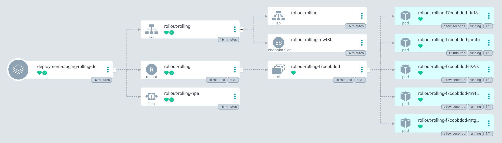

3. staging rolling 화면 모니터링

    ```sh
    export ROLLING_URL=$(kubectl --context spoke-staging get svc -n rolling rollout-rolling -o jsonpath='{.status.loadBalancer.ingress[0].hostname}')
    echo "Staing Rolling URL: http://$ROLLING_URL"
    ```

    브라우저로 접속

4. image를 `green`으로 변경

    ```sh
    sed -i 's/image: .*/image: argoproj\/rollouts-demo:green/g' $GITOPS_DIR/workload/deploy-workshop/rolling/staging/rollout.yaml
    ```

5. git 커밋

    변경 사항을 커밋해 보겠습니다.

    ```sh
    cd $GITOPS_DIR/workload
    git add .
    git commit -m "update image for staging deploy-workshop rolling service"
    git push
    ```

    시간이 지나며 자동으로 점차 green으로 전환되는 것을 확인 할 수 있습니다.
    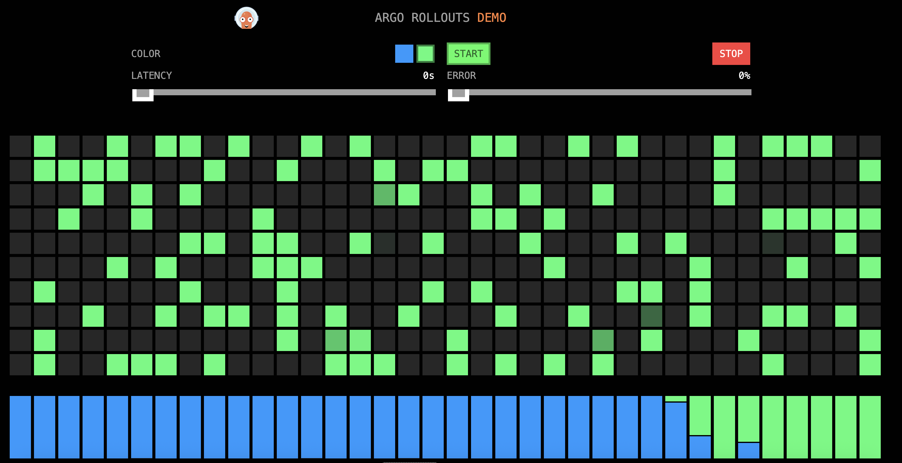


## Argo Rollout: bluegreen(5분)

bluegreen유형에 새로운 버전이 배포되면 어떻게 동작하는지 알아봅니다.

```yaml
  strategy:
    blueGreen:
      activeService: rollout-bluegreen-active
      previewService: rollout-bluegreen-preview
      autoPromotionEnabled: false
```

- 2번째 줄: bluegreen유형을 정의합니다.
- 3번째 줄: active(blue) pod에 접근할 수 있는 service를 지정합니다.
- 4번째 줄: preview(green) pod에 접근할 수 있는 service를 지정합니다.
- 5번째 줄: 수동으로 승인해야 preview가 active로 대체됩니다.

1. 동작을 좀 더 상세히 보기 위해 staging deploy-workshop bluegreen서비스의 pod수를 조정합니다.

    ```sh
    cat >> $GITOPS_DIR/workload/deploy-workshop/bluegreen/staging/hpa.yaml << 'EOF'
      minReplicas: 5
      maxReplicas: 10
    EOF
    ```

2. git 커밋

    변경 사항을 커밋해 보겠습니다.

    ```sh
    cd $GITOPS_DIR/workload
    git add .
    git commit -m "increas pod for staging deploy-workshop bluegreen service"
    git push
    ```

    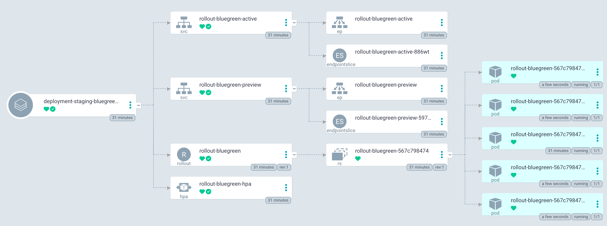

3. staging bluegreen 화면 모니터링

    ```sh
    export BLUE_URL=$(kubectl --context spoke-staging get svc -n bluegreen rollout-bluegreen-active -o jsonpath='{.status.loadBalancer.ingress[0].hostname}')
    export GREEN_URL=$(kubectl --context spoke-staging get svc -n bluegreen rollout-bluegreen-preview -o jsonpath='{.status.loadBalancer.ingress[0].hostname}')
    echo "Staging Blue/Green Blue URL: http://$BLUE_URL"
    echo "Staging Blue/Green Green URL: http://$GREEN_URL"
    ```

    브라우저로 접속

4. image를 `green`으로 변경

    ```sh
    sed -i 's/image: .*/image: argoproj\/rollouts-demo:green/g' $GITOPS_DIR/workload/deploy-workshop/bluegreen/staging/rollout.yaml
    ```

5. git 커밋

    변경 사항을 커밋해 보겠습니다.

    ```sh
    cd $GITOPS_DIR/workload
    git add .
    git commit -m "update image for staging deploy-workshop bluegreen service"
    git push
    ```

    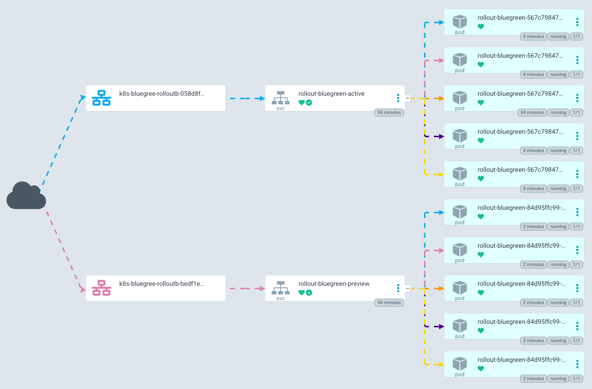
    
    preview 화면이 green으로 전환되는 것을 확인할 수 있습니다.
    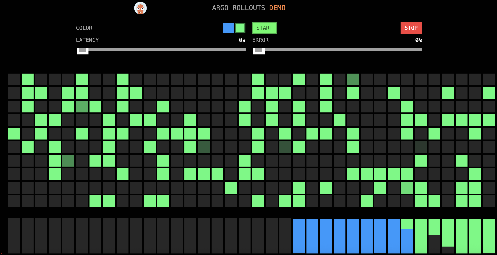

    active 화면은 그대로 blue인 것을 확인할 수 있습니다.
    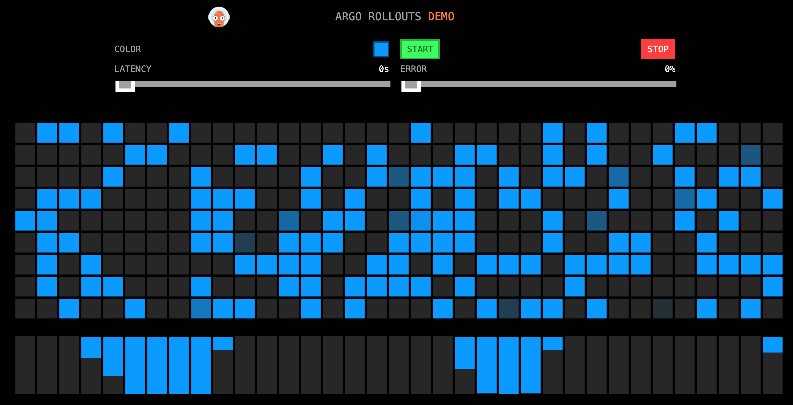

6. 승인

    ```sh
    argocd app actions run deployment-staging-bluegreen-deploy-workshop resume \
      --kind Rollout \
      --resource-name rollout-bluegreen
    ```
    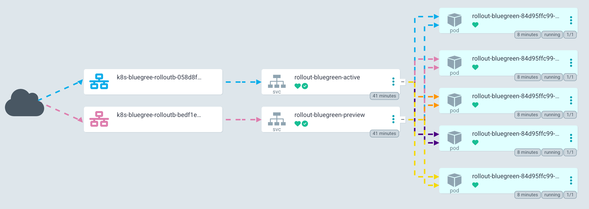
    active, preview모두 green을 가리키며, active화면이 green으로 전환되는 것을 확인 할 수 있습니다.
    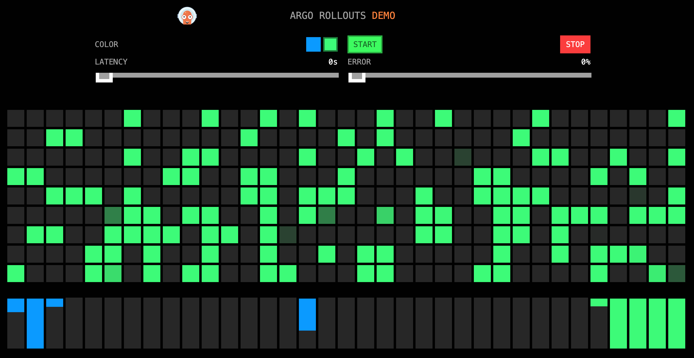


## Argo Rollout: canary(10분)

bluegreen유형에 새로운 버전이 배포되면 어떻게 동작하는지 알아봅니다.

rollout.yaml
```yaml
  strategy:
    canary:
      canaryService: rollout-canary-canary
      stableService: rollout-canary-stable
      steps:
      - setWeight: 20
      - pause: {}
      - setWeight: 40    # 전체 Pod의 40%를 카나리 버전으로
      - pause: {}
      - setWeight: 60
      - pause: {}
      - setWeight: 80
      - pause: {}
```

- 2번째 줄: canary유형을 정의합니다.
- 3번째 줄: stableService는 신규 버전 이전에 서비스하고 있는 서비스를 의미합니다.
- 4번째 줄: canaryService는 신규 버전을 의미합니다.
- 5~13번째 줄: rolling과 비슷하지만 `- pause: {}`이 중간에 추가되었습니다. 이는 명시적으로 승인이 필요하다는 의미입니다. 예제에서는 편의상 한번의 승인 후에는 점진적으로 신규 버전을 늘려가는 방식으로 정의되었습니다.

1. 동작을 좀 더 상세히 보기 위해 staging deploy-workshop bluegreen서비스의 pod수를 조정합니다.

    ```sh
    cat >> $GITOPS_DIR/workload/deploy-workshop/canary/staging/hpa.yaml << 'EOF'
      minReplicas: 5
      maxReplicas: 10
    EOF
    ```

2. git 커밋

    변경 사항을 커밋해 보겠습니다.

    ```sh
    cd $GITOPS_DIR/workload
    git add .
    git commit -m "increas pod for staging deploy-workshop canary service"
    git push
    ```

    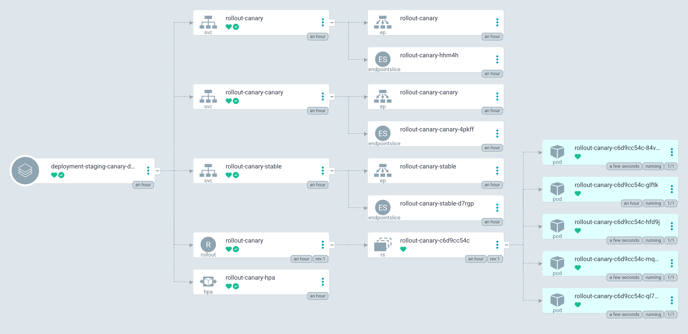

3. staging canary 화면 모니터링

    ```sh
    export CANARY_URL=$(kubectl --context spoke-staging get svc -n canary rollout-canary -o jsonpath='{.status.loadBalancer.ingress[0].hostname}')
    echo "Staing Canary Main URL: http://$CANARY_URL"
    ```

    브라우저로 접속

4. image를 `green`으로 변경

    ```sh
    sed -i 's/image: .*/image: argoproj\/rollouts-demo:green/g' $GITOPS_DIR/workload/deploy-workshop/canary/staging/rollout.yaml
    ```

5. git 커밋

    변경 사항을 커밋해 보겠습니다.

    ```sh
    cd $GITOPS_DIR/workload
    git add .
    git commit -m "update image for staging deploy-workshop canary service"
    git push
    ```

    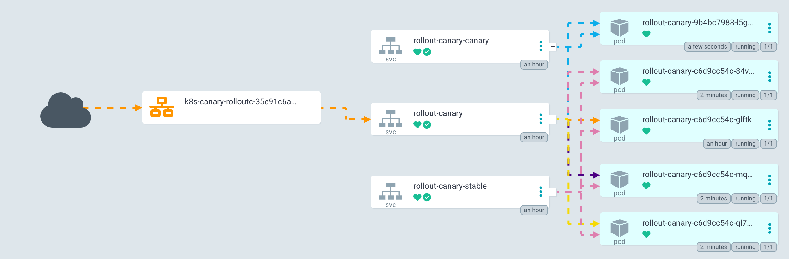
    
    canary 화면이 일부 green으로 전환되는 것을 확인할 수 있습니다.
    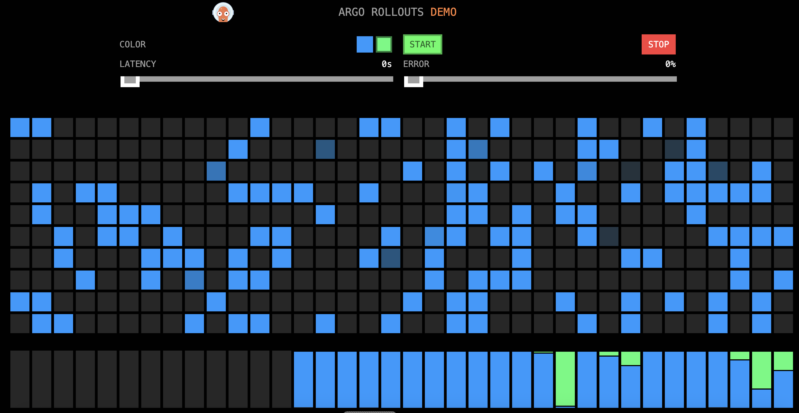

6. 승인

    ```sh
    argocd app actions run deployment-staging-canary-deploy-workshop resume \
      --kind Rollout \
      --resource-name rollout-canary
    ```

    잠시 후 canary화면이 모두 green으로 전환되는 것을 확인 할 수 있습니다.
    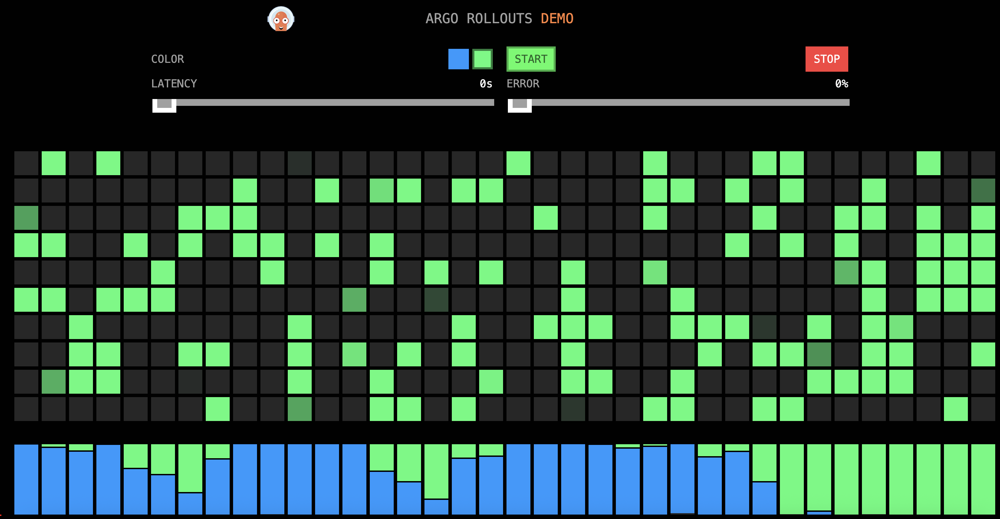


# Karpenter(30분)

EKS AutoMode는 이미 완전관리형 Karpenter가 설치되어 있습니다. 또한 내장 nodepool 2개(system, general-purpose)와 내장 nodeclass(default)하나를 포함하고 있습니다.

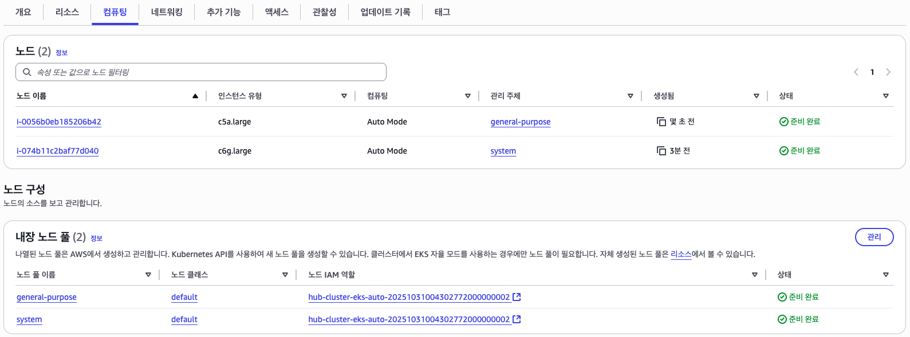

이 장에서는 커스텀 nodepool과 nodeclass를 생성하여 적용해 보도록하겠습니다.

## Karpenter Node: nodepool, nodeclass 만들기(10분)

플랫폼 엔지니어로써 Karpenter Node를 온보딩하겠습니다. 이 작업은 온전히 platform안에서 이루어집니다.

1. dev Karpenter Node 애플리케이션셋 생성

    ```sh
    mkdir -p $GITOPS_DIR/platform/config/karpenter-node
    cat > $GITOPS_DIR/platform/config/karpenter-node/karpenter-node-dev-applicationset.yaml << 'EOF'
    apiVersion: argoproj.io/v1alpha1
    kind: ApplicationSet
    metadata:
      name: create-karpenter-node-dev
      namespace: argocd
    spec:
      goTemplate: true
      syncPolicy:
        preserveResourcesOnDeletion: false
      generators:
        - matrix:
            generators:
              - clusters:
                  selector:
                    matchExpressions:
                      - key: workload_karpenter-node
                        operator: In
                        values: ['true']
                      - key: environment
                        operator: In
                        values: ['dev']
                  values:
                    workload: karpenter-node
              - git:
                  requeueAfterSeconds: 30
                  repoURL: '{{ .metadata.annotations.platform_repo_url }}'
                  revision: '{{ .metadata.annotations.platform_repo_revision }}'
                  directories:
                    - path: '{{ .metadata.annotations.platform_repo_basepath }}config/karpenter-node/dev'
      template:
        metadata:
          name: 'karpenter-node-{{ .metadata.labels.environment }}'
          labels:
            environment: '{{ .metadata.labels.environment }}'
            tenant: 'karpenter-node'
            component: '{{ index .path.segments 2 }}'
            workloads: 'true'
        spec:
          project: default
          source:
            repoURL: '{{ .metadata.annotations.platform_repo_url }}'
            path: '{{ .path.path }}'
            targetRevision: '{{ .metadata.annotations.platform_repo_revision }}'
          destination:
            name: '{{ .name }}'
          syncPolicy:
            automated:
              allowEmpty: true
              prune: true
            retry:
              backoff:
                duration: 1m
    EOF
    ```

2. staging, prod Karpenter Node 애플리케이션셋 생성

    ```sh
    sed -e 's/dev/staging/g' < $GITOPS_DIR/platform/config/karpenter-node/karpenter-node-dev-applicationset.yaml > $GITOPS_DIR/platform/config/karpenter-node/karpenter-node-staging-applicationset.yaml
    sed -e 's/dev/prod/g' < $GITOPS_DIR/platform/config/karpenter-node/karpenter-node-dev-applicationset.yaml > $GITOPS_DIR/platform/config/karpenter-node/karpenter-node-prod-applicationset.yaml
    ```

3. dev nodepool 생성

    ```sh
    mkdir -p $GITOPS_DIR/platform/config/karpenter-node/dev
    cat > $GITOPS_DIR/platform/config/karpenter-node/dev/nodepool.yaml << 'EOF'
    apiVersion: karpenter.sh/v1
    kind: NodePool
    metadata:
      name: custom-nodepool
    spec:
      disruption:
        budgets:
          - nodes: 10%
        consolidateAfter: 30s
        consolidationPolicy: WhenEmptyOrUnderutilized
      template:
        metadata:
          labels:
            workload: 'custom'
        spec:
          expireAfter: 336h
          nodeClassRef:
            group: eks.amazonaws.com
            kind: NodeClass
            name: custom-nodeclass
          requirements:
            - key: karpenter.sh/capacity-type
              operator: In
              values:
                - on-demand
            - key: eks.amazonaws.com/instance-category
              operator: In
              values:
                - m
            - key: eks.amazonaws.com/instance-generation
              operator: Gt
              values:
                - "4"
            - key: kubernetes.io/arch
              operator: In
              values:
                - amd64
            - key: kubernetes.io/os
              operator: In
              values:
                - linux
          terminationGracePeriod: 24h0m0s
          taints:
            - key: workload
              value: custom
              effect: NoSchedule
    EOF
    ```

4. default nodeclass로 부터 dev nodeclass 생성

    ```sh
    kubectl get nodeclass default -o yaml --context hub-cluster | sed '/^  annotations:/,/^  finalizers:/{
      /^  annotations:/d
      /eks.amazonaws.com\/nodeclass-hash/d
    }
    /^  finalizers:/,/^[^ ]/{
      /^  finalizers:/d
      /^  -/d
    }
    /^  creationTimestamp:/d
    /^  generation:/d
    /^  labels:/,/^  name:/{
      /^  labels:/d
      /app.kubernetes.io\/managed-by:/d
    }
    /^  resourceVersion:/d
    /^  uid:/d
    /^status:/,$d
    s/name: default$/name: custom-nodeclass/' > $GITOPS_DIR/platform/config/karpenter-node/dev/nodeclass.yaml
    ```

5. dev kustomization 생성

    ```sh
    cat > $GITOPS_DIR/platform/config/karpenter-node/dev/kustomization.yaml << 'EOF'
    apiVersion: kustomize.config.k8s.io/v1beta1
    kind: Kustomization
    resources:
    - nodepool.yaml
    - nodeclass.yaml
    EOF
    ```

6. staging nodepool 생성

    ```sh
    mkdir -p $GITOPS_DIR/platform/config/karpenter-node/staging
    cp -r $GITOPS_DIR/platform/config/karpenter-node/dev/nodepool.yaml $GITOPS_DIR/platform/config/karpenter-node/staging/nodepool.yaml
    ```

7. default nodeclass로 부터 staging nodeclass 생성

    ```sh
    kubectl get nodeclass default -o yaml --context spoke-staging | sed '/^  annotations:/,/^  finalizers:/{
      /^  annotations:/d
      /eks.amazonaws.com\/nodeclass-hash/d
    }
    /^  finalizers:/,/^[^ ]/{
      /^  finalizers:/d
      /^  -/d
    }
    /^  creationTimestamp:/d
    /^  generation:/d
    /^  labels:/,/^  name:/{
      /^  labels:/d
      /app.kubernetes.io\/managed-by:/d
    }
    /^  resourceVersion:/d
    /^  uid:/d
    /^status:/,$d
    s/name: default$/name: custom-nodeclass/' > $GITOPS_DIR/platform/config/karpenter-node/staging/nodeclass.yaml
    ```

8. staging kustomization 생성

    ```sh
    mkdir -p $GITOPS_DIR/platform/config/karpenter-node/staging
    cp -r $GITOPS_DIR/platform/config/karpenter-node/dev/kustomization.yaml $GITOPS_DIR/platform/config/karpenter-node/staging/kustomization.yaml
    ```

9.  git 커밋

    ```sh
    cd $GITOPS_DIR/platform
    git add .
    git commit -m "add karpenter-node applicationset and values"
    git push
    ```

10. hub, spoke-staging 클러스터에 nodepool, nodeclass 생성

    ```sh
    sed -i 's/{ workload_deploy-workshop = true }/{ workload_deploy-workshop = true },\n    { workload_karpenter-node = true }/g' ~/environment/hub/main.tf
    sed -i 's/{ workload_deploy-workshop = true }/{ workload_deploy-workshop = true },\n    { workload_karpenter-node = true }/g' ~/environment/spoke/main.tf
    ```

11. hub 클러스터 변경사항을 적용

    ```sh
    cd ~/environment/hub
    terraform apply --auto-approve
    ```

    ```sh
    cd ~/environment/spoke
    terraform workspace select staging
    terraform apply --auto-approve
    ```


9. 검증

    hub-cluster, spoke-staging에서 `workload_karpenter-node=true`라벨이 추가된 것을 확인할 수 있습니다.

    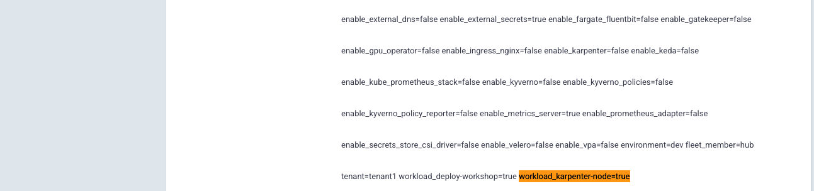

    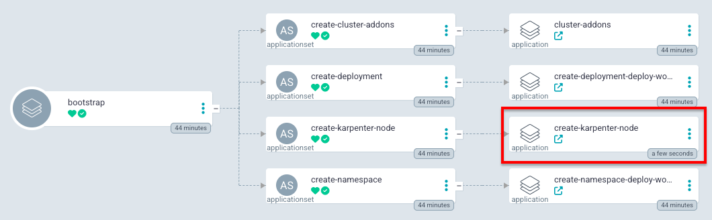

    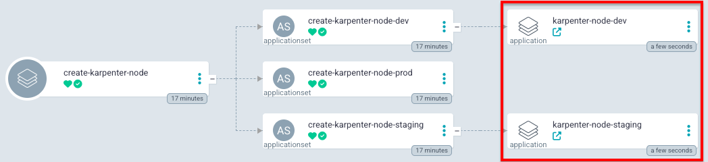

    kubenetes에서 확인:
    ```sh
    echo "hub-cluster nodepool:"
    kubectl get nodepool --context hub-cluster
    echo "hub-cluster nodeclass:"
    kubectl get nodeclass --context hub-cluster
    echo "spoke-staging nodepool:"
    kubectl get nodepool --context spoke-staging
    echo "spoke-staging nodeclass:"
    kubectl get nodeclass --context spoke-staging
    ```

    결과:
    ```sh
    hub-cluster nodepool:
    NAME              NODECLASS          NODES   READY   AGE
    custom-nodepool   custom-nodeclass   0       True    62m
    general-purpose   default            1       True    131m
    system            default            0       True    131m
    hub-cluster nodeclass:
    NAME               ROLE                                              READY   AGE
    custom-nodeclass   hub-cluster-eks-auto-20251031004302772000000002   True    62m
    default            hub-cluster-eks-auto-20251031004302772000000002   True    131m
    spoke-staging nodepool:
    NAME              NODECLASS          NODES   READY   AGE
    custom-nodepool   custom-nodeclass   0       True    62m
    general-purpose   default            1       True    109m
    system            default            0       True    109m
    spoke-staging nodeclass:
    NAME               ROLE                                                READY   AGE
    custom-nodeclass   spoke-staging-eks-auto-20251031010314563800000005   True    2m4s
    default            spoke-staging-eks-auto-20251031010314563800000005   True    109m
    ```

## staging deploy-workshop 노드 변경(10분)

이 장에서는 staging에 배포되어있는 deploy-workshop 서비스들이 custom 노드를 사용하도록 변경해보도록하겠습니다.

custom-nodepool에는 아래와 같이 taint가 정의되어 있습니다. 이는 일치하는 toleration key, value를 가지지 않은 pods는 스케쥴링되지 않도록 합니다.

```yaml
          taints:
            - key: workload
              value: custom
              effect: NoSchedule
```

toleration의 예
```yaml
tolerations:
  - key: workload
    operator: Equal
    value: custom
    effect: NoSchedule
nodeSelector:
  workload: custom
```

1. deploy-workshop 서비스 rollout template에 toleration 및 nodeSelector 추가

    ```sh
    cat >> $GITOPS_DIR/workload/deploy-workshop/rolling/staging/rollout.yaml << 'EOF'
          tolerations:
          - key: workload
            operator: Equal
            value: custom
            effect: NoSchedule
          nodeSelector:
            workload: custom
    EOF

    cat >> $GITOPS_DIR/workload/deploy-workshop/bluegreen/staging/rollout.yaml << 'EOF'
          tolerations:
          - key: workload
            operator: Equal
            value: custom
            effect: NoSchedule
          nodeSelector:
            workload: custom
    EOF

    cat >> $GITOPS_DIR/workload/deploy-workshop/canary/staging/rollout.yaml << 'EOF'
          tolerations:
          - key: workload
            operator: Equal
            value: custom
            effect: NoSchedule
          nodeSelector:
            workload: custom
    EOF
    ```

2. git 커밋

    ```sh
    cd $GITOPS_DIR/workload
    git add .
    git commit -m "update node for deploy-workshop services"
    git push
    ```
3. bluegreen, canary 승인

    > **주의**
    > 
    > 승인 가능상태가 되려면 몇 분 기다려야합니다.

    ```sh
    argocd app actions run deployment-staging-bluegreen-deploy-workshop resume \
      --kind Rollout \
      --resource-name rollout-bluegreen
    ```

    ```sh
    argocd app actions run deployment-staging-canary-deploy-workshop resume \
      --kind Rollout \
      --resource-name rollout-canary
    ```

4. 검증

    ```sh
    kubectl get nodes -L karpenter.sh/nodepool --spoke-staging
    ```

    결과:
    ```sh
    NAME                  STATUS   ROLES    AGE     VERSION               NODEPOOL
    i-0bed9823f67129725   Ready    <none>   140m    v1.32.8-eks-e386d34   general-purpose
    i-0ccde876d8c3ff5ee   Ready    <none>   3m17s   v1.32.8-eks-e386d34   custom-nodepool
    ```

    pod를 조회하여 노드 확인:
    ```sh
    kubectl get pods -A -o custom-columns=NAMESPACE:.metadata.namespace,NAME:.metadata.name,NODE:.spec.nodeName \
    | egrep '^(NAMESPACE|rolling|bluegreen|canary)[[:space:]]'
    ```

    ```sh
    NAMESPACE       NAME                                 NODE
    bluegreen       rollout-bluegreen-7ffbf4cb75-68t6h   i-0ccde876d8c3ff5ee
    bluegreen       rollout-bluegreen-7ffbf4cb75-gjhpc   i-0ccde876d8c3ff5ee
    bluegreen       rollout-bluegreen-7ffbf4cb75-pb26t   i-0ccde876d8c3ff5ee
    bluegreen       rollout-bluegreen-7ffbf4cb75-pfqqv   i-0ccde876d8c3ff5ee
    bluegreen       rollout-bluegreen-7ffbf4cb75-rpwsf   i-0ccde876d8c3ff5ee
    canary          rollout-canary-54ccf6f884-5tqjd      i-0ccde876d8c3ff5ee
    canary          rollout-canary-54ccf6f884-9278p      i-0ccde876d8c3ff5ee
    canary          rollout-canary-54ccf6f884-flhsd      i-0ccde876d8c3ff5ee
    canary          rollout-canary-54ccf6f884-v8v6r      i-0ccde876d8c3ff5ee
    canary          rollout-canary-54ccf6f884-wm79d      i-0ccde876d8c3ff5ee
    rolling         rollout-rolling-77cfd7c59c-9xt4c     i-0ccde876d8c3ff5ee
    rolling         rollout-rolling-77cfd7c59c-fd8mr     i-0ccde876d8c3ff5ee
    rolling         rollout-rolling-77cfd7c59c-lwp95     i-0ccde876d8c3ff5ee
    rolling         rollout-rolling-77cfd7c59c-tps2q     i-0ccde876d8c3ff5ee
    rolling         rollout-rolling-77cfd7c59c-vq9w7     i-0ccde876d8c3ff5ee
    ```

## Scaleout(10분)

EKS 노드그룹이 Auto Scaling Group을 통해 노드를 관리하는 것과 Karpenter는 노드를 직접 관리합니다. 

이번 장에서는 deploy-workshop canary 서비스를 이용하여 hpa를 통해 pod가 확장되고 Karpenter 노드가 확장되는 것을 테스트해보도록합니다.

1. hpa 조정

    ```sh
    sed -E -i 's/averageUtilization: 50/averageUtilization: 5/g; s/maxReplicas: 10/maxReplicas: 30/g' $GITOPS_DIR/workload/deploy-workshop/canary/staging/hpa.yaml
    ```

    결과:
    ```yaml
    apiVersion: autoscaling/v2
    kind: HorizontalPodAutoscaler
    metadata:
      name: rollout-canary-hpa
    spec:
      metrics:
      - type: Resource
        resource:
          name: cpu
          target:
            type: Utilization
            averageUtilization: 5
      minReplicas: 5
      maxReplicas: 30
    ```

    - averageUtilization: cpu 사용률이 5%가 넘으면 scaleout이 일어나도록 극단적으로 변경했습니다.
    - maxReplicas: pod가 최대 30개까지 늘어나도록 변경하여 node의 scaleout을 유도했습니다.

2. git 커밋

    ```sh
    cd $GITOPS_DIR/workload
    git add .
    git commit -m "update hpa for staging deploy-workshop canary services"
    git push
    ```

3. 검증

    argocd 화면에서 pod가 증가한 것을 확인할 수 있습니다.

    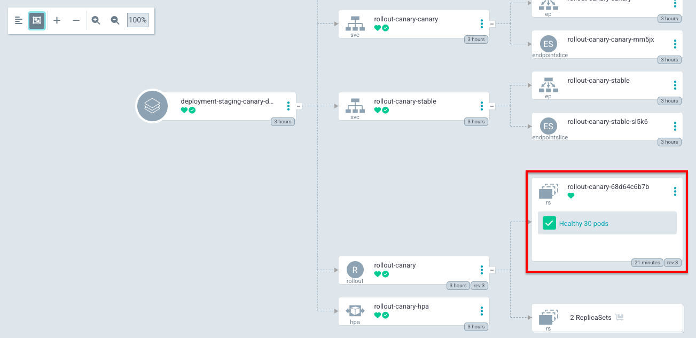

    ```sh
    kubectl get nodes -L karpenter.sh/nodepool -L beta.kubernetes.io/instance-type --context spoke-staging
    ```

    node 목록을 조회하여 node가 추가된 것을 확인할 수 있습니다.
    ```
    NAME                  STATUS   ROLES    AGE     VERSION               NODEPOOL          INSTANCE-TYPE
    i-0bed9823f67129725   Ready    <none>   3h23m   v1.32.8-eks-e386d34   general-purpose   c5a.large
    i-0ccde876d8c3ff5ee   Ready    <none>   66m     v1.32.8-eks-e386d34   custom-nodepool   m5a.large
    i-0f688f75c979b4955   Ready    <none>   6m1s    v1.32.8-eks-e386d34   custom-nodepool   m5a.large
    ```

4. 원상 복구

    ```sh
    sed -E -i 's/averageUtilization: 5/averageUtilization: 50/g; s/maxReplicas: 30/maxReplicas: 10/g' $GITOPS_DIR/workload/deploy-workshop/canary/staging/hpa.yaml
    ```

5. git 커밋

    ```sh
    cd $GITOPS_DIR/workload
    git add .
    git commit -m "rollback hpa for staging deploy-workshop canary services"
    git push
    ```

6. 검증
   
    최대 pod개수가 10개로 줄었기 때문에 즉시 20개의 pod가 사라지고 나머지는 점차 줄어듭니다. `-w` 옵션을 사용하면 이 과정을 지켜볼 수 있습니다.

    ```sh
    kubectl get hpa --namespace canary --context spoke-staging -w
    ```
