독립형 Argo CD 배포
---

이 모듈에서는 단일 Amazon EKS 클러스터 내에 독립형 ArgoCD 인스턴스를 배포합니다 . 이 독립형 설정은 Argo CD가 관리하는 워크로드 및 Kubernetes 애드온과 함께 배치되는 단일 클러스터 내의 리소스를 관리하는 데 이상적입니다.

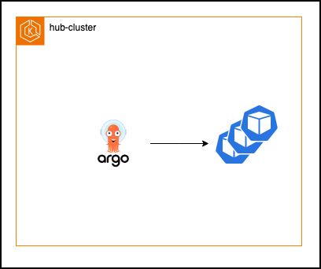

책임을 명확히 하기 위해 두 가지 주요 역할을 정의합니다. 플랫폼 엔지니어 및 개발자.

- 플랫폼 엔지니어는 VPC, EKS 클러스터 생성, Kubernetes 애드온 관리, 애플리케이션 온보딩 등 인프라 프로비저닝을 담당합니다.
- 개발자는 배포, ConfigMap 및 기타 워크로드 관련 리소스를 포함하여 워크로드별 Kubernetes 매니페스트를 정의하고 유지 관리하는 데 중점을 둡니다.

# Git 저장소 개요(10분)

이 장에서는 gitea를 사용하여 세 개의 Git 저장소를 작업합니다. IDE 인스턴스에 사전 설치된 서버:

**개발자 저장소**

- eks-blueprints-workshop-gitops-apps - 웹스토어 마이크로서비스 워크로드에 대한 Kubernetes 매니페스트가 포함되어 있습니다.

**플랫폼 저장소**

- eks-blueprints-workshop-gitops-platform - 네임스페이스 생성 및 워크로드 배포를 자동화하는 인프라 코드가 포함되어 있습니다.
- eks-blueprints-workshop-gitops-addons - Kubernetes 추가 기능 매니페스트 및 구성 값이 포함되어 있습니다.

워크로드와 플랫폼 저장소를 분리하면 개발자와 플랫폼 엔지니어의 역할과 책임이 서로 다르다는 것을 알 수 있습니다.

이 워크숍에서는 편의를 위해 Gitea를 사용하지만, GitHub, GitLab, Bitbucket과 같은 Git 관리 시스템을 대체 시스템으로 사용할 수 있습니다.

## Gitea 대시보드

Gitea 서버에 접속하면 저장소를 볼 수 있습니다.

Gitea URL을 찾으려면 다음을 실행하세요.

```sh
gitea_credentials
```

> **중요한**
> 
> 워크숍 전체에서 여러 bash 함수를 사용합니다. 함수에 대해 자세히 알아보려면 다음을 실행하여 `type <function_name>`해당 소스 파일을 찾을 수 있습니다.
> ```sh
> type gitea_credentials
> ```
> 
> 예제 출력
> 
> ```sh
> gitea_credentials is a shell function from /home/ec2-user/.bashrc.d/argocd.bash
> ```

출력 예

```sh
Gitea Username: workshop-user
Gitea Password: 8yJPQ4IMsW97EQdKXJXGqRlIty6n3B
https://d3aeqzejs2v8j.cloudfront.net/gitea/workshop-user/
출력 링크를 클릭하면 브라우저에서 열 수 있습니다. 처음에는 제공된 로그인 정보와 비밀번호를 입력해야 합니다.
```


로그인 후 저장소와 파일을 탐색할 수 있습니다.


# ArgoCD 설치(15분)

이 장에서는 플랫폼 엔지니어로서 EKS 클러스터에 ArgoCD를 설치합니다.

**Terraform 대신 Argo CD를 사용하여 Kubernetes 리소스를 배포하는 이유는 무엇입니까?**

> Terraform과 Argo CD는 모두 유용한 인프라 자동화 도구이지만, 각기 다른 용도로 사용됩니다. Terraform은 VPC, EKS 클러스터, RDS 인스턴스와 같은 인프라 구성 요소를 프로비저닝하는 데 탁월합니다. 하지만 Terraform을 사용하면 애드온 설치, 워크로드 배포, 네임스페이스 생성과 같은 지속적인 쿠버네티스 작업을 관리하는 것이 복잡해질 수 있습니다.
> 
> Argo CD는 쿠버네티스 리소스의 지속적 배포(CD)를 전문으로 합니다. 클러스터 상태를 지속적으로 모니터링하고 모든 구성 변동 사항을 Git에 정의된 원하는 상태로 자동으로 동기화합니다. 따라서 Argo CD는 쿠버네티스 애플리케이션 및 구성의 수명 주기를 관리하는 데 매우 적합합니다.
> 
> 주요 차이점은 Terraform은 일회성 프로비저닝을 수행하는 반면, Argo CD는 지속적인 조정을 제공한다는 것입니다. Terraform과 달리 Argo CD는 인프라 변경 사항을 적극적으로 모니터링하고 라이브 상태가 Git과 다를 때 알림을 제공합니다.

## GitOps Bridge로 Argo CD 설치

이 장에서는 GitOps Bridge를 사용하여 허브 클러스터에 Argo CD를 설치합니다. GitOps Bridge는 클러스터에 대한 레이블 및 주석과 같은 메타데이터를 저장하는 Kubernetes 시크릿도 생성합니다.


1. GitOps Bridge 구성

    GitOps Bridge는 최소한의 설정으로 Argo CD를 작동시키기 위한 초기 구성을 처리합니다.

    ```sh
    cat <<'EOF' >> ~/environment/hub/main.tf
    provider "helm" {
      kubernetes {
        host                   = module.eks.cluster_endpoint
        cluster_ca_certificate = base64decode(module.eks.cluster_certificate_authority_data)

        exec {
          api_version = "client.authentication.k8s.io/v1beta1"
          command     = "aws"
          # This requires the awscli to be installed locally where Terraform is executed
          args = ["eks", "get-token", "--cluster-name", module.eks.cluster_name, "--region", local.region]
        }
      }
    }

    locals{
      argocd_namespace = "argocd"
      environment = "dev"
    }

    resource "kubernetes_namespace" "argocd" {
      metadata {
        name = local.argocd_namespace
      }
    }
    ################################################################################
    # GitOps Bridge: Bootstrap
    ################################################################################
    module "gitops_bridge_bootstrap" {
      source = "gitops-bridge-dev/gitops-bridge/helm"
      version = "0.1.0"
      cluster = {
        cluster_name = module.eks.cluster_name
        environment = local.environment
        #enableannotation metadata     = local.annotations
        #enableaddons addons       = local.addons
      }

      #enableapps apps = local.argocd_apps
      argocd = {
        name = "argocd"
        namespace        = local.argocd_namespace
        chart_version    = "7.8.13"
        values = [file("${path.module}/argocd-initial-values.yaml")]
        timeout          = 600
        create_namespace = false
      }
    }
    EOF
    ```

2. Argo CD에 대한 값 파일을 만듭니다.

    ```sh
    cat <<'EOF' >> ~/environment/hub/argocd-initial-values.yaml
    global:
      tolerations:
      - key: "CriticalAddonsOnly"
        operator: "Exists"
    configs:
      cm:
        timeout.reconciliation: 30s
      params:
        server.insecure: true

    server:
      resources:
        requests:
          cpu: 300m
          memory: 512Mi
      service:
        type: LoadBalancer
        port: 80
        targetPort: 8080
        annotations:
          service.beta.kubernetes.io/aws-load-balancer-scheme: internet-facing
    repoServer:
      resources:
        requests:
          cpu: 300m
          memory: 512Mi

    controller:
      resources:
        requests:
          cpu: 300m
          memory: 512Mi

    EOF
    ```

3. Terraform 적용

    ```sh
    cd ~/environment/hub
    terraform init
    terraform apply -auto-approve
    ```

4. Argo CD 설치 확인

    Argo CD 대시보드 URL을 검색하려면 다음을 실행하세요.

    > 중요
    > 
    > 로드 밸런서를 프로비저닝하는 데도 몇 분이 걸립니다.

    ```sh
    argocd_hub_credentials
    ```

    위에 있는 명령어에서 Argo CD 비밀번호를 복사한 후, 사용자 이름(username)으로 `admin`을 사용하여 Argo CD UI에 로그인합니다.

    출력 링크를 클릭하고 **'열기'**를 선택하면 Argo CD 사용자 인터페이스에 액세스할 수 있습니다.

    > 메모
    > 
    > 이 워크숍 환경에서는 편의성을 위해 HTTP 프로토콜을 사용합니다. 하지만 운영 환경에서는 안전한 통신을 위해 항상 HTTPS 프로토콜을 사용해야 합니다.

    GitOps Bridge가 Argo CD를 설치하면 기본 관리자 계정과 자동 생성된 비밀번호를 사용하여 Argo CD 대시보드에 액세스할 수 있습니다. **Argo CD UI의 설정 > 클러스터** 에서 허브 클러스터가 이미 등록되어 있는 것을 확인할 수 있습니다 . 즉, Argo CD가 허브 클러스터를 관리할 수 있는 기능을 갖추고 있음을 의미합니다.

    

    또한 gitops-bridge가 argocd 네임스페이스에서 이 EKS 클러스터에 대한 Secret을 올바르게 생성했는지 확인할 수 있습니다.

    ```sh
    kubectl --context hub-cluster get secrets -n argocd hub-cluster
    ```

    예상 출력:

    ```
    NAME          TYPE     DATA   AGE
    hub-cluster   Opaque   3      4m41s
    ```
# ArgoCD 및 GitOps Bridge 기능의 기본 사항(50분)

이 장에서는 ArgoCD 객체를 살펴보고 ArgoCD의 GitOps Bridge 기능을 살펴보겠습니다.

## Application (20분)

Kubernetes manifast를 배포하려면 로컬 manifast 파일(배포할 대상)과 대상 EKS 클러스터(배포할 위치)라는 두 가지 주요 정보가 필요합니다. 예를 들면 다음과 같습니다.

```sh
kubectl apply -f ./local-path-to-manifest.yaml --context hub-cluster
```

이 명령은 매니페스트를 허브 클러스터에 배포합니다.

Argo CD는 Application 객체를 사용하여 유사한 접근 방식을 따릅니다. Git에서 배포할 내용과 배포할 위치(대상 클러스터 및 네임스페이스)를 정의합니다.

### guestbook 애플리케이션 생성

이 섹션에서는 guestbook ArgoCD 애플리케이션을 만들어 보겠습니다. 이 애플리케이션은 애플리케이션 저장소의 코드를 허브 클러스터에 배포합니다.


1. guestbook ArgoCD Application 생성

    ArgoCD **Application** 은 ArgoCD에 Git에서 배포할 내용과 배포 위치를 알려주는 특수한 쿠버네티스 객체(CRD)입니다. 클러스터의 실제 상태를 지속적으로 확인하고 Git의 상태와 자동으로 동기화합니다.

    이 단계에서는 ArgoCD Application을 배포합니다. 각 Application은 다음을 지정해야 합니다.

    - Source: 매니페스트가 포함된 Git 저장소.
    - Destination: 대상 Kubernetes 클러스터 및 네임스페이스.
    아래 예시에서는 소스(13번째 줄, `<<APP REPO URL>>` )와 대상(16번째 줄, `<<CLUSTER NAME>>`)에 대한 자리 표시자가 있습니다. 이후 단계에서 이를 업데이트하겠습니다.

    ```sh
    mkdir -p ~/environment/basics
    cd ~/environment/basics
    cat <<'EOF' >> ~/environment/basics/guestbook.yaml
    apiVersion: argoproj.io/v1alpha1
    kind: Application
    metadata:
      name: guestbook
      namespace: argocd
    spec:
      project: default
      # Source of the application manifests
      source:
        repoURL: <<APP REPO URL>> 
        path: guestbook
      destination:
        name: <<CLUSTER NAME>>
        namespace: guestbook   
      syncPolicy:
        automated: 
          prune: true
    EOF
    ```

    VSCode에서 방명록 작업 열기

    ```sh
    code ~/environment/basics/guestbook.yaml
    ```

2. 소스 업데이트(repoURL)

    "eks-blueprints-workshop-gitops-apps"에 방명록 매니페스트 파일을 채웁니다.

    우리는 이미 이 저장소를 로컬 "gitops-repos/workload" 폴더에 복제했습니다.

    ```sh
    mkdir -p "${GITOPS_DIR}/workload/guestbook"
    cp -r /home/ec2-user/eks-blueprints-for-terraform-workshop/gitops/workload/guestbook/* "${GITOPS_DIR}/workload/guestbook/"
    ```

    애플리케이션 Git 저장소에 변경 사항을 푸시해 보겠습니다.

    ```sh
    cd ~/environment/gitops-repos/workload
    git add .
    git commit -m "initial guestbook"
    git push --set-upstream origin main
    ```

    gitea 대시보드로 이동하여 애플리케이션 저장소(eks-blueprints-workshop-gitops-apps)의 HTTPS URL을 복사합니다.

    터미널에서 다음을 실행하여 gitea 대시보드 URL을 가져옵니다.

    ```
    gitea_credentials
    ```

    

    저장소에 guestbook이 포함되어 있는 것을 볼 수 있습니다.

    이전 단계의 `<<APP REPO URL>>`을 애플리케이션 저장소 URL로 교체합니다.

    

3. ArgoCD를 구성하여 Git 저장소에 액세스

    ArgoCD cli를 사용하여 ArgoCD에 git 저장소에 대한 액세스 권한을 부여해 보겠습니다.

    `<APP_REPO_URL>`을 2단계에서 복사한 HTTPS URL로 바꾸세요. gitea_credentials 명령어에서 사용된 URL은 사용하지 마세요. gitea 대시보드의 URL입니다.

    <GIT_PASSWORD>을 2단계에서 workshop-user의 비밀번호로 바꾸세요 . 이 비밀번호는 gitea_credentials에 표시되는 비밀번호입니다. Gitea 저장소는 편의를 위해 대시보드와 동일한 비밀번호를 사용합니다.

    ```sh
    argocd repo add <APP_REPO_URL> --name guestbookrepo --username workshop-user --password <GIT_PASSWORD>
    ```

    다음과 같은 형태입니다.
    
    ```sh
    argocd repo add https://d2exxxxxxxx.cloudfront.net/gitea/workshop-user/eks-blueprints-workshop-gitops-apps.git --username workshop-user --password pmQ5mWKM3aiISbVvxxxxxxx
    ```

    ArgoCD 대시보드에서 새로 생성된 git 저장소의 유효성을 검사할 수 있습니다. **설정 > 저장소**로 이동하세요.

    

4. 목적지 업데이트

    GitOps Bridge는 이미 ArgoCD에 hub-cluster에 대한 액세스 권한을 제공했습니다.

    ArgoCD 대시보드 > 설정 > 클러스터 > hub-cluster로 이동합니다. 클러스터 이름(예: hub-cluster)을 기록해 둡니다.

    

    guestbook 매니페스트의 `<<CLUSTER NAME>>`을 클러스터 이름(예: hub-cluster)으로 바꾸세요 .

    

5. 파일을 저장합니다

    파일을 업데이트했습니다. 파일을 저장하세요.

    햄버거 > File > Save을 클릭하세요

6. 방명록 매니페스트 적용

    이 매니페스트를 적용하면:

    - ArgoCD는 Application 객체를 생성합니다.
    - ArgoCD는 리소스(배포, 서비스, Pod)를 허브 클러스터에 동기화하고 배포합니다.

    ```sh
    kubectl create ns guestbook
    kubectl apply -f ~/environment/basics/guestbook.yaml
    ```

7. 응용 프로그램 확인
    
    ArgoCD 웹 UI로 이동하세요. 방명록 애플리케이션이 나열되어 있어야 합니다.

    

    방명록을 클릭하면 방명록 애플리케이션에서 생성된 모든 리소스를 볼 수 있습니다.

    Application(svc,deployment, replicaset, pods)에서 생성된 리소스를 확인할 수 있습니다.

    ```sh
    kubectl get all -n guestbook
    ```

### 자동 조정(Auto Reconciliation)

이 섹션에서는 애플리케이션 git 저장소의 manifest를 수정하고 클러스터에서 자동으로 조정되는 모습을 살펴보겠습니다.

1. 복제본 수 업데이트
    
    현재 guestbook-ui-deployment.yaml의 replicas는 1입니다. replica를 3으로 업데이트해 보겠습니다.

    ```sh
    sed -i 's/replicas: 1/replicas: 3/g' ~/environment/gitops-repos/workload/guestbook/guestbook-ui-deployment.yaml
    ```

    Application Git 저장소에 변경 사항을 푸시해 보겠습니다.

    ```sh
    cd ~/environment/gitops-repos/workload
    git add .
    git commit -m "updated replica count to 3"
    git push 
    ```

2. 자동 조정 검증

    ArgoCD가 애플리케이션 Git 저장소와 조정되어 3개의 복제본에 배포된 것을 확인할 수 있습니다. 3개의 Pod가 표시되어야 합니다.

    **Argo CD는 30초**마다 Git 저장소에서 변경 사항을 폴링하고 (이 워크숍에서 설정한 대로), 모든 업데이트를 클러스터에 자동으로 동기화합니다. 서버 부하가 높으면 조정에 **1~2분 정도 걸릴 수 있습니다.**

    **서버가 바쁠 수 있으므로 조정하는 데 1~2분이 걸릴 수 있습니다.**

    ```sh
    kubectl get pods -n guestbook
    ```

3. 정리

    ArgoCD CLI를 사용하여 애플리케이션과 관리되는 리소스를 삭제합니다.

    ```sh
    argocd app delete guestbook --cascade -y
    kubectl delete ns guestbook --force
    ```

    > 메모
    > 
    > 리소스를 삭제하는 데 몇 분이 걸릴 수 있습니다.


## ApplicationSet (20분)

이전 장에서는 ArgoCD Application 객체를 사용하여 허브 클러스터에 애플리케이션을 배포했습니다. 동일한 애플리케이션을 스포크 클러스터에 배포하려면 다른 ArgoCD 애플리케이션을 수동으로 생성해야 합니다.


Argo CD는 매번 이런 작업을 수행하는 대신, 확장성과 자동화성이 더 뛰어난 솔루션인 **ApplicationSet**을 제공합니다.


ApplicationSet은 ArgoCD 애플리케이션의 팩토리라고 생각하면 됩니다. 템플릿을 정의하고 생성기를 사용하여 여러 애플리케이션 객체를 생성합니다.


### 정적 목록 생성기

방명록 ArgoCD 애플리케이션을 클러스터 목록에 배포하는 ApplicationSet을 만들어 보겠습니다. 이 예에서는 hub-cluster에 배포합니다.

1. guestbook ApplicationSet 만들기

    ```sh
    cd ~/environment/basics
    cat <<'EOF' >> ~/environment/basics/guestbookApplicationSet.yaml
    apiVersion: argoproj.io/v1alpha1
    kind: ApplicationSet
    metadata:
      name: guestbook
      namespace: argocd
    spec:
      goTemplate: true
      goTemplateOptions: ["missingkey=error"]
      generators:
      - list:
          elements:
          - cluster: hub-cluster
            name: hub-cluster
          # - cluster: spoke-cluster
          #  name: spoke-cluster

      template:
        metadata:
          name: '{{.cluster}}-guestbook'
        spec:
          project: "default"
          source:
            repoURL: <<APP REPO URL>>
            path: guestbook
            targetRevision: HEAD
          destination:
            name: '{{.name}}'
            namespace: guestbook
          syncPolicy:
            automated: {}        

    EOF
    ```

2. repoURL 업데이트

    이 ApplicationSet은 Git 저장소 URL에 대한 자리 표시자를 사용하고 있습니다 `<<APP REPO URL>>`. 이 단계에서는 Guestbook 앱 저장소의 실제 URL로 업데이트합니다.

    VSCode에서 guestbook ApplicationSet을 엽니다.

    ```sh
    code ~/environment/basics/guestbookApplicationSet.yaml
    ```

    gitea 대시보드로 이동하여 애플리케이션 저장소(eks-blueprints-workshop-gitops-apps)의 HTTPS URL을 복사합니다.

    > Gitea 대시보드 URL
    > 
    > 터미널에서 gitea url에 대한 다음 명령을 실행합니다.
    > ```sh
    > gitea_credentials
    > ```
    
    `<<APP REPO URL>>`을 애플리케이션 저장소 URL로 **교체**

3. 파일을 저장합니다

    파일을 업데이트했습니다. 파일을 저장하세요.

    햄버거 > File > Save을 클릭하세요

4. 정적 목록 생성기 적용

    manifest를 적용하세요
    ```sh
    kubectl create ns guestbook
    kubectl apply -f ~/environment/basics/guestbookApplicationSet.yaml
    ```

5. 신청서 확인

    ArgoCD 웹 UI로 이동하세요. 방명록 ArgoCD 애플리케이션이 나열되어 있어야 합니다.

    

    spoke-cluster를 만든 후 spoke-cluster 섹션의 주석 처리를 제거하면 해당 클러스터를 타겟으로 하는 두 번째 애플리케이션이 자동으로 생성됩니다.

3. 정리하기

    ```sh
    argocd appset delete guestbook  -y
    kubectl delete ns guestbook --force
    kubectl get secrets -n argocd -o json | jq -r '
      .items[]
      | select(.data != null)
      | select(any(.data[]?; @base64d == "guestbookrepo"))
      | .metadata.name
    ' | xargs -r -I{} kubectl delete secret -n argocd {}
    ```

    > **메모**
    >
    > 리소스를 삭제하는 데 몇 분이 걸릴 수 있습니다.

### 동적 목록 생성기

정적 목록 생성기를 사용하면 각 클러스터를 수동으로 추가해야 합니다. 더 나은 방법은 레이블을 기반으로 클러스터를 선택하는 클러스터 생성기를 사용하여 클러스터를 동적으로 선택하는 것입니다.

ArgoCD는 다양한 유형의 [Generator를 지원합니다.](https://argo-cd.readthedocs.io/en/stable/operator-manual/applicationset/Generators/) 클러스터, git, 매트릭스 등을 사용하여 동적으로 애플리케이션을 생성합니다.

#### 클러스터 생성기

클러스터 생성기의 작동 방식을 살펴보겠습니다. 클러스터 생성기는 클러스터 객체에 정의된 **레이블**을 기반으로 클러스터를 선택합니다 . ArgoCD 대시보드 > 설정 > 클러스터 > 허브 클러스터로 이동하여 레이블을 확인할 수 있습니다.


이러한 라벨은 GitOps Bridge에서 생성되었습니다.

레이블은 AWS 태그와 유사합니다. 예를 들어 AWS에서는 `app=webserver` 또는 `app=appserver`와 같은 태그를 사용하여 EC2 인스턴스의 역할을 지정할 수 있습니다. 이러한 태그는 인스턴스의 역할이나 용도를 식별하는 데 도움이 됩니다.

ArgoCD의 레이블은 비슷한 방식으로 작동합니다. 클러스터에 레이블을 지정하여 역할, 환경 또는 용도를 나타낼 수 있습니다. 예를 들어, 클러스터에 `workload_webstore=true(웹스토어 앱 배포 가능)` 또는 `environment=staging`(스테이징 버전 수신 필요) 레이블을 지정하면 Argo CD ApplicationSet과 같은 도구가 해당 역할에 따라 적절한 클러스터를 동적으로 타겟팅할 수 있습니다.

클러스터 생성기에서 라벨을 사용하는 방법에 대한 몇 가지 예를 살펴보겠습니다.

hub-cluster, spoke-staging, spoke-prod라는 3개의 클러스터 객체가 있고 각 객체마다 레이블(키 값 쌍)이 다르다고 가정해 보겠습니다.

다음은 ApplicationSet의 코드 조각입니다. 클러스터 생성기는 하나의 클러스터 레이블이 조건에 부합하므로 하나의 애플리케이션을 생성합니다.

```yaml
  .
  .
  generators:
  - clusters:
      selector:
        matchLabels:
          environment: hub
  .
  .
```


다음 생성기는 2개의 클러스터 레이블이 기준과 일치하므로 2개의 애플리케이션을 생성합니다.

```yaml
  generators:
  - clusters:
      selector:
        matchLabels:
          workloads: true
```


클러스터의 레이블을 업데이트하면 ApplicationSet 컨트롤러는 업데이트된 레이블 값에 따라 새로운 ArgoCD 애플리케이션을 동적으로 생성하거나 기존 애플리케이션을 삭제합니다.

예를 들어, 위의 시나리오에서 허브 클러스터에 workloads=true를 설정하면 ApplicationSet은 해당 클러스터를 타겟으로 하는 추가 애플리케이션을 자동으로 생성합니다.

## App of Apps Pattern (10분)

이 장에서는 실습이 없지만, 워크숍 전체에서 앱 오브 앱 패턴이 광범위하게 사용됩니다.

### 배경

실제 조직에서는 애플리케이션 배포에 여러 팀이 관여합니다. 이를 크게 다음과 같이 분류해 보겠습니다.

- 개발자 : 작업 부하에 대한 애플리케이션 코드와 Kubernetes 매니페스트를 담당합니다.
- 플랫폼 팀 : 인프라(VPC, 클러스터, 애드온), 네임스페이스 생성(할당량, 제한, 정책) 및 워크로드 배포 자동화를 담당합니다.

책임과 자동화를 명확하게 분리하기 위해 ArgoCD 사용자는 종종 앱 오브 앱 패턴을 채택합니다.

### App of Apps Pattern이란 무엇인가요?

일반적으로 ArgoCD 애플리케이션은 쿠버네티스 매니페스트를 배포하는 데 사용됩니다. 예를 들어, 이전 장에서 guestbook Application이 배포 및 서비스 리소스를 허브 클러스터에 직접 배포하는 방법을 살펴보았습니다.


ArgoCD의 **App of Apps Pattern은 하나의** 부모 애플리케이션이 Application 여러 자식 애플리케이션을 배포하는 전략입니다 Applications/ApplicationSets. 예를 들어, 웹스토어 부모 애플리케이션은 UI, 에셋, 카트 마이크로서비스를 위한 애플리케이션을 배포합니다.


**이 패턴을 사용하여 웹스토어** 워크로드를 어떻게 배포할 수 있는지 살펴보겠습니다 .


웹 스토어는 `ui` , `orders`, `checkout`, `carts`, `catalog`, `assets`와 같은 여러 개의 마이크로서비스로 구성됩니다.

### 개발자 저장소 레이아웃

개발자는 모듈식 구조를 사용하여 코드와 매니페스트를 구성합니다. 각 마이크로서비스는 다음 폴더 아래에 있습니다. `webstore/`:


### 플랫폼 온보딩 웹스토어 워크로드

플랫폼 팀은 플랫폼 저장소 폴더 `workload/`에 `deploy-webstore.yaml`파일을 생성하여 웹스토어 워크로드를 온보딩합니다. 이 파일은 모든 웹스토어 마이크로서비스를 배포하는 `ApplicationSet`를 정의합니다.


```yaml
apiVersion: argoproj.io/v1alpha1
kind: ApplicationSet
metadata:
  name: webstore-applications
  namespace: argocd
spec:
  goTemplate: true
  goTemplateOptions: ["missingkey=error"]
  generators:
    - git:
        repoURL: https://<developer-repo-url>
        revision: HEAD
        directories:
          - path: webstore/*
  template:
    metadata:
      name: '{{.path.basename}}'
    spec:
      project: default
      source:
        repoURL: https://<developer-repo-url>
        targetRevision: HEAD
        path: '{{.path.path}}'
      destination:
        name: hub-cluster
        namespace: '{{.path.basename}}'
      syncPolicy:
        automated: {}
```

### Generator
- 10번째 줄 : [Git 생성기를 사용합니다.](https://argo-cd.readthedocs.io/en/stable/operator-manual/applicationset/Generators-Git/) 동적으로 디렉토리를 감지합니다.
- 13-14번째 줄 : `webstore/`아래의 모든 하위 디렉토리를 탐색합니다.


### 템플릿
- 21번째 줄 : 개발자 Git 저장소를 가리킵니다.
- 22번째 줄 : `{{.path.path}}`는 `webstore/ui`, `webstore/orders`와 같은 경로로 해석됩니다.
- 25번째 줄 : 배포 대상 hub-cluster.
- 26번째 줄 : `{{.path.basename}}`는 `ui`, `carts` 등과 같은 네임스페이스 마이크로서비스 이름을 제공합니다.

이렇게 하면 `ApplicationSet`은 마이크로서비스마다 하나의 Argo CD 애플리케이션이 생성됩니다.


### Root Application

`App of Apps Pattern`을 활성화하기 위해 플랫폼 팀은 위의 `ApplicationSet`을 배포하는 Root Argo CD 애플리케이션을 만듭니다.


```yaml
apiVersion: argoproj.io/v1alpha1
kind: Application
metadata:
  name: webstore-root
  namespace: argocd
spec:
  project: default
  source:
    repoURL: https://<platform-repo-url>
    path: workload
    targetRevision: HEAD
  destination:
    name: hub-cluster
    namespace: argocd
  syncPolicy:
    automated: {}
```

- 9번째 줄 : Repo URL은 Platform repo를 가리킵니다.
- 10번째 줄 : `workload/`폴더(`deploy-webstore.yaml`) 아래의 모든 manifest를 동기화합니다.

### 다이어그램: 작동 원리


- Root 애플리케이션(`webstore-root`)이 `workload`폴더를 동기화합니다.
- 이렇게 하면 ApplicationSet(`deploy-webstore`)가 마이크로서비스당 하나의 Argo CD Application를 생성합니다.

### App of Apps Pattern의 이점

- 🔄 자동화 : 루트 앱 배포는 ApplicationSet모든 마이크로서비스를 배포합니다.  
  새로운 워크로드를 온보딩하려면 플랫폼 팀은 플랫폼 Git 저장소의 워크로드 폴더에 새 ApplicationSet을 추가하기만 하면 됩니다.
- 👥 책임 분리 :
  - 플랫폼 팀은 구조와 환경 정책을 정의합니다.
  - 개발자는 자신의 서비스 매니페스트를 소유합니다.

# Git 저장소 구성(20분)

이 장에서는 플랫폼 엔지니어로서 Argo CD가 Git 저장소와 상호 작용할 수 있도록 필요한 메타데이터와 자격 증명을 구성합니다.


## 클러스터 주석 삽입(10분)

"애플리케이션" 장의 앞부분에서 ArgoCD 애플리케이션 매니페스트에서 repoURL을 수동으로 업데이트했습니다. 이 작업을 더욱 동적이고 재사용 가능하게 만들려면 클러스터 객체의 어노테이션이나 메타데이터에서 repoURL과 같은 환경 값을 가져오는 ApplicationSet을 사용할 수 있습니다.

애노테이션은 ArgoCD 클러스터 객체에 연결된 키-값 쌍입니다. 허브-클러스터에는 GitOps Bridge에서 삽입된 애노테이션이 이미 포함되어 있습니다. ArgoCD 대시보드 > 설정 > 클러스터 > 허브-클러스터로 이동하여 이러한 애노테이션을 확인할 수 있습니다.

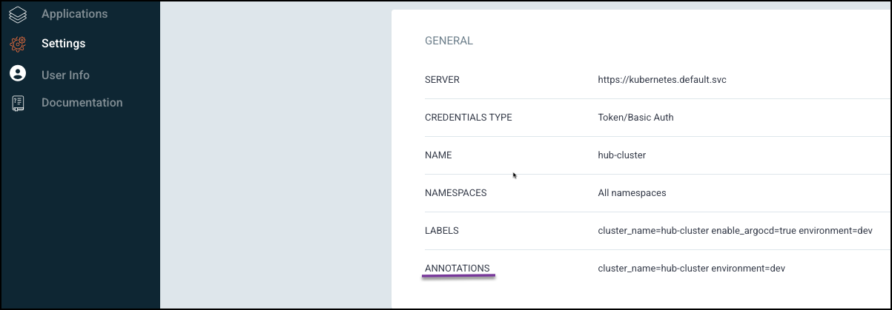

> 레이블은 생성기 조건을 충족하는 객체 컬렉션을 찾는 데 사용할 수 있습니다. 어노테이션은 저장소 URL과 같은 추가 정보를 제공합니다.

다음 장에서는 Git 저장소를 참조하는 ApplicationSet을 생성합니다. ArgoCD에서는 애노테이션을 사용하여 이러한 저장소를 동적으로 참조할 수 있습니다. 예를 들어 workload_repo_url 애노테이션을 참조하려면 다음과 같이 합니다.

```sh
apiVersion: argoproj.io/v1alpha1
kind: ApplicationSet
...
template:
   spec:
      source:
        repoURL:'{{.metadata.annotations.workload_repo_url}}'
```

저장소(플랫폼, 워크로드, 애드온)에 대한 정보는 AWS Secrets(eks-blueprints-workshop-gitops-platform, eks-blueprints-workshop-gitops-workloads, eks-blueprints-workshop-gitops-addons)에 이미 입력되어 있습니다. 다음은 eks-blueprints-workshop-gitops-platform의 AWS Secret 값입니다. 이 Secret은 플랫폼 Git 저장소의 메타데이터를 저장합니다.

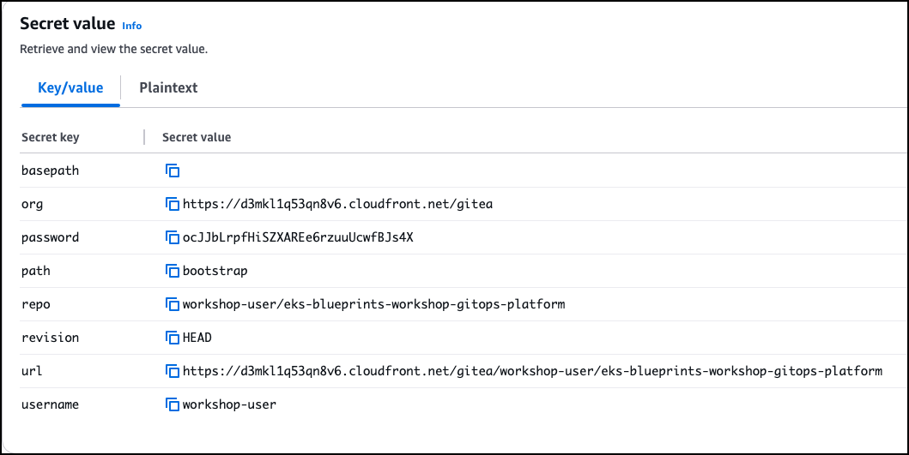

이 장에서는 이러한 값을 주석으로 복사하여 ArgoCD ApplicationSet에서 참조할 수 있도록 합니다.

1. Secrete Manaser

    ```sh
    cat <<'EOF' >> ~/environment/hub/main.tf

    # Retrieve Git repository metadata from AWS Secrets Manager for platform, workload, and addon repositories

    data "aws_secretsmanager_secret" "git_data_addons" {
      name = var.secret_name_git_data_addons
    }
    data "aws_secretsmanager_secret_version" "git_data_version_addons" {
      secret_id = data.aws_secretsmanager_secret.git_data_addons.id
    }
    data "aws_secretsmanager_secret" "git_data_platform" {
      name = var.secret_name_git_data_platform
    }
    data "aws_secretsmanager_secret_version" "git_data_version_platform" {
      secret_id = data.aws_secretsmanager_secret.git_data_platform.id
    }
    data "aws_secretsmanager_secret" "git_data_workload" {
      name = var.secret_name_git_data_workloads
    }
    data "aws_secretsmanager_secret_version" "git_data_version_workload" {
      secret_id = data.aws_secretsmanager_secret.git_data_workload.id
    }

    EOF
    ```

2. AWS Secrets에서 Git 메타데이터 검색

    각 비밀에는 url, basepath, path, revision과 같은 키가 포함되어 있습니다.

    다음 블록을 main.tf 파일에 추가하여 비밀을 구문 분석하고 로컬 변수에 값을 할당합니다.

    ```sh
    cat <<'EOF' >> ~/environment/hub/main.tf

    locals{

      gitops_addons_url      = jsondecode(data.aws_secretsmanager_secret_version.git_data_version_addons.secret_string).url
      gitops_addons_basepath = jsondecode(data.aws_secretsmanager_secret_version.git_data_version_addons.secret_string).basepath
      gitops_addons_path     = jsondecode(data.aws_secretsmanager_secret_version.git_data_version_addons.secret_string).path
      gitops_addons_revision = jsondecode(data.aws_secretsmanager_secret_version.git_data_version_addons.secret_string).revision


      gitops_platform_url      = jsondecode(data.aws_secretsmanager_secret_version.git_data_version_platform.secret_string).url
      gitops_platform_basepath = jsondecode(data.aws_secretsmanager_secret_version.git_data_version_platform.secret_string).basepath
      gitops_platform_path     = jsondecode(data.aws_secretsmanager_secret_version.git_data_version_platform.secret_string).path
      gitops_platform_revision = jsondecode(data.aws_secretsmanager_secret_version.git_data_version_platform.secret_string).revision


      gitops_workload_url      = jsondecode(data.aws_secretsmanager_secret_version.git_data_version_workload.secret_string).url
      gitops_workload_basepath = jsondecode(data.aws_secretsmanager_secret_version.git_data_version_workload.secret_string).basepath
      gitops_workload_path     = jsondecode(data.aws_secretsmanager_secret_version.git_data_version_workload.secret_string).path
      gitops_workload_revision = jsondecode(data.aws_secretsmanager_secret_version.git_data_version_workload.secret_string).revision

      annotations = merge(
        #enableaddonmetadata module.eks_blueprints_addons.gitops_metadata,
        {
          aws_cluster_name = module.eks.cluster_name
          aws_region = local.region
          aws_account_id = data.aws_caller_identity.current.account_id
          aws_vpc_id = local.vpc_id
          aws_vpc_name = data.terraform_remote_state.vpc.outputs.vpc_name
        },
        {
          #enableirsarole argocd_iam_role_arn = aws_iam_role.argocd_hub.arn
          argocd_namespace = local.argocd_namespace
        },
        {
          addons_repo_url = local.gitops_addons_url
          addons_repo_basepath = local.gitops_addons_basepath
          addons_repo_path = local.gitops_addons_path
          addons_repo_revision = local.gitops_addons_revision
        },
        {
          platform_repo_url = local.gitops_platform_url
          platform_repo_basepath = local.gitops_platform_basepath
          platform_repo_path = local.gitops_platform_path
          platform_repo_revision = local.gitops_platform_revision
        },
        {
          workload_repo_url = local.gitops_workload_url
          workload_repo_basepath = local.gitops_workload_basepath
          workload_repo_path = local.gitops_workload_path
          workload_repo_revision = local.gitops_workload_revision
        },
        #enableeso{
        #enableeso  external_secrets_service_account = local.external_secrets.service_account
        #enableeso  external_secrets_namespace = local.external_secrets.namespace
        #enableeso}    
      )
    }

    EOF
    ```

3. 주석 삽입

    어노테이션은 GitOps Bridge 모듈을 사용하여 허브-클러스터 객체에 적용됩니다. 다음 명령을 사용하여 메타데이터 줄(7번째 줄)의 주석 처리를 제거하고 어노테이션 주입을 활성화하세요.

    ```sh
    sed -i "s/#enableannotation //g" ~/environment/hub/main.tf
    ```

    위의 명령은 main.tf의 메타데이터 줄(7번째 줄)의 주석 처리를 해제하여 주석 주입을 활성화합니다.

    ```sh
    module "gitops_bridge_bootstrap" {
      source = "gitops-bridge-dev/gitops-bridge/helm"
      version = "0.0.1"
      cluster = {
        cluster_name = module.eks.cluster_name
        environment = local.environment
        metadata = local.annotations
        #enableaddons addons = local.labels
    }
    ```

4. Terraform 적용

    ```sh
    cd ~/environment/hub
    terraform apply --auto-approve
    ```

5. 주석 업데이트 검증

Argo CD 대시보드에서 **Setting > Cluster > hub-cluster** 로 이동하여 hub-cluster 객체를 확인하세요. 이를 통해 GitOps Bridge가 주석을 성공적으로 업데이트했는지 확인할 수 있습니다.

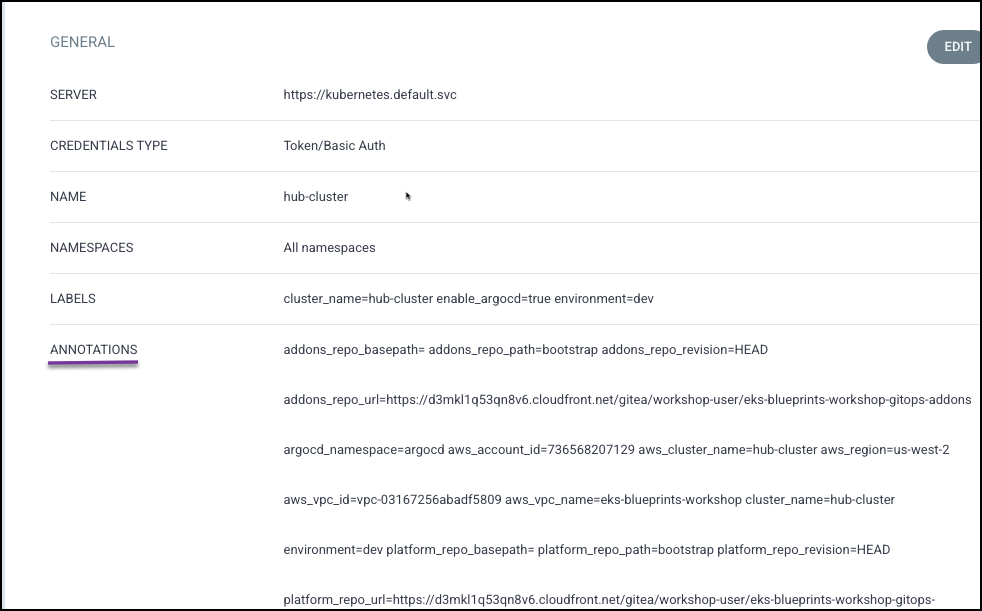

## ArgoCD Git 저장소(10분)

Gitea에 Git 저장소가 호스팅되어 있지만 Argo CD에서는 아직 접근할 수 없습니다. 이 장에서는 ArgoCD가 GitOps 저장소에 접근할 수 있도록 구성합니다. 여러 가지 방법이 있습니다. Argo CD가 이러한 저장소에 액세스할 수 있도록 합니다. 사용자 이름과 비밀번호 방식을 사용합니다.

저장소(플랫폼, 워크로드, 애드온)에 대한 자격 증명은 이미 AWS Secrets(eks-blueprints-workshop-gitops-platform, eks-blueprints-workshop-gitops-workloads, eks-blueprints-workshop-gitops-addons)에 저장되어 있습니다. 다음은 eks-blueprints-workshop-gitops-platform secret의 AWS Secret 값입니다.

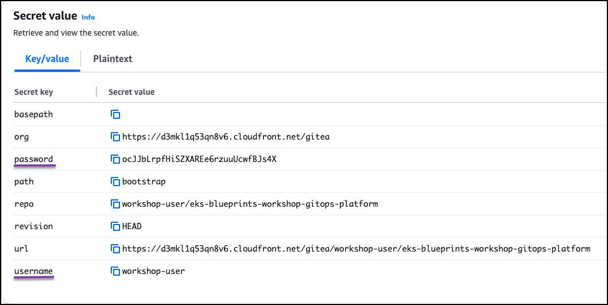


1. Git 자격 증명 읽기

    ```sh
    cat <<'EOF' >> ~/environment/hub/main.tf

    locals{
      gitops_workload_repo_username = jsondecode(data.aws_secretsmanager_secret_version.git_data_version_workload.secret_string).username
      gitops_workload_repo_password = jsondecode(data.aws_secretsmanager_secret_version.git_data_version_workload.secret_string).password

      gitops_platform_repo_username = jsondecode(data.aws_secretsmanager_secret_version.git_data_version_platform.secret_string).username
      gitops_platform_repo_password = jsondecode(data.aws_secretsmanager_secret_version.git_data_version_platform.secret_string).password

      gitops_addons_repo_username = jsondecode(data.aws_secretsmanager_secret_version.git_data_version_addons.secret_string).username
      gitops_addons_repo_password = jsondecode(data.aws_secretsmanager_secret_version.git_data_version_addons.secret_string).password

    }

    EOF
    ```

2. Git 저장소에 대한 Argo CD 비밀번호 만들기

    시크릿을 생성하는 방법은 여러 가지가 있습니다. Secrets Manager에서 시크릿을 생성하고 외부 시크릿 연산자를 사용하여 클러스터에 동기화할 수 있습니다. 이 워크숍에서는 Terraform을 사용하여 시크릿을 생성합니다.

    ```sh
    cat <<'EOF' >> ~/environment/hub/main.tf

    resource "kubernetes_secret" "git_secrets" {
      depends_on = [kubernetes_namespace.argocd]
      for_each = {
        git-addons = {
          type     = "git"
          name     = "git-addons"
          url      = local.gitops_addons_url
          username = local.gitops_addons_repo_username
          password = local.gitops_addons_repo_password
        }
        git-platform = {
          type     = "git"
          name     = "git-platform"
          url      = local.gitops_platform_url
          username = local.gitops_platform_repo_username
          password = local.gitops_platform_repo_password
        }
        git-workloads = {
          type     = "git"
          name     = "git-workloads"
          url      = local.gitops_workload_url
          username = local.gitops_workload_repo_username
          password = local.gitops_workload_repo_password
        }
      }
      metadata {
        name      = each.key
        namespace = kubernetes_namespace.argocd.metadata[0].name
        labels = {
          "argocd.argoproj.io/secret-type" = "repository"
        }
      }
      data = each.value
    }
    EOF
    ```

3. Terraform 적용

    이 명령은 Terraform 구성을 적용하고 EKS 클러스터에 Argo CD 비밀을 프로비저닝합니다.

    ```sh
    cd ~/environment/hub
    terraform apply --auto-approve
    ```

    Argo CD 대시보드로 이동하여 설정 페이지에 접속하세요. "저장소"를 선택하면 gitops-platform 및 gitops-workload 저장소를 볼 수 있습니다.

    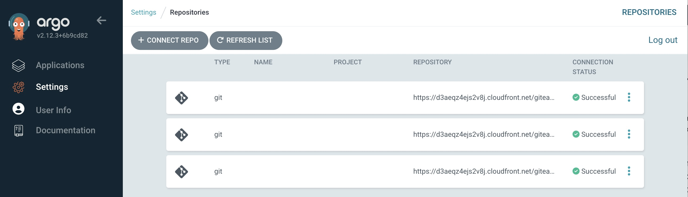

    Argo CD의 Git 저장소 연결 데이터는 Kubernetes Secret에 저장됩니다. Terraform이 Git 저장소에 액세스하기 위한 구성을 포함하는 Secret 객체를 생성했는지 확인할 수 있습니다.

    ```sh
    kubectl get secret -n argocd --selector=argocd.argoproj.io/secret-type=repository --context hub-cluster
    ```

    예상 출력:

    ```sh
    NAME            TYPE     DATA   AGE
    git-addons      Opaque   5      4m36s
    git-platform    Opaque   5      4m36s
    git-workloads   Opaque   5      4m36s
    ```

    이 시점에서 Argo CD는 Kubernetes Secrets에 저장된 자격 증명을 사용하여 Git 저장소에서 안전하게 인증할 수 있습니다.

# Bootstrap(20분)

이 장에서는 플랫폼 엔지니어로서 Argo CD와 GitOps Bridge를 사용하여 기본 자동화 패턴을 설정합니다.

## 플랫폼 저장소 부트스트랩

플랫폼 Git 저장소의 폴더를 감시하도록 애플리케이션을 구성합니다. 이 폴더의 모든 파일은 자동으로 처리됩니다.

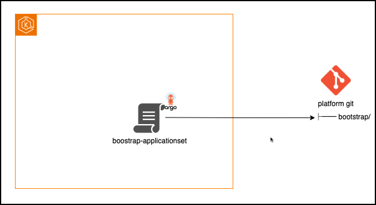

다음 장에서는 애드온, 네임스페이스, 워크로드 자동화를 위해 이 폴더에 파일을 추가합니다.


### Bootstrap ApplicationSet 만들기

ApplicationSet은 플랫폼 Git 저장소의 platform/bootstrap 디렉토리를 가리키는 "bootstrap"이라는 이름의 새로운 ArgoCD 애플리케이션을 생성합니다.


1. Bootstrap ApplicationSet 만들기

    ```sh
    mkdir -p ~/environment/hub/bootstrap
    cat > ~/environment/hub/bootstrap/bootstrap-applicationset.yaml << 'EOF'
    apiVersion: argoproj.io/v1alpha1
    kind: ApplicationSet
    metadata:
      name: bootstrap
      namespace: argocd
    spec:
      goTemplate: true
      syncPolicy:
        preserveResourcesOnDeletion: true
      generators:
        - clusters:
            selector:
              matchLabels:
                fleet_member: hub
      template:
        metadata:
          name: 'bootstrap'
        spec:
          project: default
          source:
            repoURL: '{{ .metadata.annotations.platform_repo_url }}'
            path: '{{ .metadata.annotations.platform_repo_basepath }}{{ .metadata.annotations.platform_repo_path }}'
            targetRevision: '{{ .metadata.annotations.platform_repo_revision }}'
            directory:
              recurse: true
          destination:
            namespace: 'argocd'
            name: '{{ .name }}'
          syncPolicy:
            automated:
              allowEmpty: true

    EOF
    ```

    참고로 22~24번째 줄은 ArgoCD 클러스터 비밀의 주석을 사용합니다.

    현재 환경에서 값을 확인할 수 있습니다.

    ```sh
    kubectl --context hub-cluster get secrets -n argocd hub-cluster -o json | jq ".metadata.annotations.platform_repo_url" -r
    kubectl --context hub-cluster get secrets -n argocd hub-cluster -o json | jq ".metadata.annotations.platform_repo_basepath" -r
    kubectl --context hub-cluster get secrets -n argocd hub-cluster -o json | jq ".metadata.annotations.platform_repo_path" -r
    kubectl --context hub-cluster get secrets -n argocd hub-cluster -o json | jq ".metadata.annotations.platform_repo_revision" -r
    ```

    출력 결과는 다음과 유사해야 합니다. 플랫폼 저장소의 bootstrap 폴더를 가리켜야 합니다. 이 워크숍에서는 platform_repo_basepath가 사용되지 않으므로 빈 문자열로 설정되어 있습니다.

    ```sh
    https://d3mkl1q53qn8v6.cloudfront.net/gitea/workshop-user/eks-blueprints-workshop-gitops-platform

    bootstrap
    HEAD
    ```

2. Terraform에서 Bootstrap ApplicationSet 참조

    ~/environment/hub/bootstrap/bootstrap-applicationset.yaml에 부트스트랩 애플리케이션 세트를 생성했습니다. 이를 참조하는 변수를 다시 만들어 보겠습니다.

    ```sh
    cat <<'EOF' >> ~/environment/hub/main.tf
    locals{
      argocd_apps = {
        bootstrap   = file("${path.module}/bootstrap/bootstrap-applicationset.yaml")
      }
    }
    EOF
    ```

3. GitOps Bridge를 사용하여 Bootstrap ApplicationSet 배포

    이전 단계에서 Bootstrap ApplicationSet을 참조하는 변수를 생성했습니다. GitOps Bridge를 사용하여 이 ApplicationSet을 생성하겠습니다.

    ```sh
    sed -i "s/#enableapps //g" ~/environment/hub/main.tf
    ```

    위에 제공된 코드는 GitOps Bridge의 주석 처리를 제거하여 ArgoCD 애플리케이션을 생성합니다. 이 경우 부트스트랩 애플리케이션을 생성합니다.

    ```sh
    module "gitops_bridge_bootstrap" {
      source = "gitops-bridge-dev/gitops-bridge/helm"
      version = "0.0.1"
      cluster = {
        cluster_name = module.eks.cluster_name
        environment = local.environment
        #enableannotation metadata = local.addons_metadata
        #enableaddons addons = local.addons
      }
      apps = local.argocd_apps
      argocd = {
        namespace = local.argocd_namespace
    ```

### 허브 클러스터에 레이블을 지정하세요

1. fleet_member 레이블 변수 추가

    ApplicationSet 클러스터 생성기(16번째 줄)는 fleet_member = hub라는 레이블이 있는 클러스터를 필터링합니다. 이 레이블을 허브 클러스터 정의에 추가해 보겠습니다.

    

    fleet_member 라벨을 추가해 보겠습니다.

    ```sh
    cat <<'EOF' >> ~/environment/hub/main.tf

    locals{
      addons = merge(
        { fleet_member = "hub" },
        { tenant = "tenant1" },
        #enableaddonvariable local.aws_addons,
        #enableaddonvariable local.oss_addons,
        #enablewebstore{ workload_webstore = true }  
      )

    }

    EOF
    ```

2. GitOps Bridge를 통해 레이블 주입 활성화

    GitOps Bridge를 사용하여 허브-클러스터 객체에 레이블을 추가합니다. GitOps Bridge는 지정된 클러스터 객체에 레이블을 추가하도록 구성되어 있습니다.

    ```sh
    sed -i "s/#enableaddons//g" ~/environment/hub/main.tf
    ```

    위 코드는 아래에 강조 표시된 것처럼 main.tf 파일의 addons 변수의 주석 처리를 제거합니다. GitOps Bridge addons(8번째 줄) 변수에 할당된 모든 값은 클러스터 레이블에 할당됩니다.

    ```sh
    module "gitops_bridge_bootstrap" {
      source = "gitops-bridge-dev/gitops-bridge/helm"
      version = "0.0.1"
      cluster = {
        cluster_name = module.eks.cluster_name
        environment = local.environment
        #enableannotation metadata = local.annotations
        addons = local.addons
    }
    ```

### Terraform 적용

```sh
cd ~/environment/hub
terraform apply --auto-approve
```

### ArgoCD에서 Bootstrap 애플리케이션 검증

UI에서 ArgoCD 대시보드로 이동하여 "애플리케이션"을 클릭하여 부트스트랩 애플리케이션이 성공적으로 생성되었는지 확인하세요 . 부트스트랩 ArgoCD 애플리케이션은 현재 bootstrap플랫폼 Git 저장소의 폴더를 가리키도록 구성되어 있습니다.

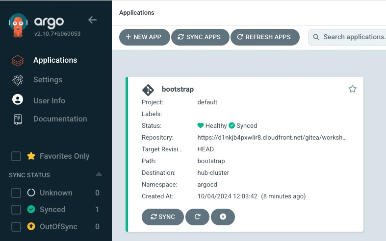

현재 폴더가 비어 있습니다. 다음 장에서는 애드온, 네임스페이스, 프로젝트 및 워크로드에 대한 ApplicationSet 파일로 폴더를 채울 것입니다.

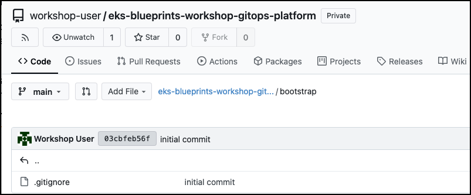

# Kubernetes Addon(30분)

이 장에서는 플랫폼 엔지니어로서 애드온 관리를 자동화할 수 있습니다.


애드온은 쿠버네티스 애플리케이션에 운영 기능을 지원합니다. 애드온 소프트웨어는 일반적으로 쿠버네티스 커뮤니티, AWS와 같은 클라우드 제공업체 또는 타사 공급업체에서 개발 및 유지 관리합니다. Amazon EKS Auto 모든 클러스터에 대해 Kubernetes용 Amazon VPC CNI 플러그인, Karpenter, kube-proxy, CoreDNS, PodIdentity 등의 애드온을 자동으로 관리합니다. 다른 모든 애드온은 직접 설치하고 관리해야 합니다.

GitOps Bridge는 Argo CD ApplicationSets를 유지 관리합니다. 저장소의 addons 폴더 아래에 있는 다양한 애드온에 대해 설명합니다. Kubernetes와 EKS가 발전함에 따라 이러한 ApplicationSet은 GitOps Bridge 프로젝트를 통해 업데이트됩니다. 각 애드온에 대해 별도의 ApplicationSet을 작성하는 대신, GitOps Bridge에서 제공하는 ApplicationSet을 활용합니다. 이 방법을 사용하면 불필요한 작업을 방지하고 GitOps Bridge 커뮤니티에서 엄선한 애드온 ApplicationSet의 이점을 활용할 수 있습니다.

이 워크숍에서는 GitOps Bridge ApplicationSets 저장소의 복제본을 활용합니다. 조직에서는 ApplicationSets를 복제한 후 그대로 사용하거나 특정 기업 요구에 맞게 사용자 정의하는 것을 고려해야 합니다.

**Argo CD로 애드온을 관리하는 이유는 무엇인가요?**

- GitOps 기반 - 매니페스트는 Git에 저장되어 버전 제어, 협업 및 검토가 가능합니다.
- 자동 동기화 - Argo CD는 Git 저장소와 일치하도록 클러스터 상태를 자동으로 동기화하여 지속적인 배포를 제공합니다.
- 롤백 및 감사 가능성 - 변경 사항을 추적하고 쉽게 롤백할 수 있어 안정성이 향상됩니다.
- 유연한 수명 주기 관리 - 애드온의 업그레이드, 확장 등을 쉽게 자동화할 수 있습니다.
- 다중 클러스터 가능 - 일관된 방식으로 여러 클러스터에서 애드온을 관리할 수 있습니다.
- 상태 모니터링 - Argo CD는 애드온 배포에 대한 상태 및 알림을 제공합니다.

**GitOps Bridge ApplicationSet은 어떻게 구성되나요?**

GitOps Bridge가 제공하는 ApplicationSets는 환경별 및 클러스터별로 재정의될 수 있습니다.

예를 들어, 아래는 재정의 파일이 있는 GitOps Repo와 GitOps Bridge ApplicationSet의 스니펫을 나란히 비교한 것입니다. 구성 값은 먼저 기본 설정에서 읽습니다. 그런 다음 환경별 설정이 기본값을 재정의합니다. 마지막으로 클러스터별 설정이 기본값과 환경 값을 모두 재정의합니다. 예를 들어 aws-load-balancer-controller 애드온에서는 폴더에서 기본값을 가져옵니다 . dev 환경에서는 <path> 아래에 <path> environments/default/addons/aws-load-balancer-controller를 추가하여 일부 값을 재정의할 수 있습니다 . my-cluster 환경에서는 <path> 아래에 <path>.yaml을 추가하여 이러한 값을 재정의할 수 있습니다 . 기본값 재정의는 선택 사항입니다. 사용자 지정이 필요하지 않으면 기본값을 사용할 수 있습니다.values.yamlenvironments/dev/addons/aws-load-balancer-controllerenvironments/clusters/my-cluster/addons/aws-load-balancer-controller


## 애드온 자동화를 위한 레이블 삽입

이 장에서는 애드온 설치 및 제거 자동화를 지원하는 메타데이터로 클러스터에 레이블을 지정합니다. 다음 장에서는 ArgoCD와 GitOps Bridge가 이러한 레이블을 읽어 각 클러스터에 배포하거나 제거할 애드온을 결정합니다.

1. 애드온 레이블 변수 정의

    다음 코드는 애드온에 대한 부울 변수를 정의합니다.

    변수는 aws_addons와 oss_addons의 두 가지 범주로 구성됩니다. aws_addons는 IAM 역할(예: 외부 비밀 운영자는 AWS Secrets Manager에 액세스해야 함)과 같은 AWS 관련 통합이 필요합니다. "oss_addons"는 AWS 관련 서비스(예: Nginx)에 의존하지 않는 오픈 소스 도구입니다.

    ```sh
    cat <<'EOF' >> ~/environment/hub/main.tf

    locals{
      aws_addons = {
        enable_cert_manager                          = try(var.addons.enable_cert_manager, false)
        enable_aws_efs_csi_driver                    = try(var.addons.enable_aws_efs_csi_driver, false)
        enable_aws_fsx_csi_driver                    = try(var.addons.enable_aws_fsx_csi_driver, false)
        enable_aws_cloudwatch_metrics                = try(var.addons.enable_aws_cloudwatch_metrics, false)
        enable_aws_privateca_issuer                  = try(var.addons.enable_aws_privateca_issuer, false)
        enable_cluster_autoscaler                    = try(var.addons.enable_cluster_autoscaler, false)
        enable_external_dns                          = try(var.addons.enable_external_dns, false)
        enable_external_secrets                      = try(var.addons.enable_external_secrets, false)
        enable_aws_load_balancer_controller          = try(var.addons.enable_aws_load_balancer_controller, false)
        enable_fargate_fluentbit                     = try(var.addons.enable_fargate_fluentbit, false)
        enable_aws_for_fluentbit                     = try(var.addons.enable_aws_for_fluentbit, false)
        enable_aws_node_termination_handler          = try(var.addons.enable_aws_node_termination_handler, false)
        enable_karpenter                             = try(var.addons.enable_karpenter, false)
        enable_velero                                = try(var.addons.enable_velero, false)
        enable_aws_gateway_api_controller            = try(var.addons.enable_aws_gateway_api_controller, false)
        enable_aws_ebs_csi_resources                 = try(var.addons.enable_aws_ebs_csi_resources, false)
        enable_aws_secrets_store_csi_driver_provider = try(var.addons.enable_aws_secrets_store_csi_driver_provider, false)
        enable_ack_apigatewayv2                      = try(var.addons.enable_ack_apigatewayv2, false)
        enable_ack_dynamodb                          = try(var.addons.enable_ack_dynamodb, false)
        enable_ack_s3                                = try(var.addons.enable_ack_s3, false)
        enable_ack_rds                               = try(var.addons.enable_ack_rds, false)
        enable_ack_prometheusservice                 = try(var.addons.enable_ack_prometheusservice, false)
        enable_ack_emrcontainers                     = try(var.addons.enable_ack_emrcontainers, false)
        enable_ack_sfn                               = try(var.addons.enable_ack_sfn, false)
        enable_ack_eventbridge                       = try(var.addons.enable_ack_eventbridge, false)
        enable_aws_argocd                            = try(var.addons.enable_aws_argocd , false)
        enable_cw_prometheus                         = try(var.addons.enable_cw_prometheus, false)
        enable_cni_metrics_helper                    = try(var.addons.enable_cni_metrics_helper, false)
      }
      oss_addons = {
        enable_argocd                          = try(var.addons.enable_argocd, false)
        enable_argo_rollouts                   = try(var.addons.enable_argo_rollouts, false)
        enable_argo_events                     = try(var.addons.enable_argo_events, false)
        enable_argo_workflows                  = try(var.addons.enable_argo_workflows, false)
        enable_cluster_proportional_autoscaler = try(var.addons.enable_cluster_proportional_autoscaler, false)
        enable_gatekeeper                      = try(var.addons.enable_gatekeeper, false)
        enable_gpu_operator                    = try(var.addons.enable_gpu_operator, false)
        enable_ingress_nginx                   = try(var.addons.enable_ingress_nginx, false)
        enable_keda                            = try(var.addons.enable_keda, false)
        enable_kyverno                         = try(var.addons.enable_kyverno, false)
        enable_kyverno_policy_reporter         = try(var.addons.enable_kyverno_policy_reporter, false)
        enable_kyverno_policies                = try(var.addons.enable_kyverno_policies, false)
        enable_kube_prometheus_stack           = try(var.addons.enable_kube_prometheus_stack, false)
        enable_metrics_server                  = try(var.addons.enable_metrics_server, false)
        enable_prometheus_adapter              = try(var.addons.enable_prometheus_adapter, false)
        enable_secrets_store_csi_driver        = try(var.addons.enable_secrets_store_csi_driver, false)
        enable_vpa                             = try(var.addons.enable_vpa, false)
      }

    }

    EOF
    ```


2. 라벨 주입

    이전 Bootstrap 챕터에서는 addonsGitOps Bridge에서 레이블을 생성하는 데 사용되는 변수를 추가했습니다. 이제 위에서 정의한 aws_addons와 oss_addons를 해당 변수에 병합해 보겠습니다.

    ```sh
    sed -i "s/#enableaddonvariable//g" ~/environment/hub/main.tf
    ```

    위 코드는 아래에 강조된 것처럼 main.tf의 애드온 변수의 주석 처리를 제거합니다.

    ```sh
    locals{
      addons = merge(
        { fleet_member = "hub" },
        { tenant = "tenant1" },
        local.aws_addons,
        local.oss_addons,
        #enablewebstore{ workload_webstore = true }  
      )
    }
    ```

3. Terraform 적용

    ```sh
    cd ~/environment/hub
    terraform apply --auto-approve
    ```

4. 라벨 검증

    Argo CD 대시보드에서 Settings > Clusters > hub-cluster로 이동합니다. 허브-클러스터 객체를 검사하여 GitOps Bridge가 레이블을 성공적으로 업데이트했는지 확인합니다.

    

    ArgoCD는 클러스터를 나타내는 Kubernetes Secret에서 레이블을 읽습니다.

    클러스터 비밀의 라벨과 주석을 확인할 수 있습니다.

    ```sh
    kubectl --context hub-cluster get secrets -n argocd hub-cluster -o yaml
    ```

    **출력 예**

    ```yaml
    apiVersion: v1
    data:
      config: ewogICJ0bHNDbGllbnRDb25maWciOiB7CiAgICAiaW5zZWN1cmUiOiBmYWxzZQogIH0KfQo=
      name: aHViLWNsdXN0ZXI=
      server: aHR0cHM6Ly9rdWJlcm5ldGVzLmRlZmF1bHQuc3Zj
    kind: Secret
    metadata:
      annotations:
        addons_repo_basepath: ""
        addons_repo_path: bootstrap
        addons_repo_revision: HEAD
        addons_repo_url: https://dcv3flp70gaiw.cloudfront.net/gitea/workshop-user/eks-blueprints-workshop-gitops-addons
        argocd_namespace: argocd
        aws_account_id: "012345678910"
        aws_cluster_name: hub-cluster
        aws_load_balancer_controller_namespace: kube-system
        aws_load_balancer_controller_service_account: aws-load-balancer-controller-sa
        aws_region: us-west-2
        aws_vpc_id: vpc-0281c90d8fb4ce6a2
        cluster_name: hub-cluster
        environment: control-plane
        external_secrets_namespace: external-secrets
        external_secrets_service_account: external-secrets-sa
        platform_repo_basepath: ""
        platform_repo_path: bootstrap
        platform_repo_revision: HEAD
        platform_repo_url: https://dcv3flp70gaiw.cloudfront.net/gitea/workshop-user/eks-blueprints-workshop-gitops-platform
        workload_repo_basepath: ""
        workload_repo_path: ""
        workload_repo_revision: HEAD
        workload_repo_url: https://dcv3flp70gaiw.cloudfront.net/gitea/workshop-user/eks-blueprints-workshop-gitops-apps
      creationTimestamp: "2024-10-07T21:40:44Z"
      labels:
        argocd.argoproj.io/secret-type: cluster
        aws_cluster_name: hub-cluster
        cluster_name: hub-cluster
        enable_argocd: "true"
        environment: control-plane
        fleet_member: control-plane
        kubernetes_version: "1.30"
        tenant: tenant1
        workloads: "true"
      name: hub-cluster
      namespace: argocd
      resourceVersion: "6865"
      uid: af0dfcb9-a034-4f2d-be9b-167eb78c830a
    type: Opaque
    ```

이제 gitops_bridge_bootstrap terraform 모듈 에서 구성된 모든 메타데이터를 secret에서 볼 수 있습니다 .

## 애드온 관리 자동화

이전 장에서는 GitOps Bridge Terraform 모듈을 사용하여 ArgoCD를 설치하고 필요한 레이블과 주석을 클러스터에 삽입했습니다.

이 장에서는 다음 단계로 넘어가서 GitOps Bridge Helm 차트를 사용하여 클러스터 애드온의 설치 및 수명 주기 관리를 자동화합니다.

GitOps Bridge는 선언적 접근 방식을 사용하여 애드온 관리를 간소화하는 미리 작성된 Helm 차트를 제공합니다. 이 차트는 애드온 저장소의 charts 폴더에 있습니다.


1. Addons ApplicationSet 구성

    이전 부트스트랩 챕터에서는 플랫폼 Git 저장소의 bootstrap/ 폴더를 지속적으로 감시하는 Argo CD 애플리케이션을 만들었습니다. 이제 GitOps Bridge Helm 차트를 허브 클러스터에 동적으로 배포하는 ApplicationSet을 bootstrap 폴더에 추가합니다.

    

    이제 cluster-addons ApplicationSet을 플랫폼 Git 저장소의 bootstrap 폴더에 추가합니다. 아래 강조 표시된 줄은 addons Git 저장소의 GitOps Bridge Helm 차트를 가리키는 repoURL과 경로를 보여줍니다.

    ```sh
    cat <<'EOF' >> ~/environment/gitops-repos/platform/bootstrap/addons-applicationset.yaml

    apiVersion: argoproj.io/v1alpha1
    kind: ApplicationSet
    metadata:
      name: create-cluster-addons
      namespace: argocd
    spec:
      syncPolicy:
        preserveResourcesOnDeletion: true
      goTemplate: true
      goTemplateOptions: 
        - missingkey=error
      generators: 
        - clusters:
            selector:
              matchLabels:
                fleet_member: hub
            values:
              addonChart: gitops-bridge
      template:
        metadata:
          name: cluster-addons
          finalizers: 
            # This is here only for workshop purposes. In a real-world scenario, you should not use this 
            - resources-finalizer.argocd.argoproj.io
        spec:
          project: default
          sources: 
            - ref: values
              repoURL: "{{.metadata.annotations.addons_repo_url}}"
              targetRevision: "{{.metadata.annotations.addons_repo_revision}}" 
            - repoURL: "{{.metadata.annotations.addons_repo_url}}"
              path: "{{.metadata.annotations.addons_repo_basepath}}charts/{{.values.addonChart}}"
              targetRevision: "{{.metadata.annotations.addons_repo_revision}}"
              helm:
                valuesObject:
                  #selectorMatchLabels: 
                  # fleet_member: control-plane
                ignoreMissingValueFiles: true
                valueFiles: 
                  - "$values/{{.metadata.annotations.addons_repo_basepath}}default/addons/{{.values.addonChart}}/values.yaml"
                  - "$values/{{.metadata.annotations.addons_repo_basepath}}environments/{{.metadata.labels.environment}}/addons/{{.values.addonChart}}/values.yaml" 
                  - "$values/{{.metadata.annotations.addons_repo_basepath}}clusters/{{.name}}/addons/{{.values.addonChart}}/values.yaml"
                  - "$values/{{.metadata.annotations.addons_repo_basepath}}tenants/{{.metadata.labels.tenant}}/default/addons/{{.values.addonChart}}/values.yaml" 
                  - "$values/{{.metadata.annotations.addons_repo_basepath}}tenants/{{.metadata.labels.tenant}}/environments/{{.metadata.labels.environment}}/addons/{{.values.addonChart}}/values.yaml"
                  - "$values/{{.metadata.annotations.addons_repo_basepath}}tenants/{{.metadata.labels.tenant}}/clusters/{{.name}}/addons/{{.values.addonChart}}/values.yaml"
          destination:
            namespace: argocd
            name: "{{.name}}"
          syncPolicy:
            automated:
              selfHeal: false
              allowEmpty: true
              prune: false
            retry:
              limit: 100
            syncOptions: 
              - CreateNamespace=true 
              - ServerSideApply=true

    EOF
    ```

    업데이트된 ApplicationSet 구성을 플랫폼 저장소에 커밋하고 푸시합니다.

    ```sh
    git -C ${GITOPS_DIR}/platform add .  || true
    git -C ${GITOPS_DIR}/platform commit -m "add addon applicationset" || true
    git -C ${GITOPS_DIR}/platform push || true
    ```

2. 애드온 ApplicationSet 검증

    UI에서 Argo CD 대시보드로 이동하여 "cluster-addons" 애플리케이션이 성공적으로 생성되었는지 확인합니다.

    

    Argo CD 대시보드에서 "부트스트랩" 애플리케이션을 클릭하고 해당 애플리케이션에서 생성된 애플리케이션 목록을 살펴보세요.

    

    cluster -addons 애플리케이션은 GitOps 애드온 저장소에 정의된 모든 애드온에 대한 ApplicationSets를 생성합니다.

    

    현재는 클러스터 레이블에서 설치가 활성화되지 않았기 때문에 **추가 기능이 배포되지 않았습니다.**

## Nginx 컨트롤러 애드온 설치

GitOps Bridge를 사용하면 레이블을 간단히 설정하여 클러스터 애드온을 쉽게 설치할 수 있습니다 `true`.

이 장에서는 레이블을 설정하여 NGINX Ingress Controller를 배포합니다 `enable_ingress_nginx=true`.

### Nginx 애드온 설치

1. NGINX 애드온 레이블 활성화

    파일 `terraform.tfvars`에 라벨을 추가합니다.

    ```sh
    sed -i '
    /addons = {/,/}/{
        /}/i\
        enable_ingress_nginx = true
    }
    ' ~/environment/hub/terraform.tfvars
    ```

2. Terraform 적용

    ```
    cd ~/environment/hub
    terraform apply --auto-approve
    ```

3. ArgoCD에서 레이블 검증

    Argo CD > Settings > Clusters > hub-cluster 로 이동하세요 . 레이블이 표시되어야 합니다 `enable_ingress_nginx=true`.


4. Nginx 애플리케이션 애드온 검증

    ArgoCD 대시보드 > Applications > cluster-addons으로 이동하세요. `addon-ingress-nginx-hub-cluster` 애플리케이션 세트를 확인할 수 있습니다.

    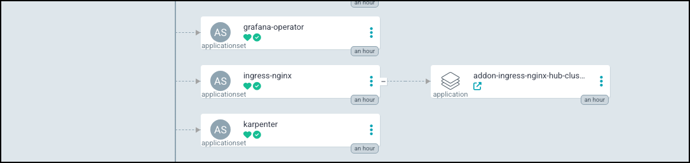

5. NGINX 애드온 배포 검증

    nginx pod를 확인할 수 있습니다

    ```sh
    kubectl get pods -n ingress-nginx --context hub-cluster
    ```

    다음과 비슷한 출력이 표시되어야 합니다.

    ```sh
    NAME                                       READY   STATUS      RESTARTS   AGE
    ingress-nginx-admission-patch-r59hq        0/1     Completed   0          72m
    ingress-nginx-controller-d46976f8f-w48ln   1/1     Running     0          73m
    ```

### Nginx 애드온 제거

1. Nginx 레이블 비활성화

    terraform.tfvars에서 레이블을 false로 설정합니다.

    ```sh
    sed -i 's/enable_ingress_nginx *= *.*/enable_ingress_nginx = false/' ~/environment/hub/terraform.tfvars
    ```

2. Terraform 적용

    ```sh
    cd ~/environment/hub
    terraform apply --auto-approve
    ```

3. Nginx 제거 확인

    Argo CD 대시보드에서 애플리케이션이 삭제되었는지 확인하세요.

    애플리케이션에서 생성된 Kubernetes 리소스는 동기화 정책으로 인해 자동으로 삭제되지 않습니다. 이 정책은 실수로 인한 삭제를 방지합니다. 이 동작은 설정 가능합니다.

## External Secrets Operator(ESO) 애드온 설치

일부 애드온은 AWS 서비스에 액세스하려면 IAM 역할이 필요합니다.

- 외부 비밀 운영자(ESO) – AWS Secrets Manager에 액세스하려면 IAM 역할이 필요합니다.
- Karpenter – EC2 API에 액세스하려면 IAM 역할이 필요합니다.
- Cert-manager – AWS Certificate Manager(ACM)에 액세스하려면 IAM 역할이 필요합니다.

이 장에서는 AWS Secrets Manager에 접근하기 위해 외부 비밀 운영자(ESO)를 배포합니다. ESO는 Pod Identity를 사용하여 AWS에서 비밀을 안전하게 인증하고 검색합니다.


1. 레이블을 사용하여 ESO 추가 기능 활성화

    이것은 label enable_external_secrets = true를 설정하여 설치할 수 있습니다.

    ```sh
    sed -i '
    /addons = {/,/}/ {
    /}/ i\
        enable_external_secrets = true
    }
    ' ~/environment/hub/terraform.tfvars
    ```

2. ESO 서비스 계정에 IAM 역할 연결

    다음 코드는 ESO Service Account에 대한 Pod Identity를 생성합니다.

    ```sh
    cat <<'EOF' >> ~/environment/hub/main.tf

    locals {
      external_secrets = {
        namespace = "external-secrets"
        service_account = "external-secrets-sa"
      }
    }
    module "external_secrets_pod_identity" {
      source = "terraform-aws-modules/eks-pod-identity/aws"
      version = "~> 1.4.0"

      name = "external-secrets"

      attach_external_secrets_policy = true
      external_secrets_ssm_parameter_arns = ["arn:aws:ssm:*:*:parameter/*"] # In case you want to restrict access to specific SSM parameters "arn:aws:ssm:${data.aws_region.current.id}:${data.aws_caller_identity.current.account_id}:parameter/${local.name}/*"
      external_secrets_secrets_manager_arns = ["arn:aws:secretsmanager:*:*:secret:*"] # In case you want to restrict access to specific Secrets Manager secrets "arn:aws:secretsmanager:${data.aws_region.current.id}:${data.aws_caller_identity.current.account_id}:secret:${local.name}/*"
      external_secrets_kms_key_arns = ["arn:aws:kms:*:*:key/*"] # In case you want to restrict access to specific KMS keys "arn:aws:kms:${data.aws_region.current.id}:${data.aws_caller_identity.current.account_id}:key/*"
      external_secrets_create_permission = false

      # Pod Identity Associations

      associations = {
        addon = {
          cluster_name = module.eks.cluster_name
          namespace = local.external_secrets.namespace
          service_account = local.external_secrets.service_account
        }
      }

      tags = local.tags
    }
    EOF
    ```

3. ESO 서비스 계정 주석 추가

    GitOps Bridge는 어노테이션을 사용하여 생성할 ESO 서비스 계정의 이름과 네임스페이스를 결정합니다. 어노테이션이 제공되지 않으면 Helm 차트에 정의된 기본값을 사용합니다.

    다음 코드는 허브 클러스터에 주석을 추가하기 위해 주석 처리를 제거합니다.

    ```sh
    sed -i "s/#enableeso//g" ~/environment/hub/main.tf
    ```

    주석 처리를 해제한 코드는 아래와 같습니다.

    ```sh
      annotations = merge(
        .
        .
        {
          external_secrets_service_account = local.external_secrets.service_account
          external_secrets_namespace = local.external_secrets.namespace
        }
        .
        .  
      )
    ```

    > **메모**
    > 
    > Terraform EKS Blueprints 애드온 모듈 eks_blueprints_addons를 사용하면 각 애드온에 대한 최소 권한 역할을 자동으로 프로비저닝할 수도 있습니다.
    > 
    > 이 모듈을 사용하면 애드온을 설치하고 IAM 역할을 생성할 수 있습니다. 하지만 IAM 역할만 생성하고 애드온 자체는 배포하지 않습니다. EKS 클러스터에 애드온을 설치하는 작업은 Argo CD를 통해 수행됩니다.
    > 
    > EKS Blueprint Addons 모듈을 사용하면 보안이 강화되고 복잡성이 줄어듭니다.
    > 
    > create_kubernetes_resources = false를 설정하여 Terraform 모듈이 필요한 AWS 리소스만 생성하고 Kubernetes 리소스는 생성하지 않도록 구성합니다(Argo CD가 Kubernetes 리소스를 관리하도록 하는 것을 선호하기 때문입니다).

4. Terraform 적용

    ```sh
    cd ~/environment/hub
    terraform init
    terraform apply --auto-approve
    ```

5. ESO 추가 기능 검증

    AWS Secret Manager에 Gitea 저장소 정보가 이미 있습니다. AWS Secret eks-blueprints-workshop-gitops-addons에서 Kubernetes secret-addon secret으로 복사할 외부 Secret을 생성하겠습니다.

    ```sh
    mkdir ~/environment/basic
    cat <<'EOF' >> ~/environment/basic/eso.yaml
    apiVersion: external-secrets.io/v1beta1
    kind: SecretStore
    metadata:
      name: aws-secretsmanager
      namespace: default
    spec:
      provider:
        aws:
          service: SecretsManager
          region: ap-northeast-2

    ---

    apiVersion: external-secrets.io/v1beta1
    kind: ExternalSecret
    metadata:
      name: service-addon
      namespace: default
    spec:
      refreshInterval: 1h
      secretStoreRef:
        name: aws-secretsmanager
        kind: SecretStore
      target:
        name: secret-addon
        creationPolicy: Owner
      dataFrom:
        - extract:
            key: "eks-blueprints-workshop-gitops-addons"
    EOF
    ```

    외부 비밀 생성

    ```sh
    kubectl apply -f ~/environment/basic/eso.yaml --context hub-cluster
    ```

    > **문제 해결**
    > 
    > "서버 오류(InternalError): 생성 중 오류"와 같은 오류가 표시되면 ESO 컨트롤러가 아직 생성 중임을 의미합니다. 몇 분 정도 기다린 후 아래 명령을 다시 실행해 보세요.
    > ```sh
    > kubectl apply -f ~/environment/basic/eso.yaml --context hub-cluster
    > ```

    Kubernetes Secret 검증

    ```sh
    kubectl get secrets secret-addon -oyaml --context hub-cluster
    ```

data: 섹션에 복사된 eks-blueprints-workshop-gitops-addons 비밀이 base64로 인코딩된 것을 볼 수 있습니다.


## metrics-server, argo rollout 애드온 설치

1. 레이블을 사용하여 metrics-server, argo-rollouts 추가 기능 활성화

    이것은 label `enable_metrics_server = true`, `enable_argo_rollouts = true`를 설정하여 설치할 수 있습니다.

    ```sh
    sed -i '
    /addons = {/,/}/{
        /}/i\
        enable_metrics_server = true\
        enable_argo_rollouts = true
    }
    ' ~/environment/hub/terraform.tfvars
    ```

2. Terraform 적용

    ```sh
    cd ~/environment/hub
    terraform init
    terraform apply --auto-approve
    ```

## ArgoCD를 애드온으로 자체 관리

처음에는 ArgoCD가 GitOps Bridge Terraform 모듈을 사용하여 설치되었습니다. 하지만 ArgoCD는 다른 애드온과 마찬가지로 GitOps 관리 애드온으로 관리할 수도 있습니다.

ArgoCD를 애드온으로 활성화하면 ArgoCD가 자체 라이프사이클을 관리할 수 있습니다. 이를 통해 선언적 업그레이드, 구성 변경, 심지어 완전한 삭제까지 GitOps를 통해 가능합니다.

1. ArgoCD 레이블 설정

    ```sh
    sed -i '
    /addons = {/,/}/{
        /}/i\
        enable_argocd = true
    }
    ' ~/environment/hub/terraform.tfvars
    ```

    `terraform.tfvars`에 대한 이 업데이트에는 다음이 추가되었습니다.

    ```sh
    eks_admin_role_name          = "WSParticipantRole"


    addons = {
        .
        .
        enable_argocd = "true"
    }
    ```

2. Terraform으로 변경 사항 적용

    ```sh
    cd ~/environment/hub
    terraform apply --auto-approve
    ```

3. ArgoCD 애드온 검증

이제 ArgoCD 애플리케이션 자체가 대시보드에 나열되어 다른 애드온과 마찬가지로 관리되는 것을 볼 수 있습니다.


> **메모**
> 
> ArgoCD가 다시 배포되면 대상 Pod가 갱신되면서 연결이 일시적으로 끊어집니다. ArgoCD 대시보드에서 연결을 다시 설정하는 데 **몇 분 정도 걸릴 수 있습니다.**

> **축하합니다.**
> 
> 이제 ArgoCD를 사용하여 ArgoCD 시스템을 관리하고 있습니다!

# 네임스페이스 및 워크로드 자동화(20분)

애플리케이션 배포는 2단계 프로세스입니다.

- 플랫폼 팀은 네임스페이스를 만들고 배포를 자동화하여 애플리케이션을 온보딩합니다.
- 개발자는 제공된 자동화를 사용하여 애플리케이션을 배포합니다.

이 섹션에서는 다음 역할을 맡게 됩니다. 플랫폼 엔지니어를 고용하고 애플리케이션 온보딩을 쉽고 반복 가능하게 만드는 자동화를 설정합니다.

다음 폴더 구조를 **플랫폼 Git** 저장소에 사용하여 애플리케이션을 온보딩합니다.

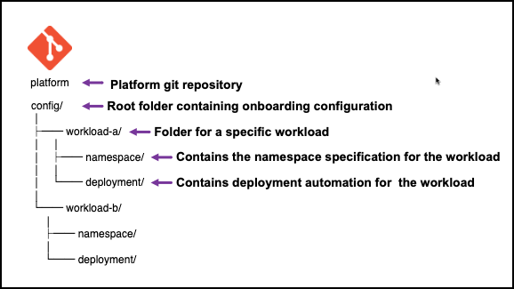

이 구조는 새 애플리케이션 온보딩을 구성 파일을 올바른 위치에 커밋하는 것만큼 간편하게 만들어 줍니다. Argo CD는 이 설정에 따라 자동으로 네임스페이스를 생성하고 애플리케이션을 배포합니다.

## 네임스페이스 자동화

이 장의 목표는 각 워크로드에 대한 네임스페이스 생성을 관리하는 ArgoCD 애플리케이션을 만드는 것입니다. 이는 각 워크로드 namespace폴더에 있는 매니페스트를 배포하는 부트스트랩 수준 애플리케이션입니다.

예를 들어, `create-namespace-workload-a` ArgoCD 애플리케이션은 `workload-a/namespace`폴더에 있는 매니페스트를 배포하는 역할을 합니다.

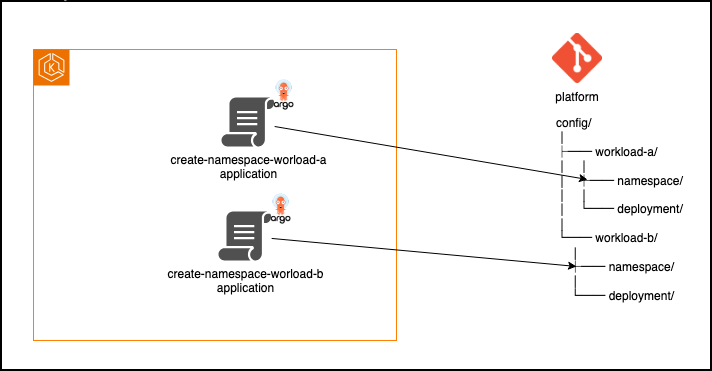

각 워크로드에 대한 ArgoCD 네임스페이스 애플리케이션을 만들려면 ApplicationSet을 사용합니다. 이전 부트스트랩 장에서는 플랫폼 Git 저장소에서 `bootstrap/`폴더를 지속적으로 모니터링하는 ArgoCD 애플리케이션을 만들었습니다. 이 장에서는 해당 폴더에 네임스페이스 ApplicationSet을 추가합니다.

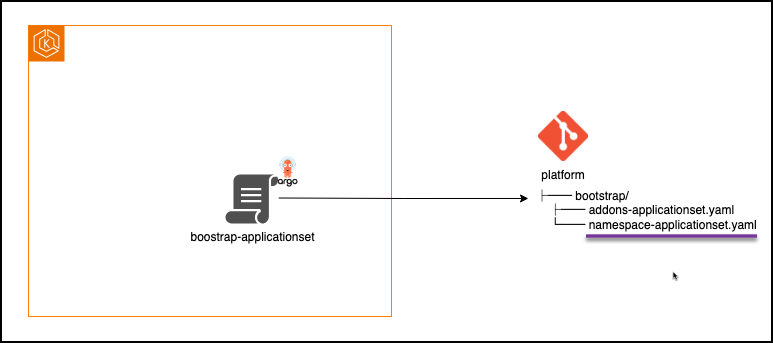

1. Bootstrap 네임스페이스 애플리케이션 세트 생성

    플랫폼 Git 저장소의 폴더 `bootstrap/`아래에 다음과 같은 파일을 만듭니다.`namespace-applicationset.yaml`

    ```sh
    cat > $GITOPS_DIR/platform/bootstrap/namespace-applicationset.yaml << 'EOF'
    apiVersion: argoproj.io/v1alpha1
    kind: ApplicationSet
    metadata:
      name: create-namespace
      namespace: argocd
    spec:
      goTemplate: true
      syncPolicy:
        preserveResourcesOnDeletion: false
      generators:
        - matrix:
            generators:
              - clusters:
                  selector:
                    matchLabels:
                      fleet_member: hub
              - git:
                  repoURL: '{{ .metadata.annotations.platform_repo_url }}'
                  revision: '{{ .metadata.annotations.platform_repo_revision }}'
                  directories:
                    - path: 'config/*/namespace'
      template:
        metadata:
          name: 'create-namespace-{{ index .path.segments 1 }}'
          labels:
            environment: '{{ .metadata.labels.environment }}'
            tenant: '{{ index .path.segments 1 }}'
            workloads: 'true'
            
        spec:
          project: default
          source:
            repoURL: '{{ .metadata.annotations.platform_repo_url }}'
            path: '{{ .path.path }}'
            targetRevision: '{{ .metadata.annotations.platform_repo_revision }}'
          destination:
            name: '{{ .name }}'
          syncPolicy:
            automated:
              allowEmpty: true
            retry:
              backoff:
                duration: 1m
                #limit: 100
            syncOptions:
              - CreateNamespace=true
    EOF
    ```

    이 ApplicationSet은 모든 워크로드에 대한 네임스페이스별 ArgoCD 애플리케이션 생성을 시작합니다.

    - 12번째 줄 : 행렬 생성기는 내부 생성기(git과 cluster)의 출력을 결합하여 순열을 생성합니다.
    - 22번째 줄 : Git 생성기는 config/*/namespace플랫폼 Git 저장소 아래의 각 폴더를 반복합니다.
    - 35번째 줄 : {{ .path.path }}각 네임스페이스 폴더 경로에 매핑됩니다 config/*/namespace.
      - 예를 들어, 의 경우 workload-a경로는 .입니다 config/workload-a/namespace.
      - 아래에 폴더가 없으면 config/*아직 애플리케이션이 생성되지 않습니다.

2. Git 커밋

    ```sh
    cd $GITOPS_DIR/platform
    git add .
    git commit -m "add bootstrap namespace applicationset"
    git push
    ```

    Push 후 ArgoCD 대시보드로 이동하여 부트스트랩 애플리케이션을 엽니다. 새로 생성된 create-namespace ApplicationSet이 표시됩니다.

    > 메모
    > 
    > 'create-namespace' 애플리케이션 세트는 몇 분 후에 표시됩니다.

    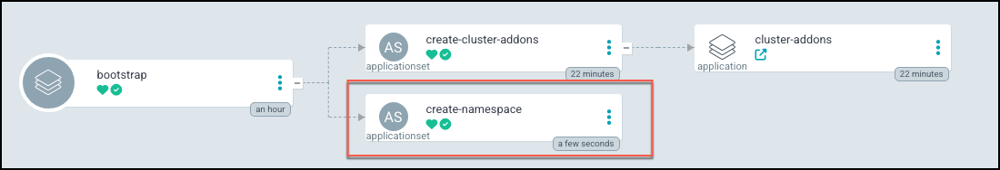

## 워크로드 자동화

이전 장의 네임스페이스 자동화와 유사하게, 이 장의 목표는 각 워크로드에 대한 ArgoCD 애플리케이션을 생성하여 워크로드 배포를 관리하는 것입니다. 이는 각 워크로드 deployment폴더에 있는 매니페스트를 배포하는 부트스트랩 수준 애플리케이션입니다.

예를 들어, `create-deployment-workload-a`ArgoCD 애플리케이션은 `workload-a/deployment`폴더에 있는 매니페스트를 배포하는 역할을 합니다.

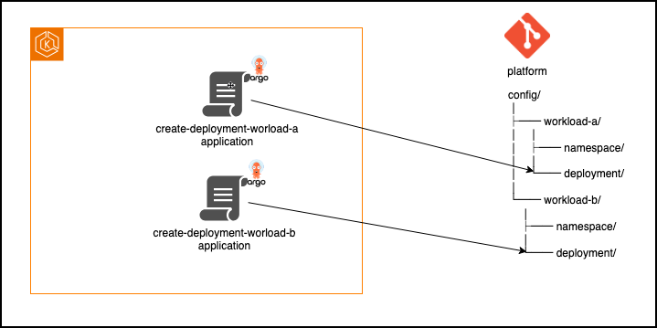

각 워크로드에 대한 ArgoCD 배포 애플리케이션을 생성하려면 ApplicationSet을 사용합니다. 이전 부트스트랩 챕터에서는 bootstrap/플랫폼 Git 저장소의 폴더를 지속적으로 감시하는 ArgoCD 애플리케이션을 생성했습니다. 이번 챕터에서는 해당 폴더에 배포 ApplicationSet을 추가합니다.

1. 부트스트랩 워크로드 애플리케이션 세트 생성

    플랫폼 Git 저장소의 `bootstrap/`폴더 아래에 다음과 같은 파일을 만듭니다.`workload-applicationset.yaml`

    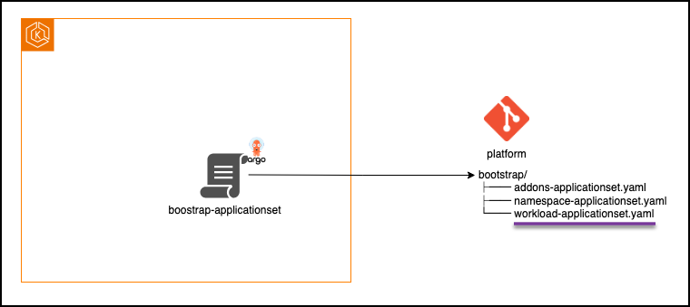

    ```sh
    cat > $GITOPS_DIR/platform/bootstrap/workload-applicationset.yaml << 'EOF'
    apiVersion: argoproj.io/v1alpha1
    kind: ApplicationSet
    metadata:
      name: create-deployment
      namespace: argocd
    spec:
      goTemplate: true
      syncPolicy:
        preserveResourcesOnDeletion: false
      generators:
        - matrix:
            generators:
              - clusters:
                  selector:
                    matchLabels:
                      fleet_member: 'hub'
              - git:
                  repoURL: '{{ .metadata.annotations.platform_repo_url }}'
                  revision: '{{ .metadata.annotations.platform_repo_revision }}'
                  directories:
                    - path: '{{ .metadata.annotations.platform_repo_basepath }}config/*/deployment'
      template:
        metadata:
          name: 'create-deployment-{{ index .path.segments 1 }}'
          labels:
            environment: '{{ .metadata.labels.environment }}'
        spec:
          project: default
          source:
            repoURL: '{{ .metadata.annotations.platform_repo_url }}'
            path: '{{ .path.path }}'
            targetRevision: '{{ .metadata.annotations.platform_repo_revision }}'
          destination:
            name: '{{ .name }}'
          syncPolicy:
            automated:
              allowEmpty: true
            retry:
              backoff:
                duration: 1m
                #limit: 100
            syncOptions:
              - CreateNamespace=true

    EOF
    ```

    이 ApplicationSet은 모든 워크로드에 대한 배포별 ArgoCD 애플리케이션 생성을 시작합니다.

    - 12번째 줄 : 행렬 생성기는 내부 생성기(git과 cluster)의 출력을 결합하여 순열을 생성합니다.
    - 22번째 줄 : Git 생성기는 config/*/deployment플랫폼 Git 저장소 아래의 각 폴더를 반복합니다.
    - 35번째 줄 : {{ .path.path }}각 네임스페이스 폴더 경로에 매핑됩니다 config/*/deployment.
        - 예를 들어, 의 경우 workload-a경로는 .입니다 config/workload-a/deployment.
        - 아래에 폴더가 없으면 config/*아직 애플리케이션이 생성되지 않습니다.

2. Git 커밋

    ```sh
    cd $GITOPS_DIR/platform
    git add .
    git commit -m "add bootstrap workload applicationset"
    git push
    ```

    > **메모**
    > 
    > 'create-deployment' 애플리케이션 세트는 몇 분 후에 표시됩니다.

    부트스트랩 폴더가 모니터링 되므로 workload-applicationset.yaml 과 같은 새 파일이 추가되면 처리됩니다.

    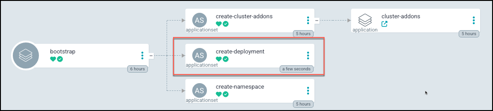

## Karpenter Node 자동화

이전 장의 네임스페이스, 워크로드 자동화와 유사하게, 이 장의 목표는 각 Karpenter Node에 대한 ArgoCD 애플리케이션을 생성하여 관리하는 것입니다. 이는 karpenter-node워크로드를 만들어 폴더에 있는 매니페스트를 배포하는 부트스트랩 수준 애플리케이션입니다.

예를 들어, `create-karpenter-node`ArgoCD 애플리케이션은 `karpenter-node/`폴더에 있는 매니페스트를 배포하는 역할을 합니다.

각 워크로드에 대한 ArgoCD 배포 애플리케이션을 생성하려면 ApplicationSet을 사용합니다. 이전 부트스트랩 챕터에서는 bootstrap/플랫폼 Git 저장소의 폴더를 지속적으로 감시하는 ArgoCD 애플리케이션을 생성했습니다. 이번 챕터에서는 해당 폴더에 karpenter ApplicationSet을 추가합니다.

1. 부트스트랩 워크로드 애플리케이션 세트 생성

    플랫폼 Git 저장소의 `bootstrap/`폴더 아래에 다음과 같은 파일을 만듭니다.`karpenter-node-applicationset.yaml`

    ```sh
    cat > $GITOPS_DIR/platform/bootstrap/karpenter-node-applicationset.yaml << 'EOF'
    apiVersion: argoproj.io/v1alpha1
    kind: ApplicationSet
    metadata:
      name: create-karpenter-node
      namespace: argocd
    spec:
      goTemplate: true
      syncPolicy:
        preserveResourcesOnDeletion: false
      generators:
        - matrix:
            generators:
              - clusters:
                  selector:
                    matchLabels:
                      fleet_member: 'hub'
              - git:
                  repoURL: '{{ .metadata.annotations.platform_repo_url }}'
                  revision: '{{ .metadata.annotations.platform_repo_revision }}'
                  directories:
                    - path: '{{ .metadata.annotations.platform_repo_basepath }}config/karpenter-node'
      template:
        metadata:
          name: 'create-karpenter-nod'
          labels:
            environment: '{{ .metadata.labels.environment }}'
        spec:
          project: default
          source:
            repoURL: '{{ .metadata.annotations.platform_repo_url }}'
            path: '{{ .path.path }}'
            targetRevision: '{{ .metadata.annotations.platform_repo_revision }}'
          destination:
            name: '{{ .name }}'
          syncPolicy:
            automated:
              allowEmpty: true
              prune: true
            retry:
              backoff:
                duration: 1m
                #limit: 100
    EOF
    ```

    이 ApplicationSet은 모든 워크로드에 대한 배포별 ArgoCD 애플리케이션 생성을 시작합니다.

2. Git 커밋

    ```sh
    cd $GITOPS_DIR/platform
    git add .
    git commit -m "add bootstrap karpenter-node applicationset"
    git push
    ```

    > **메모**
    > 
    > 'create-deployment' 애플리케이션 세트는 몇 분 후에 표시됩니다.

    부트스트랩 폴더가 모니터링 되므로 karpenter-node-applicationset.yaml 과 같은 새 파일이 추가되면 처리됩니다.

    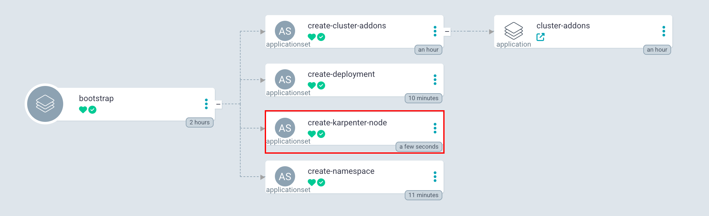

# deploy-workshop 워크로드 온보딩

플랫폼 작업플랫폼 엔지니어님, 여러분의 임무는 "deploy-workshop" 애플리케이션을 온보딩하는 것입니다. 여기에는 네임스페이스를 생성하고 "deploy-workshop" 애플리케이션의 배포를 자동화하는 작업이 포함됩니다.

> 이 워크숍의 목적에 맞게 기존 워크숍과는 다른 내용으로 각색하였습니다. 
> 
> 이 후에나오는 각 이미지에서 webstore -> deploy-workshop 이라고 봐주시면됩니다.

## 네임스페이스

멀티 테넌트 환경에서는 공유 인프라에서 애플리케이션을 서로 격리하는 것을 목표로 합니다. 네임스페이스는 이러한 격리를 제공합니다. 시크릿, 구성 맵, 볼륨과 같은 모든 애플리케이션 객체는 애플리케이션 네임스페이스 내에 생성됩니다. 할당량과 제한 범위를 사용하여 각 애플리케이션이 사용하는 클러스터 리소스의 양을 제어할 수 있습니다. 또한 네트워크 정책과 RBAC(Resource Access Control)을 설정하여 애플리케이션을 더욱 격리할 수 있습니다.

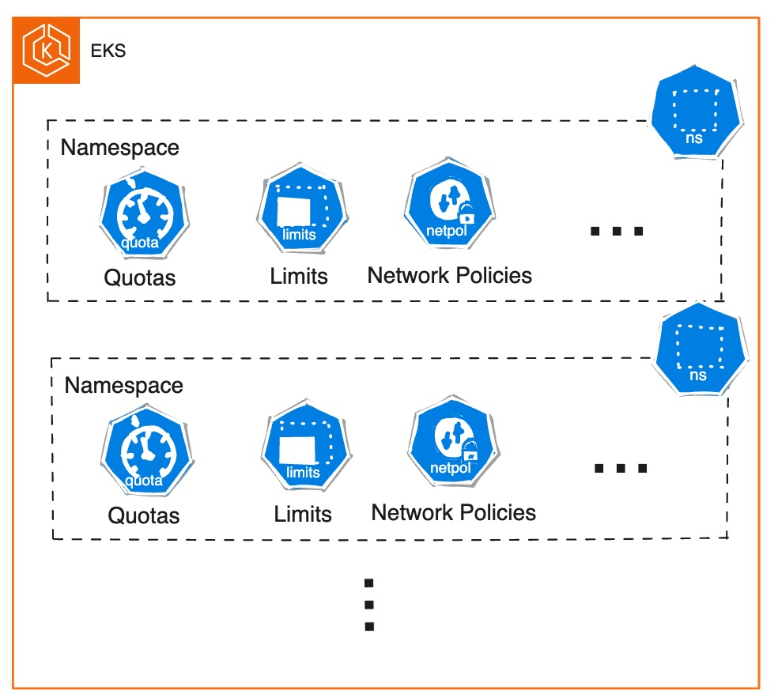

이 시나리오에서는 Argo CD를 사용하여 실제 워크로드와 별도로 애플리케이션 네임스페이스를 미리 프로비저닝합니다. 워크로드를 배포할 때 Argo CD의 "CreateNamespace: true" 옵션은 사용하지 않는 것이 좋습니다. 이러한 문제 분리를 통해 플랫폼 팀과 애플리케이션 팀의 업무를 명확하게 구분할 수 있습니다.

플랫폼 팀은 각 클러스터 및 환경에 대한 가드레일과 기본값을 설정하여 일관되고 안전한 배포 방식을 보장할 책임을 맡습니다. RBAC 규칙을 정의하고, 리소스 할당량을 적용하고, 제한을 설정하고, 네트워크 정책을 구성하고, 각 네임스페이스 내에서 추가 가드레일 정책을 구현합니다. 이러한 가드레일은 규정 준수를 보장하고 클러스터 리소스 및 보안 태세에 대한 제어를 유지하는 프레임워크 역할을 합니다.

애플리케이션 팀은 프로비저닝된 네임스페이스 내에서 워크로드를 배포할 수 있는 권한을 부여받습니다. 하지만 플랫폼 팀이 적용하는 가드레일을 수정할 수는 없습니다. 이러한 책임 분리를 통해 플랫폼 팀은 클러스터의 전반적인 보안 및 리소스 관리를 제어하는 ​​동시에 애플리케이션 팀은 정의된 경계 내에서 워크로드를 배포하고 관리하는 데 집중할 수 있습니다.

이러한 접근 방식을 따르면 중앙 집중식 거버넌스와 분산형 애플리케이션 배포 간의 균형을 달성하여 안전하고 확장 가능한 Kubernetes 환경을 조성할 수 있습니다.

### deploy-workload 네임스페이스 만들기

이 장에서는 환경(개발)별 네임스페이스(UI, 주문, 체크아웃, 장바구니, 카탈로그, 자산)를 생성하기 위해 웹스토어 애플리케이션을 온보딩합니다.

'네임스페이스 및 워크로드 자동화 > 네임스페이스 자동화' 장의 자동화를 기반으로 config/deploy-workshop/namespace플랫폼 Git 저장소에 새 폴더를 추가합니다. 이 폴더와 해당 매니페스트가 Git에 푸시되면 기존 create-namespace ApplicationSet은 다음과 같이 작동합니다.

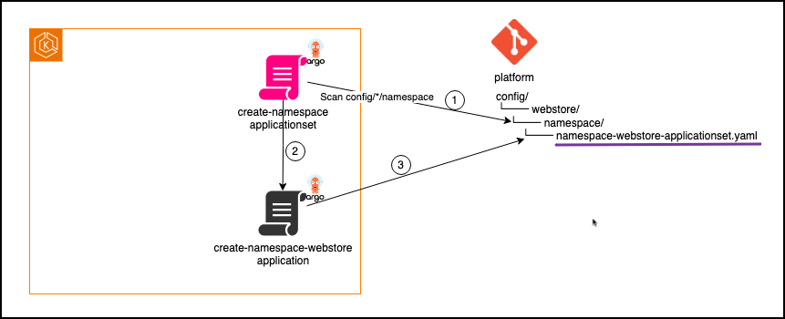

- 1. create-namespace ApplicationSet은 config/deploy-workshop/namespace 폴더를 감지합니다.
- 2. create-namespace-deploy-workshop라는 이름의 새로운 Argo CD 애플리케이션을 생성합니다.
- 3. 이 애플리케이션은 config/deploy-workshop/namespace의 매니페스트를 배포합니다.

1. deploy-workshop 네임스페이스 구성 생성

    이제 webstore 작업 부하에 대한 환경별 네임스페이스 애플리케이션을 생성하기 위해 create-namespace-env-deploy-workshop라는 ApplicationSet을 정의하겠습니다.

    ```sh
    mkdir -p $GITOPS_DIR/platform/config/deploy-workshop/namespace
    cat > $GITOPS_DIR/platform/config/deploy-workshop/namespace/namespace-deploy-workshop-applicationset.yaml << 'EOF'
    apiVersion: argoproj.io/v1alpha1
    kind: ApplicationSet
    metadata:
      name: create-namespace-env-deploy-workshop
      namespace: argocd
    spec:
      goTemplate: true
      syncPolicy:
        preserveResourcesOnDeletion: false
      generators:
        - clusters:
            selector:
              matchLabels:
                workload_deploy-workshop: 'true'
            values:
              workload: deploy-workshop
      template:
        metadata:
          name: 'namespace-{{ .metadata.labels.environment }}-deploy-workshop'
          labels:
            environment: '{{ .metadata.labels.environment }}'
            tenant: 'deploy-workshop'
            workloads: 'true'
        spec:
          project: default
          source:
            repoURL: '{{ .metadata.annotations.platform_repo_url }}'
            path: '{{ .metadata.annotations.platform_repo_basepath }}charts/namespace'
            targetRevision: '{{ .metadata.annotations.platform_repo_revision }}'
            helm:
              releaseName: 'deploy-workshop'
              ignoreMissingValueFiles: true
              valueFiles:
                - '../../config/deploy-workshop/namespace/values/default-values.yaml'
                - '../../config/deploy-workshop/namespace/values/{{ .metadata.labels.environment }}-values.yaml'
          destination:
            name: '{{ .name }}'
          syncPolicy:
            automated:
              allowEmpty: true
              prune: true
            retry:
              backoff:
                duration: 1m
                #limit: 100
    EOF
    ```

    - 라인 15: workload_deploy-workshop: 'true' 레이블이 있는 클러스터만 선택됩니다.
    - 29번째 줄: charts/namespace에 있는 Helm 차트의 네임스페이스를 가리킵니다.

    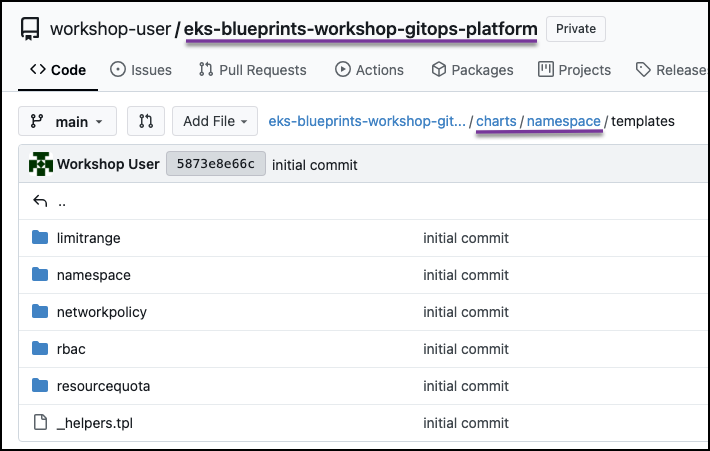

    **Helm 차트에서 파일을 확인하세요:**
    ```sh
    ├── Chart.yaml
    ├── README.md
    ├── templates
    │   ├── _helpers.tpl
    │   ├── limitrange
    │   │   └── limitrange.yaml
    │   ├── namespace
    │   │   └── namespace.yaml
    │   ├── networkpolicy
    │   │   ├── egress
    │   │   │   ├── allow-dns.yaml
    │   │   │   └── deny-all.yaml
    │   │   ├── ingress
    │   │   │   └── deny-all.yaml
    │   │   └── networkpolicy.yaml
    │   ├── rbac
    │   │   ├── rolebinding.yaml
    │   │   └── role.yaml
    │   └── resourcequota
    │       └── resourcequota.yaml
    ├── values.schema.json
    ├── values-test.yaml
    └── values.yaml
    ```

    36-37행: 기본 및 선택적 환경별 Helm 값 파일을 지정합니다.

2. deploy-workshop 네임스페이스 기본값 생성

    ```sh
    mkdir -p $GITOPS_DIR/platform/config/deploy-workshop/namespace/values
    cat > $GITOPS_DIR/platform/config/deploy-workshop/namespace/values/default-values.yaml << 'EOF'
    name: deploy-workshop
    labels:
      environment: control-plane
    namespaces:
      bluegreen:
        labels:
          additionalLabels:
            app.kubernetes.io/created-by: eks-workshop
      canary:
        labels:
          additionalLabels:
            app.kubernetes.io/created-by: eks-workshop
      rolling:
        labels:
          additionalLabels:
            app.kubernetes.io/created-by: eks-workshop
    EOF
    ```

3. hub cluster 에 deploy-workshop 워크로드 활성화

    ApplicationSet 네임스페이스는 workload_deploy-workshop: 'true'로 레이블이 지정된 클러스터만 대상으로 합니다. 허브 클러스터에 이 레이블을 활성화해 보겠습니다.

    ```sh
    sed -i 's/{ workload_webstore = true }/{ workload_webstore = true },\n    { workload_deploy-workshop = true }/g' ~/environment/hub/main.tf
    ```

    코드 조각에 의한 변경 사항은 아래와 같습니다.
    ```sh
    locals{
      .
      .

      addons = merge(
        .
        .
        .
        { workload_deploy-workshop = true }  
      )

    }
    ```

4. Terraform 적용

    이렇게 하면 허브 클러스터에서 workload_webstore: 'true'라는 레이블이 설정됩니다.

    ```sh
    cd ~/environment/hub
    terraform apply --auto-approve
    ```


5. Git 커밋

    새로 추가된 ApplicationSet 및 값 파일을 Git에 푸시합니다.

    ```sh
    cd $GITOPS_DIR/platform
    git add .
    git commit -m "add deploy-workshop namespace applicationset and namespace values"
    git push
    ```

    > **메모**
    >
    > 'create-namespace-deploy-workshop' 애플리케이션은 몇 분 후에 표시됩니다.

    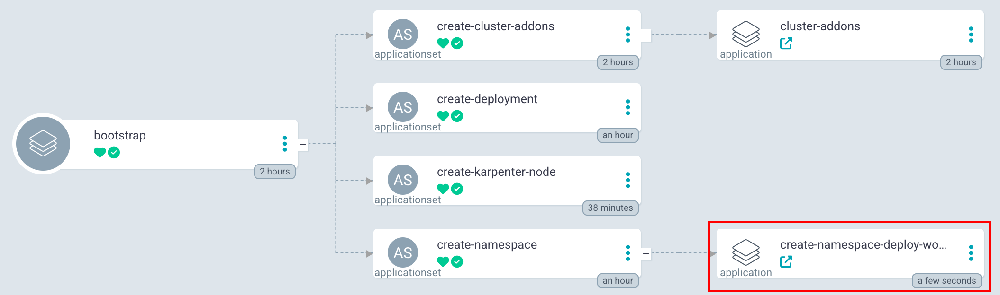


    그러면 namespace-webstore 애플리케이션은 Argo CD가 기본값을 사용하여 네임스페이스 Helm 차트를 설치하도록 합니다.

6. 네임스페이스 검증

    > **메모**
    > 
    > 네임스페이스가 생성되는 데 몇 분 정도 걸릴 수 있습니다. 몇 분 정도 기다린 후 다시 시도해 보세요.

    이 설정을 사용하면 웹스토어 네임스페이스와 해당 정책(LimitRange 및 NetworkPolicies 등)이 간단한 Git 변경 사항으로 구동되는 Argo CD 및 Helm을 사용하여 자동으로 관리됩니다.

    ```sh
    kubectl get ns --context hub-cluster --context hub-cluster
    ```

    결과
    ```sh
    NAME               STATUS   AGE
    argo-rollouts      Active   28m
    argocd             Active   7h9m
    bluegreen          Active   3m57s
    canary             Active   3m57s
    default            Active   7h22m
    external-secrets   Active   75m
    ingress-nginx      Active   95m
    kube-node-lease    Active   7h22m
    kube-public        Active   7h22m
    kube-system        Active   7h22m
    rolling            Active   3m57s
    ```

    Argo CD 대시보드에서 애플리케이션 namespace-dev-deploy-workspace를 볼 수도 있습니다.

    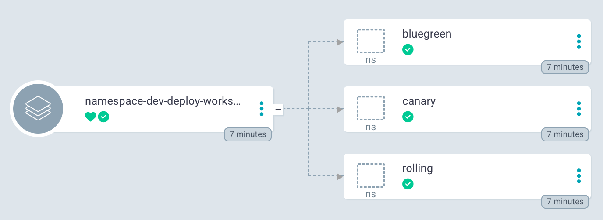

## 워크로드

이 장에서는 이전에 프로비저닝한 네임스페이스에 deploy-workshop 워크로드를 배포합니다. deploy-workshop 워크로드는 이 후 진행될 배포테스트를 위해 rolling, bluegreen, canary 3가지 애플리케이션으로 구성됩니다.

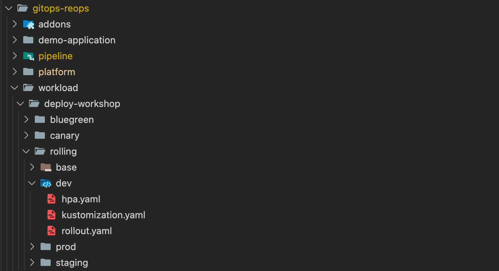

deploy-workshop 워크로드는 dev, 스테이징, 프로덕션을 포함한 여러 환경을 지원합니다. 환경별 구성은 Kustomization 파일을 통해 관리됩니다.

### deploy-workshop 배포 자동화

이 장에서는 deploy-workshop 워크로드 배포를 자동화합니다.

'네임스페이스 및 워크로드 자동화' > '워크로드 자동화' 장의 자동화를 기반으로 이제 deploy-workshop 워크로드에 적용해 보겠습니다. 구체적으로, 플랫폼 Git 저장소의 config/deploy-workshop/deployment에 새 폴더를 추가합니다. 이 폴더와 해당 매니페스트가 Git에 푸시되면 기존 create-deployment ApplicationSet은 다음과 같이 동작합니다.

deploy-workshop 워크로드 배포

1. create-deployment ApplicationSet은 config/deploy-workshop/deployment 폴더를 감지합니다.
2. create-deployment-deploy-workshop라는 이름의 새로운 Argo CD 애플리케이션을 생성합니다.
3. 이 애플리케이션은 config/deploy-workshop/deployment의 매니페스트를 배포합니다.

#### Dev deploy-workshop 배포 자동화

1. Dev 배포 애플리케이션 세트 생성

    개발 deploy-workshop 워크로드를 배포하는 역할을 하는 ApplicationSet을 만들어 보겠습니다.

    ```sh
    mkdir -p $GITOPS_DIR/platform/config/deploy-workshop/deployment
    cat > $GITOPS_DIR/platform/config/deploy-workshop/deployment/deployment-dev-deploy-workshop-applicationset.yaml << 'EOF'
    apiVersion: argoproj.io/v1alpha1
    kind: ApplicationSet
    metadata:
      name: create-deployment-dev-deploy-workshop
      namespace: argocd
    spec:
      goTemplate: true
      syncPolicy:
        preserveResourcesOnDeletion: false
      generators:
        - matrix:
            generators:
              - clusters:
                  selector:
                    matchExpressions:
                      - key: workload_deploy-workshop
                        operator: In
                        values: ['true']
                      - key: environment
                        operator: In
                        values: ['dev']                  
                  values:
                    workload: deploy-workshop
              - git:
                  requeueAfterSeconds: 30
                  repoURL: '{{ .metadata.annotations.workload_repo_url }}'
                  revision: '{{ .metadata.annotations.workload_repo_revision }}'
                  directories:
                    - path: '{{ .metadata.annotations.workload_repo_basepath }}deploy-workshop/*/dev'
      template:
        metadata:
          name: 'deployment-{{ .metadata.labels.environment }}-{{ index .path.segments 1 }}-deploy-workshop'
          labels:
            environment: '{{ .metadata.labels.environment }}'
            tenant: 'deploy-workshop'
            component: '{{ index .path.segments 1 }}'
            workloads: 'true'
        spec:
          project: default
          source:
            repoURL: '{{ .metadata.annotations.workload_repo_url }}'
            path: '{{ .path.path }}'
            targetRevision: '{{ .metadata.annotations.workload_repo_revision }}'
          destination:
            namespace: '{{ index .path.segments 1 }}'
            name: '{{ .name }}'
          syncPolicy:
            automated:
              allowEmpty: true
              prune: true
            retry:
              backoff:
                duration: 1m

    EOF
    ```

    - 라인 17: 웹스토어 워크로드는 `workload_deploy-workshop = true` 및 `environment = dev` 레이블이 있는 클러스터에만 배포됩니다.
    - 라인 27: metadata.annotations.workload_repo_url 즉, 허브 클러스터의 workload_repo_url 주석은 워크로드 git 저장소의 값을 갖습니다.
    - 30번째 줄: deploy-workshop/*/dev 에 매핑합니다 (deploy-workshop 아래의 각 마이크로서비스 개발 폴더)

    deploy-workshop 폴더 구조.

    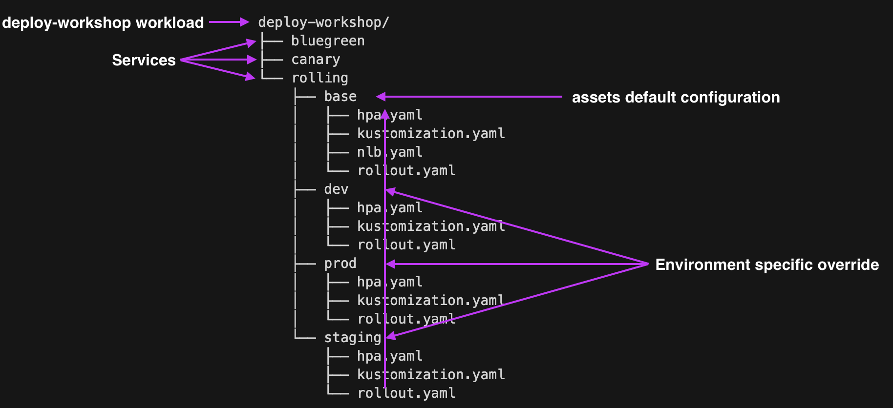

    - 3개의 서비스(bluegreen, canary, rolling)
    - 각 서비스에는
      - base: 모든 환경에 적용되는 공통 구성을 보관합니다.
      - 환경별 디렉토리(dev, staging, prod)는 환경별 구성을 보관하므로 쉽게 재정의하고 사용자 정의할 수 있습니다.
    - deploy-workshop 개발 버전을 배포하려면 dev 폴더에 있는 모든 서비스 kustomization.yaml을 배포해야 합니다.

2. Git 커밋

    ```sh
    cd $GITOPS_DIR/platform
    git add .
    git commit -m "add bootstrap workload applicationset"
    git push
    ```

3. 배포 검증

    > **메모**
    >
    > 'create-deployment-deploy-workshop' 애플리케이션은 몇 분 후에 표시됩니다.

    ArgoCD 대시보드 > Applications > Bootstrap 으로 이동하면 워크로드별 ArgoCD 애플리케이션(예: create-deployment-deploy-workshop)을 볼 수 있습니다.

    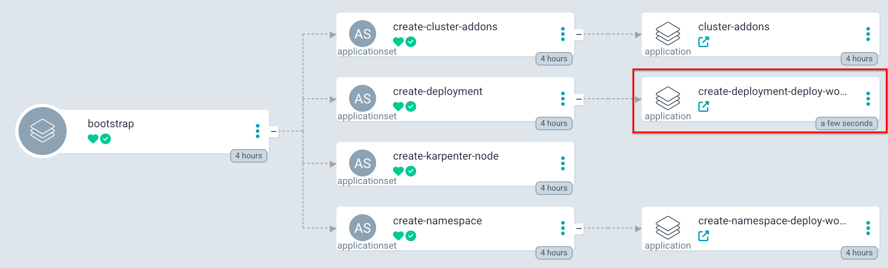

    'create-deployment-deploy-workshop'를 클릭하면 개발자 전용 ArgoCD 애플리케이션(예: create-deployment-dev-deploy-workshop)이 표시됩니다. 이는 이 장에서 추가한 애플리케이션입니다. 이 애플리케이션 세트는 workload/deploy-workshop/*/dev 폴더에 ArgoCD 애플리케이션을 생성할 준비가 되었습니다. 애플리케이션 저장소에 아직 코드가 없으므로 어떤 애플리케이션도 배포하지 않았습니다.

    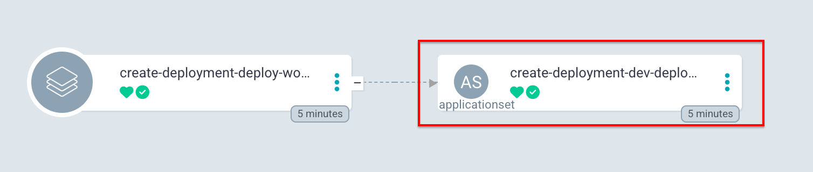


4. 온보드 스테이징 및 프로덕션

    스테이징과 프로덕션을 모두 배포하기 위한 구성도 만들어 보겠습니다.

    ```sh
    sed -e 's/dev/staging/g' < ${GITOPS_DIR}/platform/config/deploy-workshop/deployment/deployment-dev-deploy-workshop-applicationset.yaml > ${GITOPS_DIR}/platform/config/deploy-workshop/deployment/deployment-staging-deploy-workshop-applicationset.yaml
    sed -e 's/dev/prod/g' < ${GITOPS_DIR}/platform/config/deploy-workshop/deployment/deployment-dev-deploy-workshop-applicationset.yaml > ${GITOPS_DIR}/platform/config/deploy-workshop/deployment/deployment-prod-deploy-workshop-applicationset.yaml
    ```

2. Git 커밋

    ```sh
    cd $GITOPS_DIR/platform
    git add .
    git commit -m "add bootstrap workload applicationset"
    git push
    ```

    > **메모**
    > 
    > '스테이징' 및 '프로덕션' 애플리케이션은 몇 분 후에 표시됩니다.

    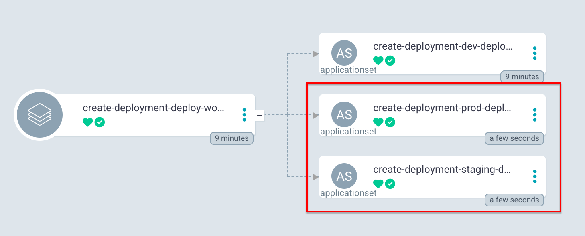

# deploy-workshop 워크로드 배포

이 장에서는 응용 프로그램 팀이 플랫폼 팀의 직접적인 참여 없이 웹스토어 애플리케이션을 독립적으로 배포합니다.

## deploy-workshop manifest 생성

이 장에서는 deploy-workshop 워크로드를 위한 kubernetes manifest를 생성합니다.

### deploy-workshop rolling 배포

Rolling 배포는 가장 기본적인 배포 전략으로, Pod를 하나씩 순차적으로 교체합니다.

1. base manifest

    ```sh
    mkdir -p $GITOPS_DIR/workload/deploy-workshop/rolling/base
    cat > $GITOPS_DIR/workload/deploy-workshop/rolling/base/rollout.yaml << 'EOF'
    apiVersion: argoproj.io/v1alpha1
    kind: Rollout
    metadata:
      name: rollout-rolling
    spec:
      revisionHistoryLimit: 2
      selector:
        matchLabels:
          app: rollout-rolling
      template:
        metadata:
          labels:
            app: rollout-rolling
        spec:
          containers:
          - name: rollouts-demo
            image: argoproj/rollouts-demo:blue
            imagePullPolicy: Always
            ports:
            - containerPort: 8080
            resources:  # ← HPA를 위해 필수!
              requests:
                cpu: 10m
                memory: 128Mi
      strategy:
        canary:
          # Pod를 순차적으로 교체
          steps:
          - setWeight: 33    # 1개 Pod 업데이트 (3개 중 33%)
          - pause: {duration: 10s}
          - setWeight: 67    # 2개 Pod 업데이트 (3개 중 67%)
          - pause: {duration: 10s}
          - setWeight: 100   # 모든 Pod 업데이트
    EOF
    ```

    ```sh
    cat > $GITOPS_DIR/workload/deploy-workshop/rolling/base/nlb.yaml << 'EOF'
    apiVersion: v1
    kind: Service
    metadata:
      name: rollout-rolling
      annotations:
        service.beta.kubernetes.io/aws-load-balancer-type: external
        service.beta.kubernetes.io/aws-load-balancer-scheme: internet-facing
        service.beta.kubernetes.io/aws-load-balancer-nlb-target-type: instance
    spec:
      type: LoadBalancer
      ports:
        - port: 80
          targetPort: 8080
          name: http
      selector:
        app: rollout-rolling  # 모든 버전의 Pod 선택
    EOF
    ```

    ```sh
    cat > $GITOPS_DIR/workload/deploy-workshop/rolling/base/hpa.yaml << 'EOF'
    apiVersion: autoscaling/v2
    kind: HorizontalPodAutoscaler
    metadata:
      name: rollout-rolling-hpa
    spec:
      scaleTargetRef:
        apiVersion: argoproj.io/v1alpha1
        kind: Rollout
        name: rollout-rolling
      minReplicas: 1
      maxReplicas: 5
      metrics:
      - type: Resource
        resource:
          name: cpu
          target:
            type: Utilization
            averageUtilization: 50
    EOF
    ```

    ```sh
    cat > $GITOPS_DIR/workload/deploy-workshop/rolling/base/kustomization.yaml << 'EOF'
    apiVersion: kustomize.config.k8s.io/v1beta1
    kind: Kustomization
    resources:
    - rollout.yaml
    - nlb.yaml
    - hpa.yaml
    EOF
    ```

2. dev manifest 생성

    ```sh
    mkdir $GITOPS_DIR/workload/deploy-workshop/rolling/dev
    cat > $GITOPS_DIR/workload/deploy-workshop/rolling/dev/hpa.yaml << 'EOF'
    apiVersion: autoscaling/v2
    kind: HorizontalPodAutoscaler
    metadata:
      name: rollout-rolling-hpa
    spec:
      metrics:
      - type: Resource
        resource:
          name: cpu
          target:
            type: Utilization
            averageUtilization: 50
    EOF
    ```

    ```sh
    cat > $GITOPS_DIR/workload/deploy-workshop/rolling/dev/kustomization.yaml << 'EOF'
    apiVersion: kustomize.config.k8s.io/v1beta1
    kind: Kustomization
    resources:
    - ../base

    patchesStrategicMerge:
    - rollout.yaml
    - hpa.yaml
    EOF
    ```

    ```sh
    cat > $GITOPS_DIR/workload/deploy-workshop/rolling/dev/rollout.yaml << 'EOF'
    apiVersion: argoproj.io/v1alpha1
    kind: Rollout
    metadata:
      name: rollout-rolling
    spec:
      template:
        spec:
          containers:
          - name: rollouts-demo
            image: argoproj/rollouts-demo:blue
            imagePullPolicy: Always
            ports:
            - containerPort: 8080
            resources:  # ← HPA를 위해 필수!
              requests:
                cpu: 10m
                memory: 128Mi
    EOF
    ```

3. git push

    ```sh
    cd $GITOPS_DIR/workload
    git add .
    git commit -m "add rolling workload"
    git push
    ```

    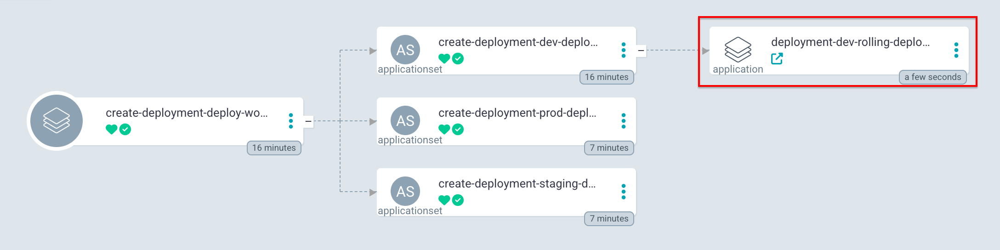

4. workload 검증

    > **중요**
    > 
    > Argo CD가 동기화되고 Karpenter가 추가 노드를 프로비저닝하는 데 몇 분이 걸립니다. 또한 로드 밸런서가 올바르게 프로비저닝되는 데도 몇 분이 걸립니다.

    ```sh
    export ROLLING_URL=$(kubectl --context hub-cluster get svc -n rolling rollout-rolling -o jsonpath='{.status.loadBalancer.ingress[0].hostname}')
    echo "Rolling URL: http://$ROLLING_URL"
    ```

    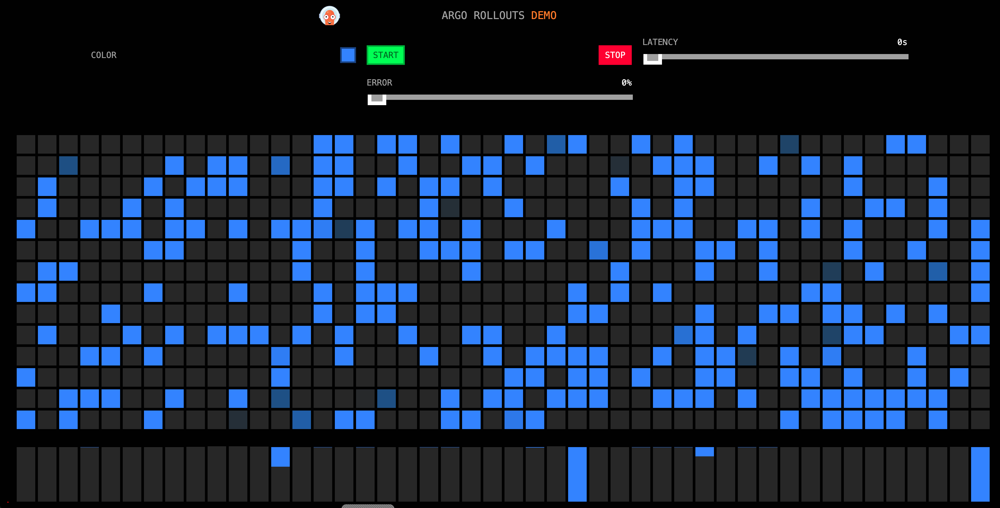


### deploy-workshop bluegreen 배포

Bluegreen 배포는 운영 환경에서 많이 사용되는 배포 전략으로 서비스의 중단 없이 다음 버전을 적용할 수 있다는 이점이 있습니다.

1. base manifest

    ```sh
    mkdir -p $GITOPS_DIR/workload/deploy-workshop/bluegreen/base
    cat > $GITOPS_DIR/workload/deploy-workshop/bluegreen/base/rollout.yaml << 'EOF'
    apiVersion: argoproj.io/v1alpha1
    kind: Rollout
    metadata:
      name: rollout-bluegreen
    spec:
      revisionHistoryLimit: 2
      selector:
        matchLabels:
          app: rollout-bluegreen
      strategy:
        blueGreen:
          activeService: rollout-bluegreen-active
          previewService: rollout-bluegreen-preview
          autoPromotionEnabled: false
      template:
        metadata:
          labels:
            app: rollout-bluegreen
        spec:
          containers:
          - name: rollouts-demo
            image: argoproj/rollouts-demo:blue
            imagePullPolicy: Always
            ports:
            - containerPort: 8080
            resources:  # ← HPA를 위해 필수!
              requests:
                cpu: 10m
                memory: 128Mi
    EOF
    ```

    ```sh
    cat > $GITOPS_DIR/workload/deploy-workshop/bluegreen/base/nlb.yaml << 'EOF'
    ---
    apiVersion: v1
    kind: Service
    metadata:
      name: rollout-bluegreen-active
      annotations:
        service.beta.kubernetes.io/aws-load-balancer-type: external
        service.beta.kubernetes.io/aws-load-balancer-scheme: internet-facing
        service.beta.kubernetes.io/aws-load-balancer-nlb-target-type: instance
    spec:
      type: LoadBalancer
      ports:
        - port: 80
          targetPort: 8080
          name: http
      selector:
        app: rollout-bluegreen
      

    ---
    apiVersion: v1
    kind: Service
    metadata:
      name: rollout-bluegreen-preview
      annotations:
        service.beta.kubernetes.io/aws-load-balancer-type: external
        service.beta.kubernetes.io/aws-load-balancer-scheme: internet-facing
        service.beta.kubernetes.io/aws-load-balancer-nlb-target-type: instance
    spec:
      type: LoadBalancer
      ports:
        - port: 80
          targetPort: 8080
          name: http
      selector:
        app: rollout-bluegreen
    EOF
    ```

    ```sh
    cat > $GITOPS_DIR/workload/deploy-workshop/bluegreen/base/hpa.yaml << 'EOF'
    apiVersion: autoscaling/v2
    kind: HorizontalPodAutoscaler
    metadata:
      name: rollout-bluegreen-hpa
    spec:
      scaleTargetRef:
        apiVersion: argoproj.io/v1alpha1
        kind: Rollout
        name: rollout-bluegreen
      minReplicas: 1
      maxReplicas: 5
      metrics:
      - type: Resource
        resource:
          name: cpu
          target:
            type: Utilization
            averageUtilization: 50
    EOF
    ```

    ```sh
    cat > $GITOPS_DIR/workload/deploy-workshop/bluegreen/base/kustomization.yaml << 'EOF'
    apiVersion: kustomize.config.k8s.io/v1beta1
    kind: Kustomization
    resources:
    - rollout.yaml
    - nlb.yaml
    - hpa.yaml
    EOF
    ```

2. dev manifest 생성

    ```sh
    mkdir -p $GITOPS_DIR/workload/deploy-workshop/bluegreen/dev
    cat > $GITOPS_DIR/workload/deploy-workshop/bluegreen/dev/kustomization.yaml << 'EOF'
    apiVersion: kustomize.config.k8s.io/v1beta1
    kind: Kustomization
    resources:
    - ../base

    patchesStrategicMerge:
    - rollout.yaml
    - hpa.yaml
    EOF
    ```


    ```sh
    cat > $GITOPS_DIR/workload/deploy-workshop/bluegreen/dev/rollout.yaml << 'EOF'
    apiVersion: argoproj.io/v1alpha1
    kind: Rollout
    metadata:
      name: rollout-bluegreen
    spec:
      template:
        spec:
          containers:
          - name: rollouts-demo
            image: argoproj/rollouts-demo:blue
            imagePullPolicy: Always
            ports:
            - containerPort: 8080
            resources:  # ← HPA를 위해 필수!
              requests:
                cpu: 10m
                memory: 128Mi
    EOF
    ```

    ```sh
    cat > $GITOPS_DIR/workload/deploy-workshop/bluegreen/dev/hpa.yaml << 'EOF'
    apiVersion: autoscaling/v2
    kind: HorizontalPodAutoscaler
    metadata:
      name: rollout-bluegreen-hpa
    spec:
      metrics:
      - type: Resource
        resource:
          name: cpu
          target:
            type: Utilization
            averageUtilization: 50
    EOF
    ```

3. git push

    ```sh
    cd $GITOPS_DIR/workload
    git add .
    git commit -m "add bluengreen workload"
    git push
    ```

    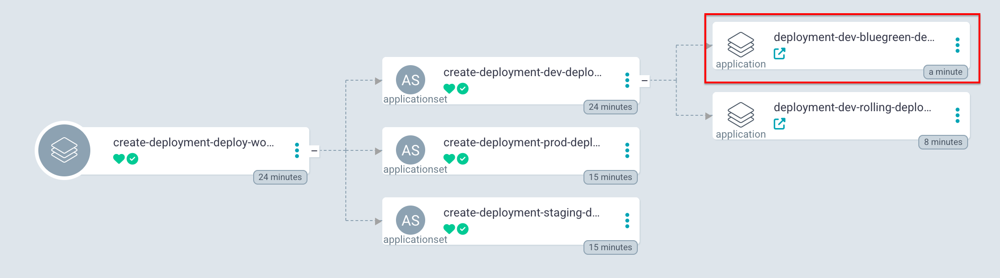


4. workload 검증

    > **중요**
    > 
    > Argo CD가 동기화되고 Karpenter가 추가 노드를 프로비저닝하는 데 몇 분이 걸립니다. 또한 로드 밸런서가 올바르게 프로비저닝되는 데도 몇 분이 걸립니다.

    ```sh
    export BLUE_URL=$(kubectl --context hub-cluster get svc -n bluegreen rollout-bluegreen-active -o jsonpath='{.status.loadBalancer.ingress[0].hostname}')
    export GREEN_URL=$(kubectl --context hub-cluster get svc -n bluegreen rollout-bluegreen-preview -o jsonpath='{.status.loadBalancer.ingress[0].hostname}')
    echo "Blue/Grenn Blue URL: http://$BLUE_URL"
    echo "Blue/Grenn Green URL: http://$GREEN_URL"
    ```

    Blue(active)
    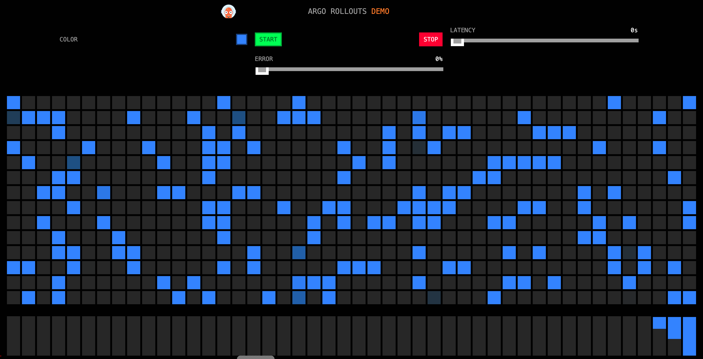

    Green(preview): 현재는 첫 배포라 active, preview가 같습니다.
    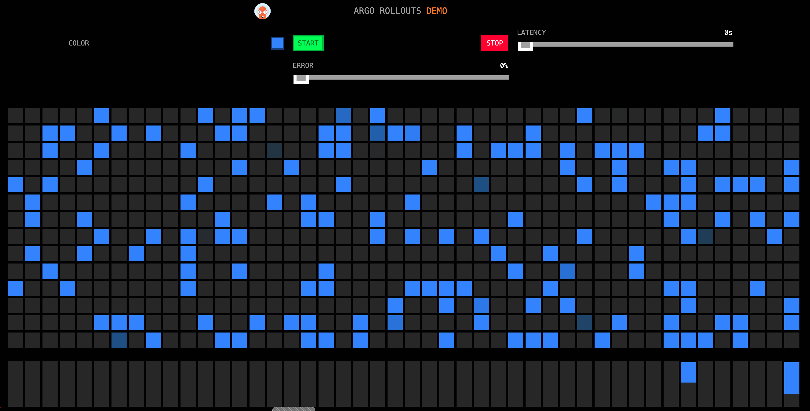


### deploy-workshop canary 배포

Canary 배포는 운영 환경에서 신규 버전을 점진적으로 배포하는 전략으로 실제 유저 요청을 살펴보며 승인단계에 따라 신규 버전의 비율을 높여가는 배포전략입니다.

1. base manifest

    ```sh
    mkdir -p $GITOPS_DIR/workload/deploy-workshop/canary/base
    cat > $GITOPS_DIR/workload/deploy-workshop/canary/base/rollout.yaml << 'EOF'
    apiVersion: argoproj.io/v1alpha1
    kind: Rollout
    metadata:
      name: rollout-canary
    spec:
      revisionHistoryLimit: 2
      selector:
        matchLabels:
          app: rollout-canary
      template:
        metadata:
          labels:
            app: rollout-canary
        spec:
          containers:
          - name: rollouts-demo
            image: argoproj/rollouts-demo:blue
            imagePullPolicy: Always
            ports:
            - containerPort: 8080
            resources:  # ← HPA를 위해 필수!
              requests:
                cpu: 10m
                memory: 128Mi
      strategy:
        canary:
          canaryService: rollout-canary-canary
          stableService: rollout-canary-stable
          steps:
          - setWeight: 20
          - pause: {}
          - setWeight: 40    # 전체 Pod의 40%를 카나리 버전으로
          - pause: {duration: 10s}
          - setWeight: 60
          - pause: {duration: 10s}
          - setWeight: 80
          - pause: {duration: 10s}
    EOF
    ```

    ```sh
    # 주의: Argo Rollouts가 자동으로 selector를 관리합니다
    # - stableService: stable 버전 Pod만 선택
    # - canaryService: canary 버전 Pod만 선택
    cat > $GITOPS_DIR/workload/deploy-workshop/canary/base/nlb.yaml << 'EOF'
    apiVersion: v1
    kind: Service
    metadata:
      name: rollout-canary-stable
    spec:
      type: ClusterIP
      ports:
        - port: 80
          targetPort: 8080
          name: http
      selector:
        app: rollout-canary
        # Argo Rollouts가 자동으로 추가: rollouts-pod-template-hash: <stable-hash>

    ---
    apiVersion: v1
    kind: Service
    metadata:
      name: rollout-canary-canary
    spec:
      type: ClusterIP
      ports:
        - port: 80
          targetPort: 8080
          name: http
      selector:
        app: rollout-canary
        # Argo Rollouts가 자동으로 추가: rollouts-pod-template-hash: <canary-hash>

    ---
    # 실제 사용자 트래픽을 받는 Service (stable + canary 모두)
    apiVersion: v1
    kind: Service
    metadata:
      name: rollout-canary
      annotations:
        service.beta.kubernetes.io/aws-load-balancer-type: external
        service.beta.kubernetes.io/aws-load-balancer-scheme: internet-facing
        service.beta.kubernetes.io/aws-load-balancer-nlb-target-type: instance
    spec:
      type: LoadBalancer
      ports:
        - port: 80
          targetPort: 8080
          name: http
      selector:
        app: rollout-canary  # stable과 canary Pod 모두 선택
    EOF
    ```

    ```sh
    cat > $GITOPS_DIR/workload/deploy-workshop/canary/base/hpa.yaml << 'EOF'
    apiVersion: autoscaling/v2
    kind: HorizontalPodAutoscaler
    metadata:
      name: rollout-canary-hpa
    spec:
      scaleTargetRef:
        apiVersion: argoproj.io/v1alpha1
        kind: Rollout
        name: rollout-canary
      minReplicas: 1
      maxReplicas: 5
      metrics:
      - type: Resource
        resource:
          name: cpu
          target:
            type: Utilization
            averageUtilization: 50
    EOF
    ```

    ```sh
    # $GITOPS_DIR/workload/deploy-workshop/canary/base/kustomization.yaml
    cat > $GITOPS_DIR/workload/deploy-workshop/canary/base/kustomization.yaml << 'EOF'
    apiVersion: kustomize.config.k8s.io/v1beta1
    kind: Kustomization
    resources:
    - rollout.yaml
    - nlb.yaml
    - hpa.yaml
    EOF
    ```

2. dev manifest 생성

    ```sh
    mkdir $GITOPS_DIR/workload/deploy-workshop/canary/dev
    cat > $GITOPS_DIR/workload/deploy-workshop/canary/dev/hpa.yaml << 'EOF'
    apiVersion: autoscaling/v2
    kind: HorizontalPodAutoscaler
    metadata:
      name: rollout-canary-hpa
    spec:
      metrics:
      - type: Resource
        resource:
          name: cpu
          target:
            type: Utilization
            averageUtilization: 50
    EOF
    ```

    ```sh
    cat > $GITOPS_DIR/workload/deploy-workshop/canary/dev/kustomization.yaml << 'EOF'
    apiVersion: kustomize.config.k8s.io/v1beta1
    kind: Kustomization
    resources:
    - ../base

    patchesStrategicMerge:
    - rollout.yaml
    - hpa.yaml
    EOF
    ```

    ```sh
    cat > $GITOPS_DIR/workload/deploy-workshop/canary/dev/rollout.yaml << 'EOF'
    apiVersion: argoproj.io/v1alpha1
    kind: Rollout
    metadata:
      name: rollout-canary
    spec:
      template:
        spec:
          containers:
          - name: rollouts-demo
            image: argoproj/rollouts-demo:blue
            imagePullPolicy: Always
            ports:
            - containerPort: 8080
            resources:  # ← HPA를 위해 필수!
              requests:
                cpu: 10m
                memory: 128Mi
    EOF
    ```

3. git push

    ```sh
    cd $GITOPS_DIR/workload
    git add .
    git commit -m "add canary workload"
    git push
    ```

    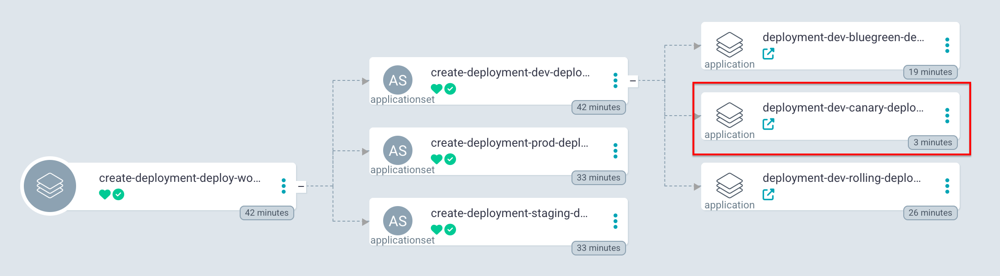

4. workload 검증

    > **중요**
    > 
    > Argo CD가 동기화되고 Karpenter가 추가 노드를 프로비저닝하는 데 몇 분이 걸립니다. 또한 로드 밸런서가 올바르게 프로비저닝되는 데도 몇 분이 걸립니다.

    ```sh
    export CANARY_URL=$(kubectl --context hub-cluster get svc -n canary rollout-canary -o jsonpath='{.status.loadBalancer.ingress[0].hostname}')
    echo "Canary Main URL: http://$CANARY_URL"
    ```

    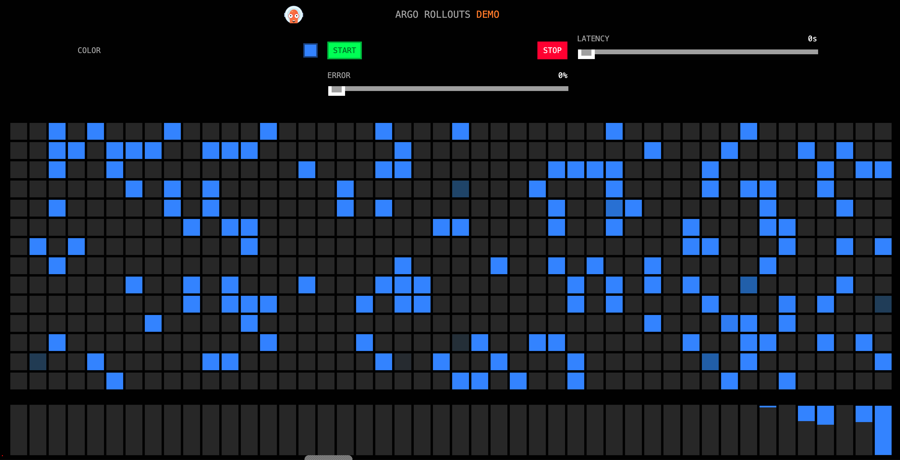
