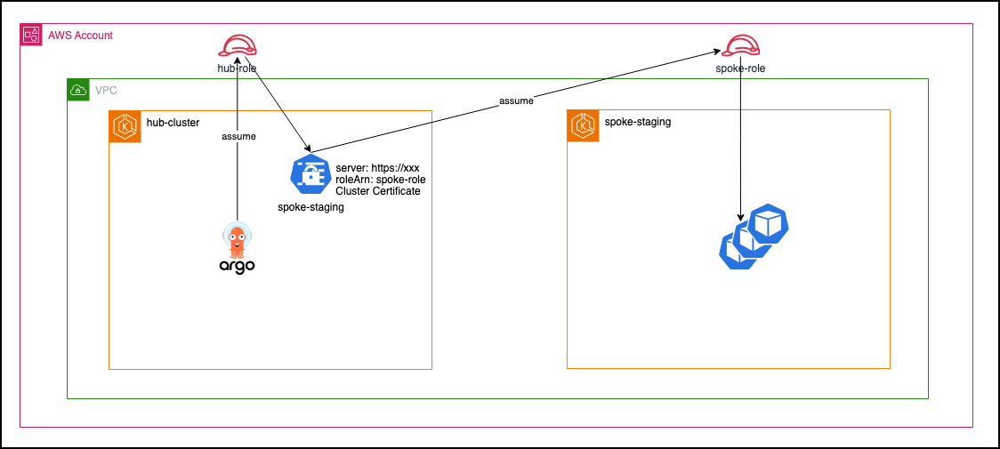
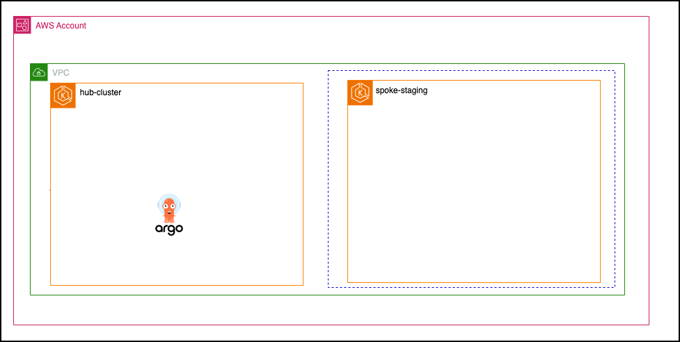
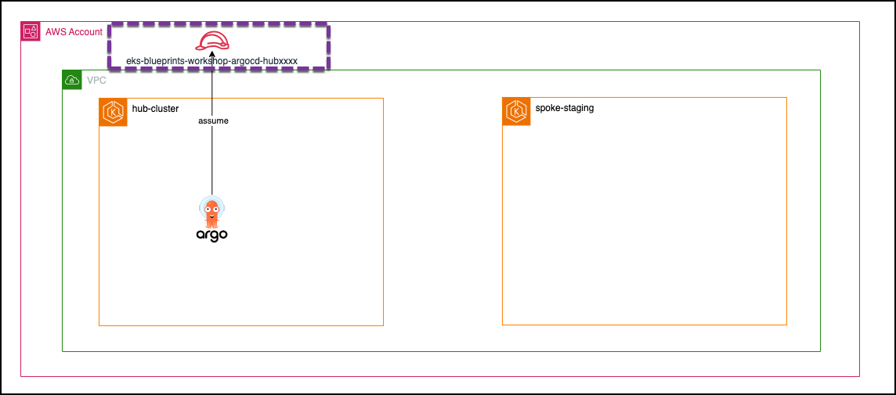
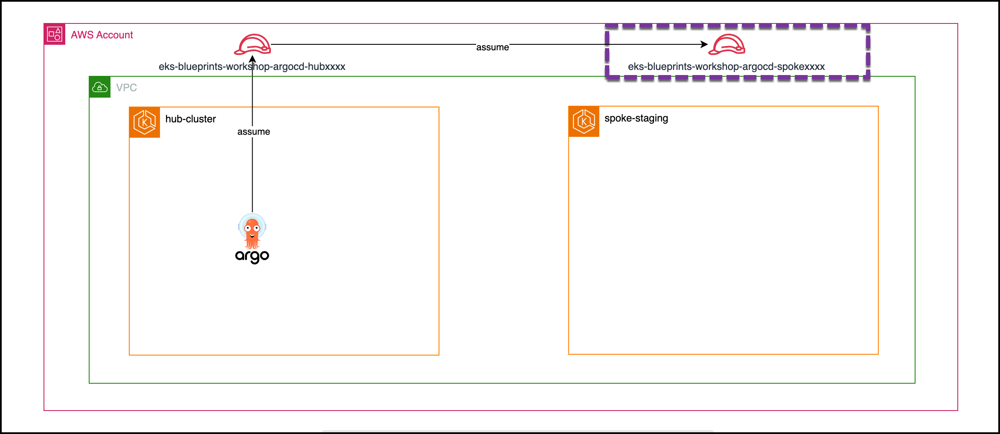
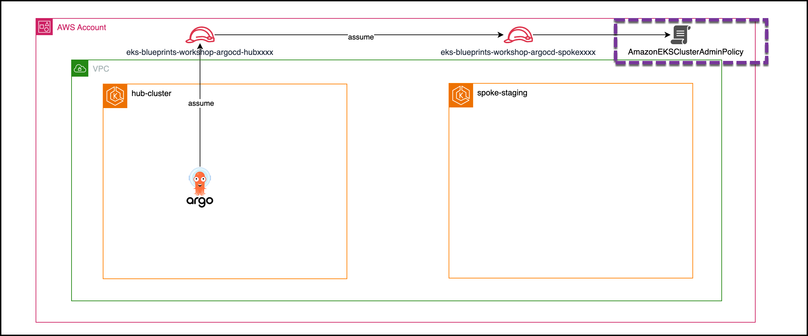
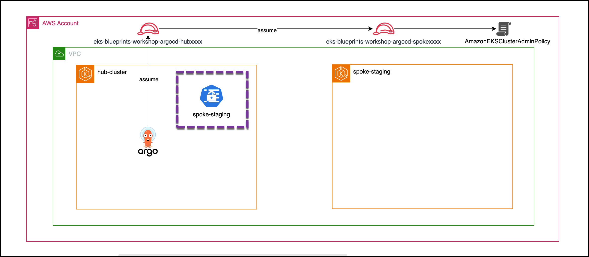
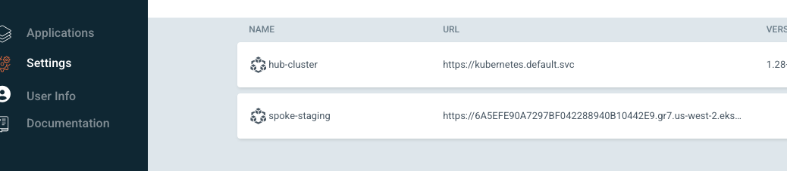
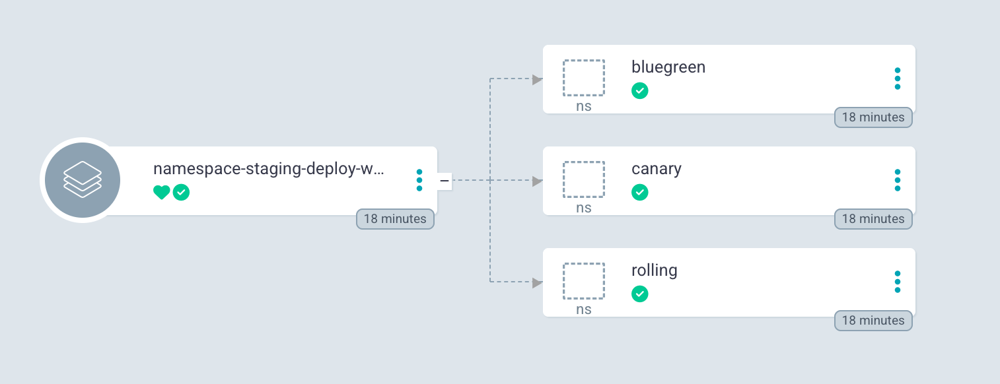
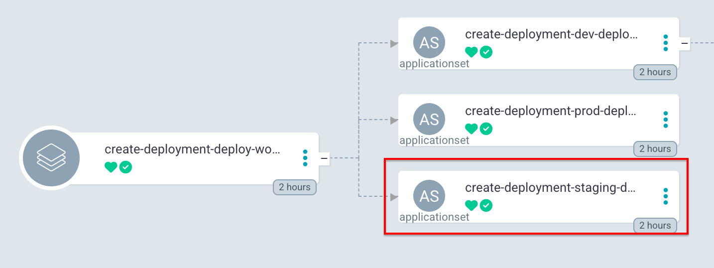

허브-스포크 ArgoCD 배포
---
허브-스포크 방식 에서는 단일 중앙 집중식 Argo CD 인스턴스( 허브 클러스터 에서 실행)가 여러 스포크 EKS 클러스터에서 애플리케이션과 애드온을 관리합니다.

이 장에서는 스포크 스테이징 클러스터 에 배포된 애플리케이션과 애드온을 관리하기 위해 허브 클러스터 에서 Argo CD를 구성합니다.

# 허브 to 스포크 연결(45분)

다음 다이어그램은 허브 ArgoCD가 원격 클러스터를 관리하는 방식을 설명합니다( spoke-staging).



허브 클러스터에서 ArgoCD를 활성화하여 스포크 클러스터의 작업 부하를 관리하려면 다음이 필요합니다.

1. **허브의 IAM 역할**: ArgoCD 서비스 계정을 `spoke-role`을 맡을 권한이 있는 IAM 역할(`hub-role`)과 연결합니다.

2. **Spoke의 IAM 역할**: 스포크 클러스터에 대한 관리자 권한을 가진 스포크 IAM 역할(`spoke-role`)을 만듭니다. 이 역할은 ArgoCD IAM 역할(`hub-role`)을 신뢰해야 합니다.

3. **허브의 클러스터 개체**: 허브에 다음과 같은 클러스터 객체(spoke-staging)를 생성합니다:

    - 스포크 클러스터의 API 엔드포인트
    - 클러스터 인증서
    - `roleArn`: `spoke-role`

ArgoCD 애플리케이션이 spoke-staging클러스터에 배포되면 ArgoCD는 `spoke-role` 역할을 수행합니다. 이 역할은 스포크 클러스터의 Kubernetes API 서버에 대한 액세스 권한을 부여하여 ArgoCD가 원격으로 애플리케이션을 배포하고, 애드온을 관리하고, 워크로드를 조정할 수 있도록 합니다.

## spoke-staing 클러스터 생성 (20분)

이 장에서는 플랫폼 엔지니어로서 spoke-staging이라는 또 다른 EKS 클러스터를 만들 것입니다.



스포크 스테이징 클러스터는 허브 클러스터 와 유사한 구성을 갖습니다 . 이 단계에서는 허브 클러스터에서 Terraform 구성을 복사하고 필요한 경우 업데이트하여 스테이징 스포크 클러스터를 생성합니다.

1. 원격 상태 구성

    스포크 스테이징 클러스터에서 VPC 모듈(for subnet)과 허브 모듈(hub-spoke 연결용)의 출력을 참조해야 합니다.

    ```sh
    mkdir -p ~/environment/spoke
    cd ~/environment/spoke
    cat > ~/environment/spoke/remote_state.tf << 'EOF'
    data "terraform_remote_state" "vpc" {
      backend = "local"

      config = {
        path = "${path.module}/../vpc/terraform.tfstate"
      }
    }
    data "terraform_remote_state" "hub" {
      backend = "local"

      config = {
        path = "${path.module}/../hub/terraform.tfstate"
      }
    }

    EOF
    ```

2. EKS Spoke 클러스터 구성

    허브 클러스터의 Terraform 구성을 몇 가지 변경 사항과 함께 재사용해 보겠습니다.

    ```sh
    cp ~/environment/hub/main.tf ~/environment/spoke
    cp ~/environment/hub/variables.tf ~/environment/spoke
    cp ~/environment/hub/outputs.tf ~/environment/spoke
    cp ~/environment/hub/versions.tf ~/environment/spoke
    sed -i 's/hub-cluster/spoke-${terraform.workspace}/g' ~/environment/spoke/main.tf
    sed -i 's/environment = "dev"/environment = terraform.workspace/' ~/environment/spoke/main.tf
    sed -i 's/fleet_member = "hub"/fleet_member = "spoke"/' ~/environment/spoke/main.tf
    sed -i 's/{ workload_webstore = true }/{ workload_webstore = false }/' ~/environment/spoke/main.tf

    # Clean some parts
    sed -i 's/^    bootstrap   = file("${path.module}\/bootstrap\/bootstrap-applicationset.yaml")/#    bootstrap   = file("${path.module}\/bootstrap\/bootstrap-applicationset.yaml")/' ~/environment/spoke/main.tf
    sed -i '/^module "gitops_bridge_bootstrap" {/,/^}/d' ~/environment/spoke/main.tf
    sed -i '/^resource "kubernetes_secret" "git_secrets" {/,/^}/d' ~/environment/spoke/main.tf
    ```

    허브-클러스터 Terraform 구성에 대한 변경 사항:

    - 5행: 클러스터 이름을 hub-cluster에서 spoke-${terraform.workspace}로 변경합니다. "staging" 작업 공간은 이후 단계에서 생성됩니다.
    - 6행: 레이블을 environment=staging으로 설정합니다.
    - 7행: 레이블을 fleet_member=spoke로 설정합니다.
    - 8행: 레이블을 workload_webstore=false로 설정합니다. 이 설정은 이후 장에서 애플리케이션 배포 시 true로 설정됩니다. 11~
    - 13행: 부트스트랩 ApplicationSet을 비활성화하고 GitOps Bridge 모듈을 제거합니다(Spoke-staging 클러스터에는 Argo CD를 배포하지 않습니다).

3. 애드온 구성

    .tfvars 파일을 복사하고 Argo CD 및 기타 선택적 구성 요소를 비활성화합니다.

    ```sh
    cp ~/environment/hub/terraform.tfvars ~/environment/spoke/terraform.tfvars
    sed -i 's/enable_argocd = true/enable_argocd = false/' ~/environment/spoke/terraform.tfvars
    sed -i 's/enable_ingress_nginx = true/enable_ingress_nginx = false/' ~/environment/spoke/terraform.tfvars
    sed -i 's/enable_external_secrets = true/enable_external_secrets = false/' ~/environment/spoke/terraform.tfvars
    ```

4. Terraform 작업 공간 생성 및 Terraform 적용

    새로운 스테이징 작업 공간을 만들고 구성을 적용합니다.

    ```sh
    cd ~/environment/spoke
    terraform workspace new staging
    terraform init
    terraform apply --auto-approve
    ```

    리소스가 생성될 때까지 기다리세요
    클러스터를 만드는 과정은 일반적으로 완료하는 데 약 15분이 걸립니다.

5. Spoke Staging 클러스터에 액세스

    kubectl을 구성하려면 다음을 실행합니다.

    ```sh
    eval $(terraform output -raw configure_kubectl)
    ```

    kubectl이 올바르게 구성되었는지 확인하려면 다음을 실행하세요.

    ```sh
    kubectl get svc --context spoke-staging
    ```

    kubectl이 올바르게 구성되었는지 확인하려면 아래 명령을 실행하여 API 엔드포인트에 도달할 수 있는지 확인하세요.

    예상 출력:

    ```sh
    NAME         TYPE        CLUSTER-IP   EXTERNAL-IP   PORT(S)   AGE
    kubernetes   ClusterIP   172.20.0.1   <none>        443/TCP   2d
    ```

    이제 AWS 콘솔의 EKS > 클러스터에서 스포크 스테이징 클러스터를 볼 수 있습니다.

## 허브 클러스터 구성(10분)

이 장에서는 ArgoCD 서비스 계정에서 수행하는 역할을 생성합니다. 이 역할에는 다른 역할에 대한 역할 수행 권한이 부여됩니다.



1. ArgoCD Hub 역할 생성

    이제 IAM 역할과 관련 리소스를 만들어 보겠습니다.

    ```sh
    # Variable to save the ArgoCD Role in SSM Parameters
    cat <<'EOF' >> ~/environment/hub/variables.tf
    variable "ssm_parameter_name_argocd_role_suffix" {
      description = "SSM parameter name for ArgoCD role"
      type        = string
      default     = "argocd-central-role"
    }
    EOF


    cat <<'EOF' >> ~/environment/hub/pod-identity.tf
    ################################################################################
    # ArgoCD EKS Pod Identity Association
    ################################################################################
    resource "aws_iam_role" "argocd_hub" {
      name_prefix = "${local.context_prefix}-argocd-hub"

      assume_role_policy = jsonencode({
        Version = "2012-10-17"
        Statement = [
          {
            Sid    = "AllowEksAuthToAssumeRoleForPodIdentity"
            Effect = "Allow"
            Action = ["sts:AssumeRole", "sts:TagSession"]
            Principal = {
              Service = "pods.eks.amazonaws.com"
            }
            Condition = {
              StringEquals = {
                "aws:SourceAccount" = data.aws_caller_identity.current.account_id
              }
              ArnEquals = {
                "aws:SourceArn" = module.eks.cluster_arn
              }
            }        
          },
        ]
      })

      inline_policy {
        name = "argocd"

        policy = jsonencode({
          Version = "2012-10-17"
          Statement = [
            {
              Action   = ["sts:AssumeRole", "sts:TagSession"]
              Effect   = "Allow"
              Resource = "*"
            },
          ]
        })
      }

      tags = local.tags
    }


    # Creating parameter for all clusters to read
    resource "aws_ssm_parameter" "argocd_hub_role" {
      name  = "${local.context_prefix}-${var.ssm_parameter_name_argocd_role_suffix}"
      type  = "String"
      value = aws_iam_role.argocd_hub.arn
    }

    resource "aws_eks_pod_identity_association" "argocd_controller" {
      cluster_name    = module.eks.cluster_name
      namespace       = "argocd"
      service_account = "argocd-application-controller"
      role_arn        = aws_ssm_parameter.argocd_hub_role.value
      tags = local.tags
    }
    resource "aws_eks_pod_identity_association" "argocd_server" {
      cluster_name    = module.eks.cluster_name
      namespace       = "argocd"
      service_account = "argocd-server"
      role_arn        = aws_ssm_parameter.argocd_hub_role.value
      tags = local.tags
    }
    EOF
    ```

    - 14번째 줄: Pod ID를 위해 AssumeRole과 TagSession이 모두 필요합니다.
    - 50번째 줄: 허브 역할 ARN을 매개변수 저장소에 저장합니다. Spoke Cluster Terraform 모듈은 ARN에 대한 매개변수를 찾습니다. 스포크와의 신뢰를 구축하기 위해 이 매개변수가 필요합니다.
    - 56-63번째 줄: 역할을 ArgoCD 서비스 계정과 연결합니다.

2. Terraform 적용

    변경 사항을 적용하여 IAM 역할과 관련 리소스를 만듭니다.

    ```sh
    cd ~/environment/hub
    terraform init
    terraform apply --auto-approve
    ```

3. ArgoCD Pod를 다시 시작하여 Pod ID를 적용합니다.

    ArgoCD를 처음 설치했을 때는 포드 ID 연결이 없었습니다. 이 장에서 Pod Identity를 추가했습니다. ArgoCD 포드를 다시 생성하여 Pod Identity에 맞게 구성해 보겠습니다.

    ```sh
    kubectl rollout restart -n argocd deployment argocd-server --context hub-cluster
    kubectl rollout restart -n argocd statefulset argocd-application-controller --context hub-cluster
    ```

## 스포크 클러스터 구성(15분)

이 장에서는 스포크 스테이징 클러스터를 허브 Argo CD 인스턴스에 관리형 클러스터로 등록할 수 있도록 구성합니다. 이를 통해 허브 클러스터에서 실행되는 Argo CD가 스포크에 워크로드를 배포할 수 있습니다.

1. 허브 클러스터에 대한 스포크 스테이징 액세스

    스포크 스테이징 Terraform은 허브 클러스터에 액세스하여 자체(ArgoCD 클러스터 개체)를 관리형 클러스터로 등록해야 합니다.

    ```sh
    cat <<'EOF' >> ~/environment/spoke/main.tf
    ################################################################################
    # Kubernetes Access for Hub Cluster
    ################################################################################
    provider "kubernetes" {
      host                   = data.terraform_remote_state.hub.outputs.cluster_endpoint
      cluster_ca_certificate = base64decode(data.terraform_remote_state.hub.outputs.cluster_certificate_authority_data)

      exec {
        api_version = "client.authentication.k8s.io/v1beta1"
        command     = "aws"
        # This requires the awscli to be installed locally where Terraform is executed
        args = ["eks", "get-token", "--cluster-name", data.terraform_remote_state.hub.outputs.cluster_name, "--region", data.terraform_remote_state.hub.outputs.cluster_region]
      }
      alias = "hub"
    }
    EOF
    ```

2. 허브 역할 ARN 검색

    SSM 매개변수에서 허브 역할 ARN을 검색합니다. 이 역할은 스포크 클러스터의 IAM 역할에 대한 신뢰 정책에 필요합니다.

    ```sh
    cat <<'EOF' >> ~/environment/spoke/variables.tf
    variable "ssm_parameter_name_argocd_role_suffix" {
      description = "SSM parameter name for ArgoCD role"
      type        = string
      default     = "argocd-central-role"
    }
    EOF

    cat <<'EOF' >> ~/environment/spoke/main.tf
    # Reading parameter created by hub cluster to allow access of argocd to spoke clusters
    data "aws_ssm_parameter" "argocd_hub_role" {
      name = "${local.context_prefix}-${var.ssm_parameter_name_argocd_role_suffix}"
    }
    EOF
    ```

3. 스포크 역할 생성

    

    ```sh
    cat <<'EOF' >> ~/environment/spoke/main.tf
    ################################################################################
    # ArgoCD EKS Access
    ################################################################################
    resource "aws_iam_role" "spoke" {
      name_prefix =  "${local.name}-argocd-spoke"
      assume_role_policy = data.aws_iam_policy_document.assume_role_policy.json
    }

    data "aws_iam_policy_document" "assume_role_policy" {
      statement {
        actions = ["sts:AssumeRole", "sts:TagSession"]
        principals {
          type        = "AWS"
          identifiers = [data.aws_ssm_parameter.argocd_hub_role.value]
        }  
      }
    }
    EOF
    ```

   - 15번째 줄: Spoke role Trust's Hub role

4. 관리자 액세스 권한 부여

    클러스터 관리자에게 스포크 역할에 대한 액세스 권한을 부여합니다.

    

    ```sh
    sed -i '
    /access_entries = {/,/^  }/ {
      /^  }/i\
    \
        gitops_role = {\
          principal_arn     = aws_iam_role.spoke.arn\
          policy_associations = {\
            argocd = {\
              policy_arn = "arn:aws:eks::aws:cluster-access-policy/AmazonEKSClusterAdminPolicy"\
              access_scope = {\
                type       = "cluster"\
              }\
            }\
          }\
        }
    }
    ' ~/environment/spoke/main.tf

    ```

5. Hub ArgoCD에 Spoke-Staging 클러스터 등록

    

    ```sh
    cat <<'EOF' >> ~/environment/spoke/main.tf
    ################################################################################
    # GitOps Bridge: Bootstrap for Hub Cluster
    ################################################################################
    module "gitops_bridge_bootstrap_hub" {
      source  = "gitops-bridge-dev/gitops-bridge/helm"
      version = "0.0.1"

      # The ArgoCD remote cluster secret is deployed on the hub cluster, not on spoke clusters
      providers = {
        kubernetes = kubernetes.hub
      }

      install = false # We are not installing argocd via helm on hub cluster
      cluster = {
        cluster_name = module.eks.cluster_name
        environment  = local.environment
        metadata     = local.annotations
        addons       = local.addons
        server       = module.eks.cluster_endpoint
        config       = <<-EOT
          {
            "tlsClientConfig": {
              "insecure": false,
              "caData" : "${module.eks.cluster_certificate_authority_data}"
            },
            "awsAuthConfig" : {
              "clusterName": "${module.eks.cluster_name}",
              "roleARN": "${aws_iam_role.spoke.arn}"
            }
          }
        EOT
      }
    }

    EOF
    ```

    - 라인 15: 스포크 클러스터에 ArgoCD를 설치하지 않습니다.

6. 허브 노드가 스포크 클러스터에 액세스하도록 허용

    스포크 클러스터는 퍼블릭 엔드포인트 접근 권한을 가지고 있지만, DNS는 VPC 내의 프라이빗 IP로 연결됩니다. 허브 클러스터의 Argo CD 포드가 스포크 클러스터 API에 연결할 수 있도록 하려면 스포크 클러스터의 보안 그룹에서 인바운드 포트 443을 열어야 합니다.

    ```sh
    cat <<'EOF' >> ~/environment/spoke/main.tf

    resource "aws_vpc_security_group_ingress_rule" "hub_to_spoke" {
      security_group_id            = module.eks.cluster_primary_security_group_id
      referenced_security_group_id = data.terraform_remote_state.hub.outputs.cluster_primary_security_group_id
      ip_protocol                  = "tcp"
      from_port                    = "443"
      to_port                      = "443"
    }

    EOF
    ```

7. 변경 사항 적용

    ```sh
    cd ~/environment/spoke
    terraform init
    terraform workspace select staging
    terraform apply --auto-approve
    ```

8. 허브 클러스터 구성 확인

    변경 사항을 적용한 후, 허브 클러스터에서 실행되는 ArgoCD UI의 설정 → 클러스터 섹션에 스포크 스테이징 클러스터가 나타나야 합니다.

    

# deploy-workshop Staging: 네임스페이스 설정(10분)


이 장에서는 다음과 같은 역할을 하게 됩니다. 플랫폼 엔지니어로서 `spoke-staging`클러스터에서 deploy-worksghop 워크로드를 위한 네임스페이스를 만듭니다.

이 장에서는 "deploy-worksghop 워크로드 온보딩>네임스페이스>deploy-worksghop 네임스페이스 생성" 장 에서 소개된 네임스페이스 자동화를 기반으로 하며, 이 장에서 이미 Argo CD가 네임스페이스 Helm 차트를 설치하도록 구성되었습니다.

간략하게 요약해 보겠습니다. 클러스터에 네임스페이스 Helm 차트(11-12번째 줄)를 배포하고 `workload_deploy-worksghop = true`(7번째 줄) 레이블을 설정하여 네임스페이스를 프로비저닝하는
ApplicationSet(namespace-deploy-worksghop-applicationset.yaml)을 추가했습니다. 이 차트는 기본값 파일(11번째 줄)을 사용하고 환경별 재정의(12번째 줄)를 적용합니다.

```yaml
.
.
generators: 
  - clusters:
      selector:
        matchLabels:
          workload_deploy-workshop: 'true'
.
.
source:
  repoURL: '{{ .metadata.annotations.platform_repo_url }}'
  path: '{{ .metadata.annotations.platform_repo_basepath }}charts/namespace'
  targetRevision: '{{ .metadata.annotations.platform_repo_revision }}'
helm:
  releaseName: 'deploy-workshop'
  ignoreMissingValueFiles: true
  valueFiles: 
    - '../../config/deploy-worksghop/namespace/values/default-values.yaml' 
    - '../../config/deploy-worksghop/namespace/values/{{ .metadata.labels.environment }}-values.yaml'
.
.
```

1. 네임스페이스 검증

    > **메모**
    > 
    > 네임스페이스가 생성되는 데 몇 분 정도 걸릴 수 있습니다. 잠시 기다렸다가 다시 시도해 보세요.

    이 설정을 사용하면 웹스토어 네임스페이스와 해당 정책(LimitRange 및 NetworkPolicies 등)이 간단한 Git 변경 사항으로 구동되는 ArgoCD 및 Helm을 사용하여 자동으로 관리됩니다.

    ```sh
    kubectl get ns --context spoke-staging
    ```

    **결과**
    ```sh
    NAME              STATUS   AGE
    argo-rollouts     Active   17m
    argocd            Active   38m
    bluegreen         Active   17m
    canary            Active   17m
    default           Active   43m
    kube-node-lease   Active   43m
    kube-public       Active   43m
    kube-system       Active   43m
    rolling           Active   17m
    ```

    


# 스테이징에 deploy-workshop 배포(10분)

이 장에서는 응용 프로그램 팀이 플랫폼 팀의 직접적인 참여 없이 deploy-workshop 스테이징 애플리케이션을 독립적으로 배포합니다.

지금까지 deploy-workshop 워크로드를 위한 스테이징 네임스페이스를 만들었지만, 스테이징 deploy-workshop 애플리케이션 자체는 아직 배포하지 않았습니다.

이 장에서는 "deploy-workshop 워크로드 온보딩 > 워크로드 > deploy-workshop 배포 자동화" 장 에서 소개된 네임스페이스 자동화를 기반으로 합니다 . 이 장에서 이미 ArgoCD가 스테이징 및 프로덕션 환경을 모두 배포하도록 구성되었습니다.



1. 웹스토어 스테이징 환경 복사

    이제 스테이징 환경 코드를 워크로드 Git 저장소에 복사합니다. 모든 환경(예: staging)은 공유 폴더 위에 사용자 지정을 적용한다는 점을 기억하세요. 이미 기본 환경이 있으므로 dev폴더를 복사합니다.

    ```sh
    cp -r $GITOPS_DIR/workload/deploy-workshop/rolling/dev $GITOPS_DIR/workload/deploy-workshop/rolling/staging
    cp -r $GITOPS_DIR/workload/deploy-workshop/bluegreen/dev $GITOPS_DIR/workload/deploy-workshop/bluegreen/staging
    cp -r $GITOPS_DIR/workload/deploy-workshop/canary/dev $GITOPS_DIR/workload/deploy-workshop/canary/staging
    ```

2. 변경 사항을 커밋합니다.

    변경 사항을 커밋해 보겠습니다.

    ```sh
    cd $GITOPS_DIR/workload
    git add .
    git commit -m "add staging manifests for deploy-workshop service"
    git push
    ```

3. 배포 검증

    > **중요**
    > 
    > ArgoCD가 동기화되고 Karpenter가 추가 노드를 프로비저닝하는 데 몇 분이 걸립니다. 또한 로드 밸런서가 올바르게 프로비저닝되는 데도 몇 분이 걸립니다.

    deploy-workshop 애플리케이션에 액세스하려면 다음을 실행하세요.

    ```sh
    export ROLLING_URL=$(kubectl --context spoke-staging get svc -n rolling rollout-rolling -o jsonpath='{.status.loadBalancer.ingress[0].hostname}')
    echo "Staing Rolling URL: http://$ROLLING_URL"

    export BLUE_URL=$(kubectl --context spoke-staging get svc -n bluegreen rollout-bluegreen-active -o jsonpath='{.status.loadBalancer.ingress[0].hostname}')
    export GREEN_URL=$(kubectl --context spoke-staging get svc -n bluegreen rollout-bluegreen-preview -o jsonpath='{.status.loadBalancer.ingress[0].hostname}')
    echo "Staing Blue/Grenn Blue URL: http://$BLUE_URL"
    echo "Staing Blue/Grenn Green URL: http://$GREEN_URL"

    export CANARY_URL=$(kubectl --context spoke-staging get svc -n canary rollout-canary -o jsonpath='{.status.loadBalancer.ingress[0].hostname}')
    echo "Staing Canary Main URL: http://$CANARY_URL"
    ```

    브라우저에서 접속하세요.

