# Jenkins

이 장에서는 Jenkins를 설치하고 Jenkins pipeline을 사용하여 배포하는 방법에 대해 알아봅니다.

## demo 애플리케이션(15분)

개발자가 개발코드를 수정하는 상황을 만들기위해서 demo 애플리케이션 저장소를 생성하고 이를 위한 ECR 레포지토리를 생성합니다.

### demo 애플리케이션 git 저장소를 생성

개발자가 코드를 저장하기 위한 git 저장소를 생성합니다.

1. gitea 화면에 접속

    ```sh
    gitea_credentials
    ```

    결과:
    ```sh
    Gitea Username: workshop-user
    Gitea Password: y1rmMJm5ayVgpEoQNEsE1YdKMcUeCqbE
    https://drys2vc4z95uy.cloudfront.net/gitea/workshop-user/
    ```

2. 저장소 추가

    우측 상단의 `+`을 눌러 저장소를 추가합니다.
    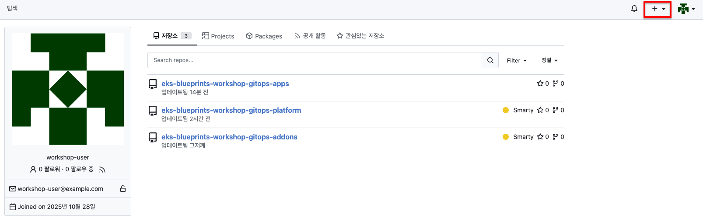

    저장소 이름에 `eks-blueprints-workshop-gitops-demo-application`를 입력하고
    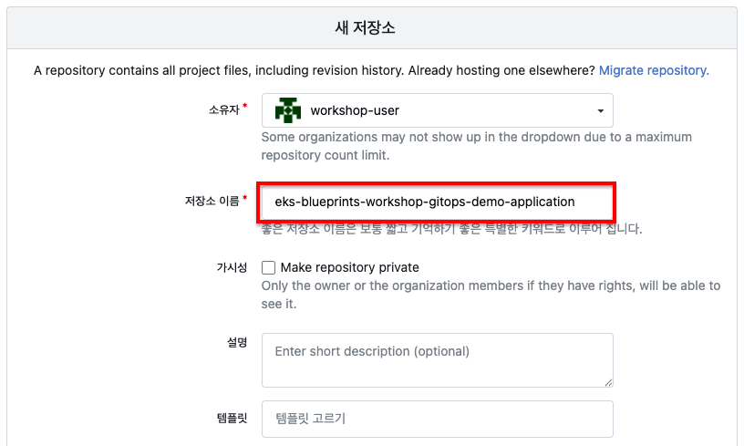

    제일 아래에 `저장소 만들기`를 선택합니다.
    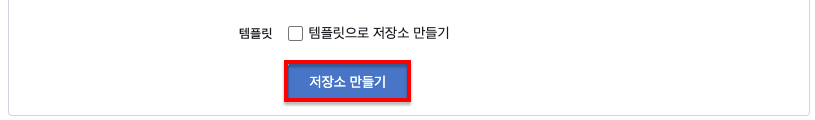

3. 생성완료

    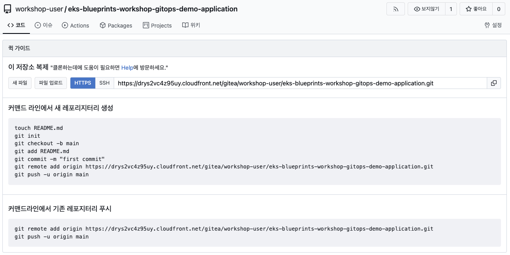

### rollout-demo 애플리케이션 git 저장소를 생성

`eks-blueprints-workshop-gitops-demo-application`저장소에 코드를 업로드합니다. 여기서는 argocd의 `rollout-demo`를 활용합니다.

1. demo-application 복제

    ```sh
    mkdir -p $GITOPS_DIR/demo-application
    cd ${GITOPS_DIR}
    git clone --depth 1 https://github.com/argoproj/rollouts-demo.git $GITOPS_DIR/demo-application
    cd $GITOPS_DIR/demo-application
    rm -rf .git
    git init
    git add .
    git commit -m "Initial commit from argoproj/rollouts-demo"
    git remote add origin ${GITEA_EXTERNAL_URL}/workshop-user/eks-blueprints-workshop-gitops-demo-application.git
    git push -u origin main
    ```

2. 검증

    브라우저로 Demo Application Repo에 접속하여 확인
    ```sh
    export DEMO_APPLICATION_REOP=(${GITEA_EXTERNAL_URL}/workshop-user/eks-blueprints-workshop-gitops-demo-application.git)
    echo "Demo Application Repo: ${DEMO_APPLICATION_REOP}"
    ```

### rollout-demo ECR 저장소 생성

변경된 demo-application 코드를 docker 이미지로 빌드하여 저장할 저장소를 생성합니다.

1. 저장소 생성

    ```sh
    aws ecr create-repository --repository-name eks-blueprint-workshop-demo-application --region ap-northeast-2
    ```

2. docker build & push 

    ```sh
    cd ${GITOPS_DIR}/demo-application
    export DEMO_APPLICATION_DOCKER_REGISTRY="${ACCOUNTID}.dkr.ecr.${AWS_REGION}.amazonaws.com/eks-blueprint-workshop-demo-application"
    aws ecr get-login-password --region ap-northeast-2 \
      | docker login --username AWS --password-stdin ${DEMO_APPLICATION_DOCKER_REGISTRY}
    docker build --build-arg COLOR=blue --build-arg ERROR_RATE= --build-arg LATENCY= -t ${DEMO_APPLICATION_DOCKER_REGISTRY}:test .
    docker push ${DEMO_APPLICATION_DOCKER_REGISTRY}:test
    ```

3. 검증

    ```sh
    aws ecr list-images \
      --repository-name eks-blueprint-workshop-demo-application \
      --filter tagStatus=TAGGED \
      --region ap-northeast-2 \
      --output json
    ```

    결과:
    ```sh
    {
        "imageIds": [
            {
                "imageDigest": "sha256:1e64e497663b43ec01ca11e0d99fdf5c661a327856b54e39b32b842579684a1b",
                "imageTag": "test"
            }
        ]
    }
    ```


## Custom Jenkins Agent(15분)

Jenkins NodE(Agent)에서 aws와 argocd명령을 사용하기 위해서 별도의 Docker 이미지를 생성하여 사용합니다.

### Custom Jenkins Agent ECR 저장소 생성

1. custom Jenkins Agent ECR 저장소 생성

    ```sh
    aws ecr create-repository --repository-name eks-blueprint-workshop-jenkins-agent --region ap-northeast-2
    ```

2. 검증

    ```sh
    aws ecr describe-repositories --repository-names eks-blueprint-workshop-jenkins-agent --region ap-northeast-2
    ```

### Custom Jenkins Agent Docker 이미지 생성

1. Dockerfile

    ```sh
    mkdir -p $GITOPS_DIR/pipeline/
    cat > $GITOPS_DIR/pipeline/Dockerfile << 'EOF'
    FROM jenkins/inbound-agent:latest

    USER root

    # 필수 패키지 설치
    RUN apt-get update && \
        apt-get install -y curl unzip git && \
        rm -rf /var/lib/apt/lists/*

    # AWS CLI v2 설치
    RUN curl "https://awscli.amazonaws.com/awscli-exe-linux-x86_64.zip" -o "awscliv2.zip" && \
        unzip awscliv2.zip && \
        ./aws/install && \
        rm -rf awscliv2.zip aws

    # ArgoCD CLI 설치
    RUN curl -sSL -o /usr/local/bin/argocd https://github.com/argoproj/argo-cd/releases/download/v2.12.2/argocd-linux-amd64 && \
        chmod +x /usr/local/bin/argocd

    # kubectl 설치 (선택사항)
    RUN curl -LO "https://dl.k8s.io/release/$(curl -L -s https://dl.k8s.io/release/stable.txt)/bin/linux/amd64/kubectl" && \
        install -o root -g root -m 0755 kubectl /usr/local/bin/kubectl && \
        rm kubectl

    # Docker CLI 설치 (선택사항)
    RUN apt-get update && \
        apt-get install -y docker.io && \
        rm -rf /var/lib/apt/lists/*

    USER jenkins
    EOF
    ```

2. custom jenkins agent docker 이미지 빌드

    ```sh
    export JENKINS_AGENT_DOCKER_REGISTRY="${ACCOUNTID}.dkr.ecr.${AWS_REGION}.amazonaws.com/eks-blueprint-workshop-jenkins-agent"
    cd $GITOPS_DIR/pipeline
    aws ecr get-login-password --region ap-northeast-2  | docker login --username AWS --password-stdin ${JENKINS_AGENT_DOCKER_REGISTRY}
    docker build -t ${JENKINS_AGENT_DOCKER_REGISTRY}:latest -f Dockerfile .
    docker push ${JENKINS_AGENT_DOCKER_REGISTRY}:latest
    ```

3. 검증

    ```sh
    aws ecr list-images \
      --repository-name eks-blueprint-workshop-jenkins-agent \
      --filter tagStatus=TAGGED \
      --region ap-northeast-2 \
      --output json
    ```

    결과:
    ```sh
    {
        "imageIds": [
            {
                "imageDigest": "sha256:5a60feec6b10ace4da56c10fbdb5c7b521f6ecdb68a37b6d3282430facf1b170",
                "imageTag": "latest"
            }
        ]
    }
    ```

## Jenkins 설치(15분)

이 장에서는 `gitops-bridge`를 통해 hub-cluster에 Jenkins를 설치하고 Pipeline을 실행할 수 있는 설정을 알아보도록 하겠습니다.

### Jenkins Addon 추가

1. jenkins addon 추가

    ```sh
    cat >> $GITOPS_DIR/addons/charts/gitops-bridge/values.yaml << 'EOF'

      jenkins:
        enabled: false
        releaseName: jenkins
        namespace: jenkins
        chart: jenkins
        repoUrl: https://charts.jenkins.io
        targetRevision: "5.8.102"
        selector:
          matchExpressions:
            - key: enable_jenkins
              operator: In
              values: ['true']
    EOF
    ```

2. jenkins value 추가

    ```sh
    export JENKINS_AGENT_DOCKER_REGISTRY="${ACCOUNTID}.dkr.ecr.${AWS_REGION}.amazonaws.com/eks-blueprint-workshop-jenkins-agent"
    mkdir -p $GITOPS_DIR/addons/default/addons/jenkins
    cat > $GITOPS_DIR/addons/default/addons/jenkins/values.yaml << EOF
    controller:
      # When enabling LDAP or another non-Jenkins identity source, the built-in admin account will no longer exist.
      # If you disable the non-Jenkins identity store and instead use the Jenkins internal one,
      # you should revert controller.admin.username to your preferred admin user:
      admin:
        # -- Admin username created as a secret if 'controller.admin.createSecret' is true
        username: "admin"
        # -- Admin password created as a secret if 'controller.admin.createSecret' is true
        # @default -- <random password>
        password: "admin"

      # For minikube, set this to NodePort, elsewhere uses LoadBalancer
      # Use ClusterIP if your setup includes ingress controller
      # -- k8s service type
      serviceType: LoadBalancer
      # -- k8s service port
      servicePort: 80

      # -- Jenkins controller service annotations
      serviceAnnotations:
        service.beta.kubernetes.io/aws-load-balancer-type: external
        service.beta.kubernetes.io/aws-load-balancer-scheme: internet-facing
        service.beta.kubernetes.io/aws-load-balancer-nlb-target-type: instance

      # Install Jenkins plugins by default
      # Use additionalPlugins to append without overriding chart defaults
      additionalPlugins:
        - pipeline-stage-view:latest

    persistence:
      # -- Enable the use of a Jenkins PVC
      enabled: false

    # ServiceAccount configuration - Use Pod Identity
    serviceAccount:
      create: true
      name: jenkins
      annotations:
        # Pod Identity will be automatically configured by terraform module

    # Agent configuration
    rbac:
      create: true
    agent:
      # Use a custom image with pre-installed tools or install them on-the-fly
      podName: "jenkins-agent"
      customJenkinsLabels: "jenkins-agent"
      
      # Container environment for agents
      containerCap: 10
      
      # Pod template for Jenkins agents with AWS CLI, ArgoCD CLI and Kaniko
      # Uses Pod Identity for AWS credentials
      # Kaniko for container image building without Docker daemon
      podTemplates:
        default-agent: |
          - name: default-agent
            label: default-agent
            serviceAccount: jenkins
            volumes:
            - emptyDirVolume:
                memory: false
                mountPath: /kaniko/.docker
            containers:
            - name: jnlp
              image: ${JENKINS_AGENT_DOCKER_REGISTRY}:latest
              workingDir: /home/jenkins/agent
              ttyEnabled: true
              envVars:
              - envVar:
                  key: AWS_REGION
                  value: ap-northeast-2
            - name: kaniko
              image: gcr.io/kaniko-project/executor:debug
              workingDir: /home/jenkins/agent
              command: /busybox/cat
              ttyEnabled: true
              envVars:
              - envVar:
                  key: AWS_REGION
                  value: ap-northeast-2
    EOF
    ```

3. git 커밋

    ```sh
    cd $GITOPS_DIR/addons
    git add .
    git commit -m "Add Jenkins addon configuration to gitops-bridge values.yaml"
    git push
    ```

### hub cluster에 Jenkins 설치

1. Jenkins 권한 추가

    ```sh
    cat >> ~/environment/hub/main.tf << 'EOF'

    ################################################################################
    # Jenkins Agent Pod Identity
    ################################################################################

    # IAM Role Trust Policy for EKS Pod Identity
    data "aws_iam_policy_document" "jenkins_agent_assume_role" {
      statement {
        effect = "Allow"
        principals {
          type        = "Service"
          identifiers = ["pods.eks.amazonaws.com"]
        }
        actions = [
          "sts:AssumeRole",
          "sts:TagSession"
        ]
      }
    }

    # IAM Role for Jenkins Agent
    resource "aws_iam_role" "jenkins_agent" {
      name               = "${local.name}-jenkins-agent-role"
      assume_role_policy = data.aws_iam_policy_document.jenkins_agent_assume_role.json

      tags = merge(
        local.tags,
        {
          Name = "${local.name}-jenkins-agent-role"
        }
      )
    }

    # IAM Policy Document for Jenkins Agent
    data "aws_iam_policy_document" "jenkins_agent_policy" {
      # ECR permissions
      statement {
        sid    = "ECRAccess"
        effect = "Allow"
        actions = [
          "ecr:GetAuthorizationToken",
          "ecr:BatchCheckLayerAvailability",
          "ecr:GetDownloadUrlForLayer",
          "ecr:GetRepositoryPolicy",
          "ecr:DescribeRepositories",
          "ecr:ListImages",
          "ecr:DescribeImages",
          "ecr:BatchGetImage",
          "ecr:InitiateLayerUpload",
          "ecr:UploadLayerPart",
          "ecr:CompleteLayerUpload",
          "ecr:PutImage"
        ]
        resources = ["*"]
      }

      # EKS permissions
      statement {
        sid    = "EKSAccess"
        effect = "Allow"
        actions = [
          "eks:DescribeCluster",
          "eks:ListClusters"
        ]
        resources = ["*"]
      }

      # STS permissions
      statement {
        sid    = "STSAccess"
        effect = "Allow"
        actions = [
          "sts:GetCallerIdentity"
        ]
        resources = ["*"]
      }
    }

    # IAM Policy for Jenkins Agent
    resource "aws_iam_role_policy" "jenkins_agent" {
      name   = "${local.name}-jenkins-agent-policy"
      role   = aws_iam_role.jenkins_agent.id
      policy = data.aws_iam_policy_document.jenkins_agent_policy.json
    }

    # EKS Pod Identity Association for Jenkins Agent
    resource "aws_eks_pod_identity_association" "jenkins_agent" {
      cluster_name    = module.eks.cluster_name
      namespace       = "jenkins"
      service_account = "jenkins"
      role_arn        = aws_iam_role.jenkins_agent.arn

      tags = merge(
        local.tags,
        {
          Name = "${local.name}-jenkins-agent-pod-identity"
        }
      )
    }
    EOF
    ```

2. enable_jenkins = true 라헬 및 value 추가

    ```sh
    sed -i '
    /oss_addons = {/,/}/{
        /}/i\
        enable_jenkins                         = try(var.addons.enable_jenkins, false)
      }
    ' ~/environment/hub/main.tf

    sed -i '
    /addons = {/,/}/{
        /}/i\
        enable_jenkins = true
    }
    ' ~/environment/hub/terraform.tfvars
    ```

3. terraform 적용

    ```sh
    cd ~/environment/hub
    terraform apply --auto-approve
    ```

4. 검증

    hub-cluster에서 enable_jenkins=true 라헬을 확인할 수 있습니다.
    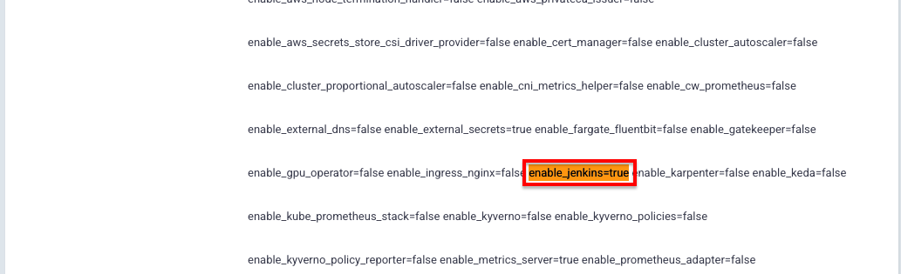

    > **중요**
    > 
    > Jenkins가 설치되는데 수 분의 시간이 소요됩니다.

    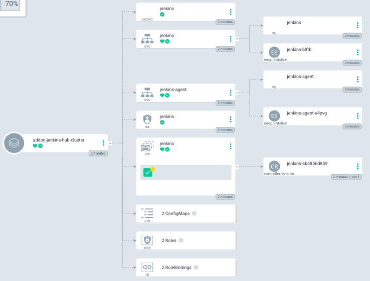

    브라우저에서 확인
    ```sh
    export JENKINS_URL=$(kubectl --context hub-cluster get svc -n jenkins jenkins -o jsonpath='{.status.loadBalancer.ingress[0].hostname}')
    export JENKINS_PASSWORD="$(kubectl get secret jenkins -n jenkins --context hub-cluster -o jsonpath="{.data.jenkins-admin-password}" | base64 --decode)"
    echo "Jenkins Username: admin"
    echo "Jenkins Password: $JENKINS_PASSWORD"
    echo "Jenkins URL: http://$JENKINS_URL"
    ```

    결과:
    ```
    Jenkins Username: admin
    Jenkins Password: admin
    Jenkins URL: http://k8s-jenkins-jenkins-95eb779f15-35c1db08cd82d091.elb.ap-northeast-2.amazonaws.com
    ```

### Jenkins Credential

Argocd 및 Git레포지토리에 접근하기 위한 Credentials을 추가합니다.

#### Argocd Credential 추가

1. Argocd Credentals 조회

    ```sh
    export ARGOCD_PWD=$(kubectl get secrets argocd-initial-admin-secret -n argocd --context hub-cluster --template='{{index .data.password | base64decode}}')
    echo "Gitops Repo Credentials Info"
    echo "Username: admin"
    echo "Password: $ARGOCD_PWD"
    echo "ID: argocd-credentials"
    ```

    결과
    ```sh
    ArgoCD Credentials Info
    Username: admin
    Password: 8BQMGgHbnsLVxCdh
    ID: argocd-credentials
    ```

2. Credential 등록 화면으로 이동합니다.

    우측 상단 `톱니`를 선택합니다.
    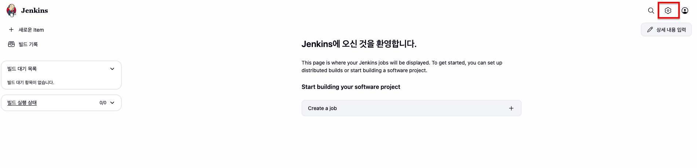

    Security의 `Credentials`를 선택합니다.
    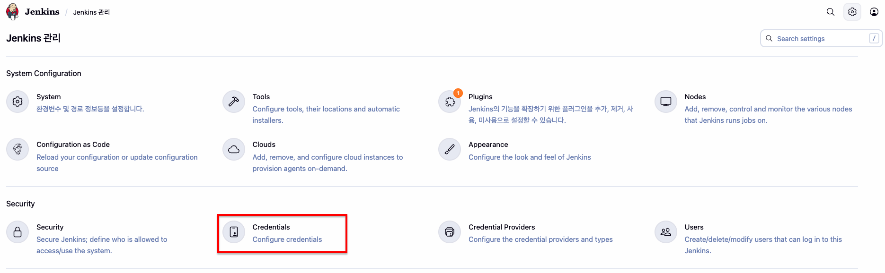

    System의 (global)을 확장하여 `Add Credentials`를 선택합니다.
    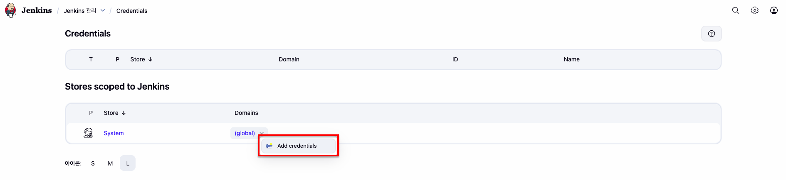

    3. Credential 생성

    1번에서 조회한 결과를 토대로 데이터를 입력합니다.
    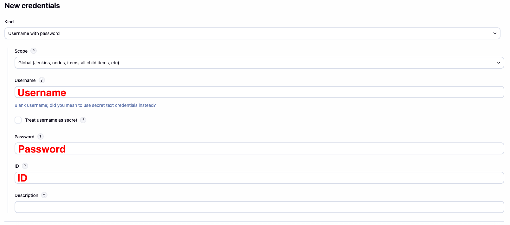

    `Create`를 선택하여 생성을 완료합니다.
    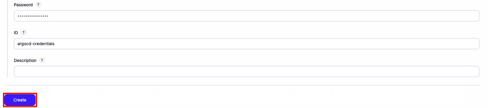

#### Gitea Credential 추가

1. Gitea Credentals 조회

    ```sh
    echo "Gitops Repo Credentials Info"
    echo "Username: workshop-user"
    echo "Password: $GITEA_PASSWORD"
    echo "ID: gitops-repo-credentials"
    ```

    결과
    ```sh
    Gitops Repo Credentials Info
    Username: workshop-user
    Password: y1rmMJm5ayVgpEoQNEsE1YdKMcUeCqbE
    ID: gitops-repo-credentials
    ```

2. Credential 등록 화면으로 이동합니다.

    우측 상단 `톱니`를 선택합니다.
    

    Security의 `Credentials`를 선택합니다.
    

    System의 (global)을 확장하여 `Add Credentials`를 선택합니다.
    

    3. Credential 생성

    1번에서 조회한 결과를 토대로 데이터를 입력합니다.
    

    `Create`를 선택하여 생성을 완료합니다.
    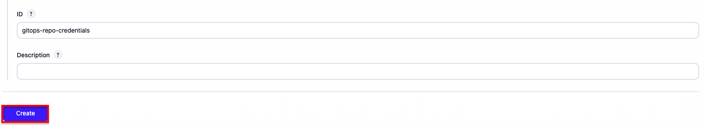
    

## Jenkins Pipeline(15분)

이 장에서는 stage demo-application을 위한 배포 파이프라인을 생성하고 코드를 수정하여 새로운 버전의 애플리케이션이 적용되는 과정을 알아봅니다.

### Jenkins Pipeline 생성

1. Pipeline 생성

    좌측 메뉴의 `+ 새로운 Item`을 선택합니다.
    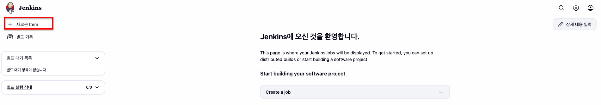

    이름에 `deploy-workshop-staging-canary`입력하고, `Pipeline`을 선택합니다. `OK`를 눌러 상세 설정화면으로 이동합니다.
    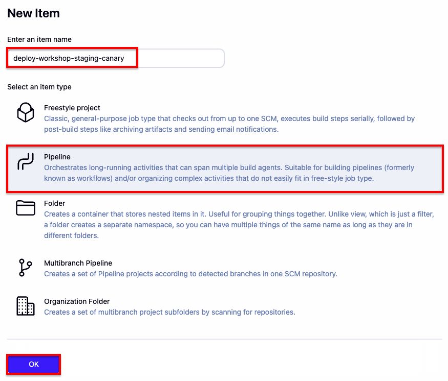

2. Pipeline 코드를 입력합니다.

    아래 groovy 코드를 복사합니다.
    ```groovy
    pipeline {
        agent {
            label 'default-agent'
        }

        environment {
            // REPLACE ENVIRONMENT INFO
        }
        
        stages {
            stage('Checkout Source') {
                steps {
                    script {
                        checkout([
                            $class: 'GitSCM',
                            branches: [[name: '*/main']],
                            userRemoteConfigs: [[
                                url: APPLICATION_REPO,
                                credentialsId: 'gitops-repo-credentials'
                            ]]
                        ])
                        
                        // Update environment variable IMAGE_TAG to git commit hash (short version)
                        env.IMAGE_TAG = sh(script: 'git rev-parse --short=7 HEAD', returnStdout: true).trim()
                        echo "IMAGE_TAG: ${env.IMAGE_TAG}"
                    }
                }
            }
            
            stage('Build & Push with Kaniko') {
                steps {
                    container('jnlp') {
                        sh """
                            set +x
                            # ECR 인증 정보를 Kaniko용 config.json으로 생성
                            AUTH=\$(aws ecr get-login-password --region ap-northeast-2 | base64 -w 0)
                            cat > /kaniko/.docker/config.json <<EOF
    {
      "auths": {
        "${ECR_REGISTRY}": {
          "auth": "\$(echo -n "AWS:\$(aws ecr get-login-password --region ap-northeast-2)" | base64 -w 0)"
        }
      }
    }
    EOF
                            set -x
                        """
                    }
                    container('kaniko') {
                        sh """
                            COLOR=\$(cat ${WORKSPACE}/COLOR)
                            # Kaniko를 사용한 이미지 빌드 및 푸시
                            /kaniko/executor \
                              --context=${WORKSPACE} \
                              --dockerfile=${WORKSPACE}/Dockerfile \
                              --build-arg COLOR=\${COLOR} \
                              --destination=${ECR_REGISTRY}/${IMAGE_NAME}:${IMAGE_TAG}
                              # --cache=true \
                              # --cache-repo=${ECR_REGISTRY}/${IMAGE_NAME}/cache \
                              # --verbosity=debug
                        """
                    }
                }
            }
            
            stage('Update GitOps Repository') {
                steps {
                    withCredentials([usernamePassword(credentialsId: 'gitops-repo-credentials', usernameVariable: 'GIT_USERNAME', passwordVariable: 'GIT_PASSWORD')]) {
                        sh """
                            # GitOps 레포지토리 클론
                            git clone https://\${GIT_USERNAME}:\${GIT_PASSWORD}@\${GITOPS_REPO#https://} workload
                            cd workload/${GITOPS_DIR}
                            
                            # 현재 rollout.yaml 확인
                            echo "Before update:"
                            cat rollout.yaml
                            
                            cp rollout.yaml rollout.yaml.bak

                            # rollout.yaml의 이미지 업데이트
                            sed -i "s|image:.*|image: ${ECR_REGISTRY}/${IMAGE_NAME}:${IMAGE_TAG}|g" rollout.yaml
                            
                            # 업데이트 후 확인
                            echo "After update:"
                            cat rollout.yaml

                            # 변경사항 커밋 및 푸시
                            git config user.email "jenkins@workshop.com"
                            git config user.name "Jenkins CI"
                            git add rollout.yaml
                            git commit -m "Update image to ${ECR_REGISTRY}/${IMAGE_NAME}:${IMAGE_TAG}" || echo "No changes to commit"
                            git push https://\${GIT_USERNAME}:\${GIT_PASSWORD}@\${GITOPS_REPO#https://} main
                        """
                    }
                }
            }

            stage('Approve Rollout') {
                steps {
                    script {
                        withCredentials([usernamePassword(credentialsId: 'argocd-credentials', usernameVariable: 'ARGOCD_USERNAME', passwordVariable: 'ARGOCD_PASSWORD')]) {
                            sh """
                                argocd login ${ARGOCD_SERVER} --username \${ARGOCD_USERNAME} --password \${ARGOCD_PASSWORD} --plaintext --grpc-web
                                argocd app sync ${ARGOCD_APP_NAME}
                                sleep 5
                            """
                        }

                        // resume이 가능한 동안 반복적으로 승인 요청
                        def continueApproval = true
                        def approvalCount = 0
                        
                        while (continueApproval && approvalCount < 5) {  // 최대 5회 반복 방지
                            // resume 액션이 가능한지 확인
                            def isResumeAvailable = sh(
                                script: """
                                    ACTIONS_OUTPUT=\$(argocd app actions list ${ARGOCD_APP_NAME} \
                                      --kind Rollout \
                                      --resource-name ${ARGOCD_APP_ROLLOUT_NAME})
                                    
                                    echo "Available actions:"
                                    echo "\$ACTIONS_OUTPUT"
                                    
                                    # resume 액션이 활성화(DISABLED=false)되어 있는지 체크
                                    if echo "\$ACTIONS_OUTPUT" | grep 'resume' | grep -q 'false'; then
                                      echo "Resume action is available"
                                      exit 0
                                    else
                                      echo "Resume action is NOT available"
                                      exit 1
                                    fi
                                """,
                                returnStatus: true
                            )
                            
                            if (isResumeAvailable == 0) {
                                // resume이 가능하면 승인 요청
                                approvalCount++
                                echo "Approval request #${approvalCount}: Resume action is available"
                                
                                input(
                                    message: "Approve Rollout to promote? (Attempt #${approvalCount})", 
                                    ok: "Approve", 
                                    submitter: "admin"
                                )
                                
                                echo "Rollout approved, proceeding with promotion"
                                sh """
                                    # promote 실행
                                    argocd app actions run ${ARGOCD_APP_NAME} resume \
                                      --kind Rollout \
                                      --resource-name ${ARGOCD_APP_ROLLOUT_NAME}
                                    echo "Rollout promoted successfully"
                                    
                                    # 상태 확인을 위한 잠시 대기
                                    sleep 5
                                """
                            } else {
                                // resume이 불가능하면 loop 종료
                                echo "Resume action is not available. Ending approval process."
                                continueApproval = false
                            }
                        }
                        
                        if (approvalCount == 0) {
                            echo "No approval was needed - resume action was not available"
                        } else {
                            echo "Total approvals completed: ${approvalCount}"
                        }
                    }
                }
            }

            stage('Wait for Deployment') {
                steps {
                    withCredentials([usernamePassword(credentialsId: 'argocd-credentials', usernameVariable: 'ARGOCD_USERNAME', passwordVariable: 'ARGOCD_PASSWORD')]) {
                        sh """
                            argocd login ${ARGOCD_SERVER} --username \${ARGOCD_USERNAME} --password \${ARGOCD_PASSWORD} --plaintext --grpc-web
                            argocd app wait ${ARGOCD_APP_NAME} --timeout 300
                            argocd app get ${ARGOCD_APP_NAME}
                        """
                    }
                }
            }
        }
    }
    ```

    아래 위치에 붙여넣기 합니다.
    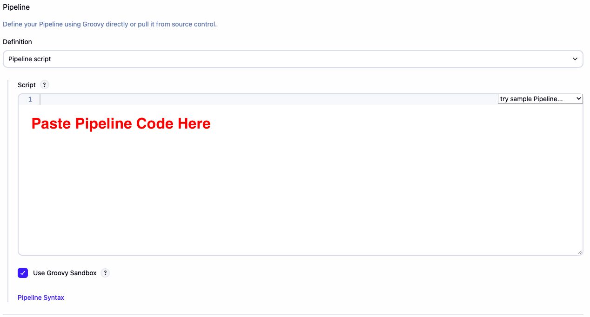

3. environment 정보 조회

    environment 정보:
    ```sh
    export ARGO_CD_URL=$(kubectl --context hub-cluster get svc -n argocd  argocd-server -o jsonpath='{.status.loadBalancer.ingress[0].hostname}')
    echo "        // ECR"
    echo "        ECR_REGISTRY = \"${ACCOUNTID}.dkr.ecr.${AWS_REGION}.amazonaws.com\""
    echo "        IMAGE_NAME = \"eks-blueprint-workshop-demo-application\""
    echo "        APPLICATION_REPO = \"${GITEA_EXTERNAL_URL}/workshop-user/eks-blueprints-workshop-gitops-demo-application\""
    echo "        // GitOps"
    echo "        GITOPS_REPO = \"${GITEA_EXTERNAL_URL}/workshop-user/eks-blueprints-workshop-gitops-apps.git\""
    echo "        GITOPS_DIR = \"deploy-workshop/canary/staging\""
    echo "        // ArgoCD"
    echo "        ARGOCD_SERVER = \"${ARGO_CD_URL}\""
    echo "        ARGOCD_APP_NAME = \"deployment-staging-canary-deploy-workshop\""
    echo "        ARGOCD_APP_ROLLOUT_NAME = \"rollout-canary\""
    ```

    결과 예시:
    ```groovy
            // ECR
            ECR_REGISTRY = "940482424078.dkr.ecr.ap-northeast-2.amazonaws.com"
            IMAGE_NAME = "eks-blueprint-workshop-demo-application"
            APPLICATION_REPO = "https://drys2vc4z95uy.cloudfront.net/gitea/workshop-user/eks-blueprints-workshop-gitops-demo-application"
            // GitOps
            GITOPS_REPO = "https://drys2vc4z95uy.cloudfront.net/gitea/workshop-user/eks-blueprints-workshop-gitops-apps.git"
            GITOPS_DIR = "deploy-workshop/canary/staging"
            // ArgoCD
            ARGOCD_SERVER = "k8s-argocd-argocdse-b337ad2062-82706d3036fd5160.elb.ap-northeast-2.amazonaws.com"
            ARGOCD_APP_NAME = "deployment-staging-canary-deploy-workshop"
            ARGOCD_APP_ROLLOUT_NAME = "rollout-canary"
    ```

4. environment입력

3번의 결과를 Pipeline `// REPLACE ENVIRONMENT INFO` 부분에 붙여 넣습니다.

예시:
```groovy
.

    environment {
        // ECR
        ECR_REGISTRY = "940482424078.dkr.ecr.ap-northeast-2.amazonaws.com"
        IMAGE_NAME = "eks-blueprint-workshop-demo-application"
        APPLICATION_REPO = "https://drys2vc4z95uy.cloudfront.net/gitea/workshop-user/eks-blueprints-workshop-gitops-demo-application"
        // GitOps
        GITOPS_REPO = "https://drys2vc4z95uy.cloudfront.net/gitea/workshop-user/eks-blueprints-workshop-gitops-apps.git"
        GITOPS_DIR = "deploy-workshop/canary/staging"
        // ArgoCD
        ARGOCD_SERVER = "k8s-argocd-argocdse-b337ad2062-82706d3036fd5160.elb.ap-northeast-2.amazonaws.com"
        ARGOCD_APP_NAME = "deployment-staging-canary-deploy-workshop"
        ARGOCD_APP_ROLLOUT_NAME = "rollout-canary"
    }
.
.
```

5. 생성 완료

`Apply` > `Save` 를 차례로 선택하여 저장합니다.
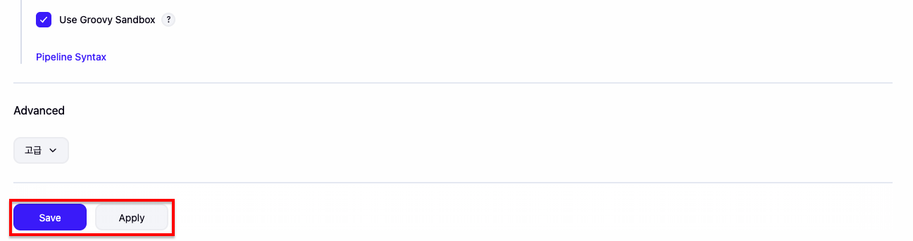

## demo-application 수정

COLOR라는 파일을 생성하여 `red`라는 값을 입력하도록하겠습니다.

1. COLOR 변경

    ```sh
    cat > $GITOPS_DIR/demo-application/COLOR << 'EOF'
    red
    EOF
    ```

2. git 커밋

    ```sh
    cd $GITOPS_DIR/demo-application
    git add .
    git commit -m "update COLOR to red"
    git push
    ```

## Jenkins Pipeline 실행

1. `deploy-workshop-staging-canary` Job으로 이동

    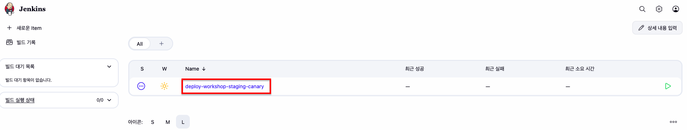

2. 빌드 실행
   
    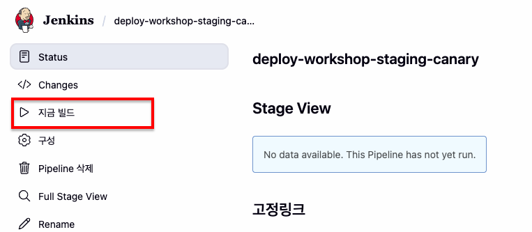

3. 모니터링

    브라우저로 canary 접근

    ```sh
    export CANARY_URL=$(kubectl --context spoke-staging get svc -n canary rollout-canary -o jsonpath='{.status.loadBalancer.ingress[0].hostname}')
    echo "Staing Canary Main URL: http://$CANARY_URL"
    ```

    승인 전에 red color가 일부 섞여서 호출되는 것을 확인할 수 있습니다.
    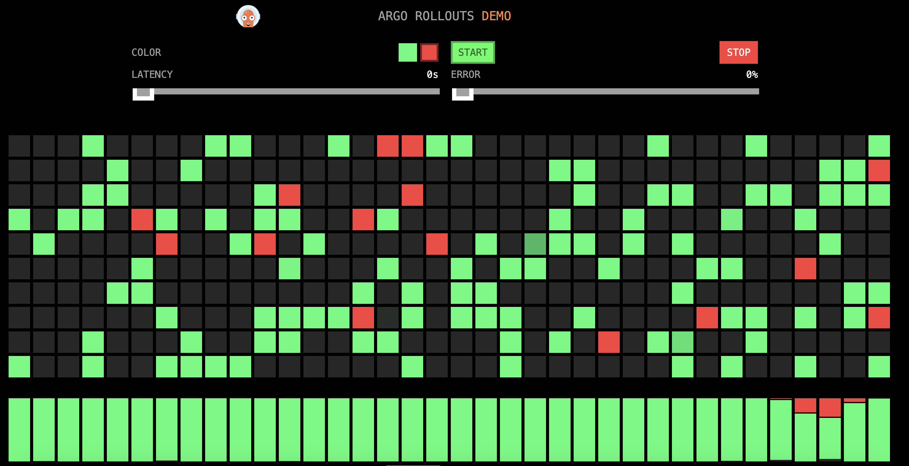

4. 승인

    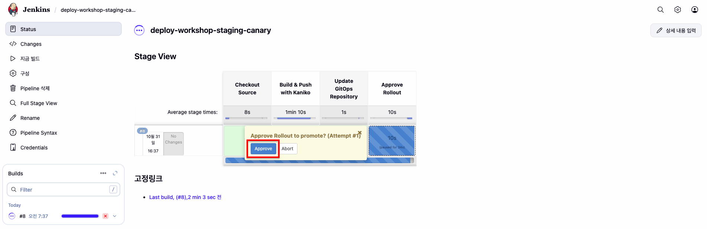

5. 검증

    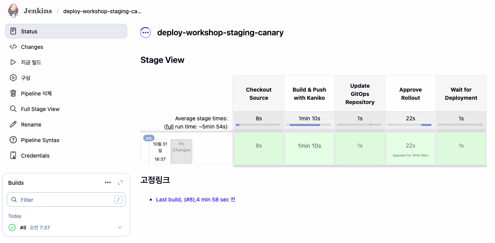

    모든 요청이 red 전환된 것을 확인할 수 있습니다.
    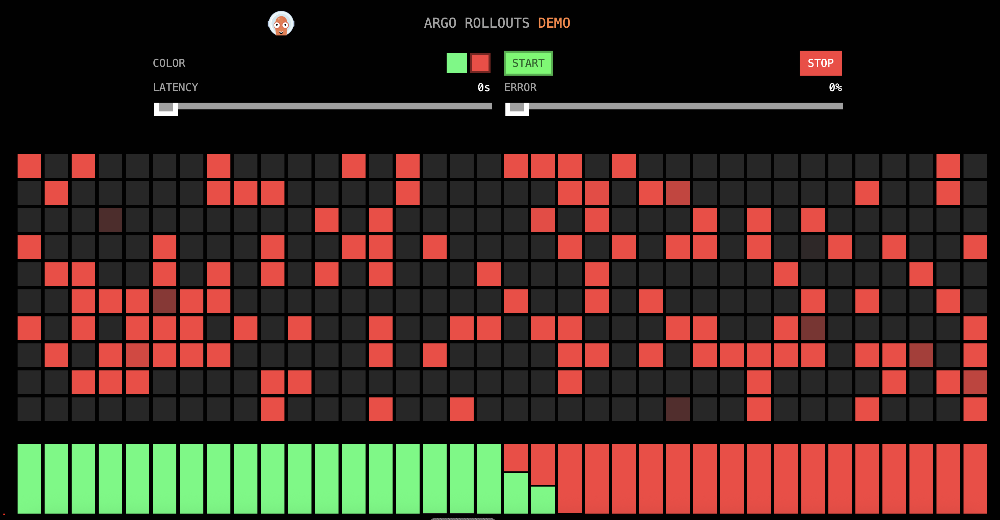